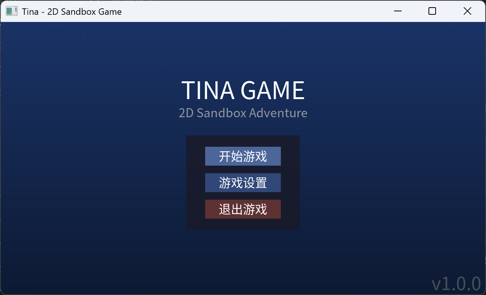
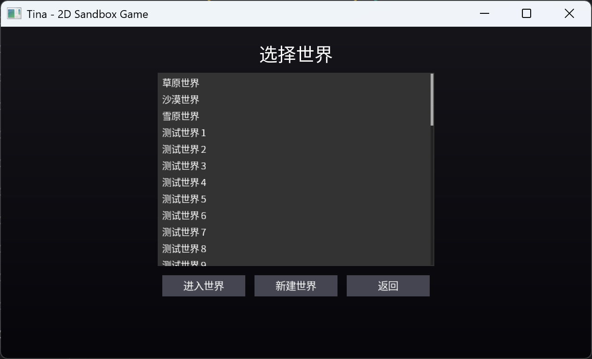
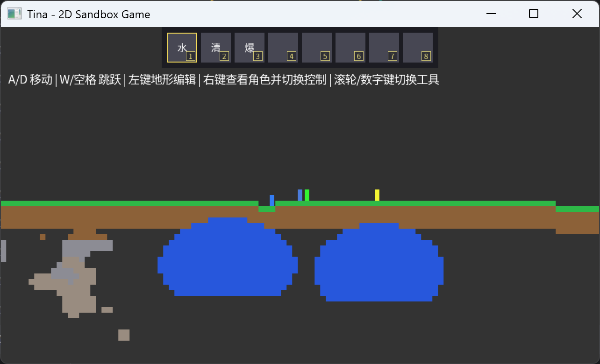

# Tina - 2D Sandbox Game Engine

**English | [简体中文](README_CN.md)**

[](https://isocpp.org/)
[](https://en.wikipedia.org/wiki/C%2B%2B#Standardization)
[](https://opensource.org/licenses/MIT)

A 2D sandbox game engine developed with modern C++17, featuring bgfx rendering backend, terrain editing, fluid simulation, ECS architecture, and more.


## 🎮 Screenshots

### Main Menu


### World Selection


### Game Scene


## ✨ Core Features

### 🎨 Rendering System
- **Cross-platform rendering with bgfx** - Supports DX11/OpenGL/Metal/Vulkan backends
- **Multi-view rendering architecture** - Layered rendering (solid, alpha, UI layers)
- **2D tile map rendering** - Efficient batch rendering
- **Particle system** - Supports explosions, debris, and other visual effects
- **Day-night cycle** - Dynamic lighting and sky color changes

### 🎮 Gameplay
- **Terrain editing** - Real-time digging, filling, and blasting
- **Fluid simulation** - Advanced water flow simulation system (CA algorithm)
- **Physics system** - AABB collision detection, gravity simulation
- **Character control** - Platformer mechanics, multi-character switching
- **Procedural generation** - Random terrain generation (Perlin noise)

### 🏗️ Engine Architecture
- **ECS architecture** - Entity-Component-System based on EnTT
- **Scene management** - Scene stack support (push/pop/replace)
- **Event system** - Dual-layer event bus (OS layer + gameplay layer)
- **Resource management** - Async resource loading, smart pointer management
- **UI system** - Custom UI framework with layout, events, and animations

### 🖼️ UI System Implementation

#### Implemented UI Components
- **UINode** - Base UI node class (transform, hierarchy, visibility)
- **UIButton** - Button component (hover, click, disabled states)
- **UIPanel** - Panel container (background, border, rounded corners)
- **UIToolbar** - Toolbar (multi-slot, icons, selection state)
- **UIDialog** - Dialog system (centering, overlay)
- **UICharacterPanel** - Character info panel (health bar, name, control button)
- **TextRenderer** - Text renderer (TrueType fonts, alignment, colors)

#### UI Features
- **Auto layout management** - Responsive window resizing
- **Event handling** - Mouse hover, click, scroll wheel
- **RAII rendering scope** - Automatic render state management
- **Color themes** - Predefined color constants
- **DPI scaling** - High-resolution display support

### 🎬 Scene System

#### Implemented Scenes
1. **MenuScene** - Main menu scene
   - Start game, settings, exit buttons
   - Background rendering, title display
   
2. **WorldSelectScene** - World selection scene
   - World list (3 preset worlds)
   - Create new world dialog
   - Seed input, world name editing
   
3. **GameScene** - Main game scene
   - Terrain rendering (solid/water)
   - Character system (player + 3 NPCs)
   - Toolbar (8 tool slots)
   - Character info panel
   - Day-night cycle
   
4. **PauseScene** - Pause menu
   - Continue, settings, return to main menu
   - Semi-transparent overlay
   
5. **SettingsScene** - Settings scene
   - Sound/music volume adjustment
   - Fullscreen toggle
   - Day-night time adjustment

### 🎵 Audio System
- **miniaudio based** - Supports MP3/WAV/FLAC
- **Audio management** - Fade in/out, volume control
- **Group management** - Independent control for sound effects and music
- **Async loading** - Lazy resource loading

### 🎯 Input System
- **InputSystem** - Unified input management
- **Keyboard input** - Keyboard state queries, key events
- **Mouse input** - Coordinate conversion, button states, scroll wheel
- **Window events** - Window resize, maximize, close

### 📦 Project Structure

```
Tina/
├── src/
│   ├── core/           # Core systems (logging, time, memory)
│   ├── engine/         # Engine core (application, scenes, events, input)
│   ├── renderer/       # Rendering system (shaders, textures, tile rendering)
│   ├── ui/             # UI system (components, renderers, layout)
│   ├── ecs/            # ECS system (components, systems)
│   └── game/           # Game logic (scenes, maps, characters)
├── resources/          # Resource files (shaders, textures, audio, fonts)
├── image/              # Game screenshots
└── docs/               # Documentation
```

### 🎮 Controls

**Main Menu**
- Click "Start Game" to enter world selection
- Click "Settings" to adjust volume and display options
- Click "Exit" to close the game

**Game Scene**
- `A/D` or `←/→` - Move character
- `W/Space` - Jump
- `Left Click` - Use current tool (dig/place/blast)
- `Right Click` - View character info and switch control
- `Scroll Wheel/Number Keys` - Switch tools
- `ESC` - Pause menu

**Tools**
- **Tool 0** - Water placer (place water at click position)
- **Tool 1** - Excavator (circular area digging)
- **Tool 2** - Exploder (large area destruction + particle effects)

## 📋 Quick Start

### Clone Repository

```bash
git clone https://github.com/wuxianggujun/Tina.git
cd Tina
git submodule update --init --recursive
```

### Windows Build

**Prerequisites:**
- CMake 3.20+
- Visual Studio 2019/2022
- Windows SDK

**Build Steps:**
```bash
mkdir build && cd build
cmake ..
cmake --build . --config Release
```

### Ubuntu Build

**Install Dependencies:**
```shell
sudo add-apt-repository ppa:git-core/ppa
sudo apt update
sudo apt install git
sudo apt install ninja-build
```

```shell
sudo snap install cmake --classic
sudo ln -s /snap/cmake/current/bin/cmake /usr/bin/cmake
sudo ln -s /snap/cmake/current/bin/ccmake /usr/bin/ccmake
sudo ln -s /snap/cmake/current/bin/cpack /usr/bin/cpack
```

```shell
# Install graphics library dependencies
sudo apt install libgl1-mesa-dev libglfw3-dev
sudo apt install libwayland-dev libwayland-egl-backend-dev libxkbcommon-dev xorg-dev 
sudo apt install libx11-dev libxext-dev libxtst-dev libxrender-dev libxmu-dev libxmuu-dev
sudo apt install pkg-config
```

**Build Steps:**
```bash
mkdir build && cd build
cmake ..
make -j$(nproc)
./Tina
```

## 🔧 Tech Stack

### Core Dependencies

| Library | Version | Purpose |
|---|---|---|
| [bgfx](https://github.com/bkaradzic/bgfx.cmake.git) | v1.149.9360-557 | Cross-platform rendering (supports DX11/OpenGL/Vulkan) |
| [GLFW](https://github.com/glfw/glfw) | 3.4 | Window management, input handling and clipboard |
| [miniaudio](https://github.com/mackron/miniaudio) | 0.11.25 | Audio playback and mixing (MP3/WAV/FLAC) |
| [EnTT](https://github.com/skypjack/entt.git) | 3.x | Entity Component System (ECS) |
| [spdlog](https://github.com/gabime/spdlog.git) | 1.x | High-performance logging library |
| [stb](https://github.com/wuxianggujun/stb-cmake.git) | latest | Image loading, TrueType fonts |
| [GLM](https://github.com/g-truc/glm.git) | 0.9.9+ | Math library (vectors, matrices) |

### Development Tools

- **[Google Test](https://github.com/google/googletest.git)** - Unit testing framework
- **[Tracy](https://github.com/wolfpld/tracy.git)** - Performance profiler


## 📚 Learning Resources

This project was developed with reference to the following excellent open source projects:

### Game Engines
- [MitchEngine](https://github.com/wobbier/MitchEngine) - Modern C++ game engine
- [CatDogEngine](https://github.com/CatDogEngine/CatDogEngine) - Data-driven game engine
- [EraEngine](https://github.com/EldarMuradov/EraEngine) - Vulkan/DX12 rendering engine
- [ElvenEngine](https://github.com/denyskryvytskyi/ElvenEngine) - 2D game engine
- [simple_engine](https://github.com/bikemurt/simple_engine) - Simple 2D engine

### Sandbox/Platformer Games
- [Platformer](https://github.com/Somgonk/Platformer) - 2D platformer game
- [OpenMiner](https://github.com/Unarelith/OpenMiner) - Minecraft-style sandbox
- [PainterEngine](https://github.com/matrixcascade/PainterEngine) - 2D graphics engine

### Architecture Design
- [2019-ecs](https://code.austinmorlan.com/austin/2019-ecs) - ECS architecture tutorial
- [Spatial.Engine](https://github.com/luizgabriel/Spatial.Engine) - Spatial engine

### bgfx Related
- [efkbgfx](https://github.com/cloudwu/efkbgfx) - Effekseer particle system + bgfx
- [ant](https://github.com/ejoy/ant) - Lua game engine (using bgfx)

### Utility Libraries
- [spdlog_wrapper](https://github.com/gqw/spdlog_wrapper) - spdlog wrapper
- [klog](https://github.com/KkemChen/klog) - Lightweight logging library

## 🎯 Event System Details

The engine adopts a **dual-layer event bus architecture**, separating OS events and gameplay events:

### Layer 1: OS Event Bus (OSEventBus)

Handles operating system level events:
- **Keyboard events** - Key press/release
- **Mouse events** - Movement, clicks, scroll wheel
- **Window events** - Resize, maximize, close

**Usage Example:**
```cpp
// Subscribe to keyboard press events
auto connection = app()->osEvents().onKeyPressed.connect(this, &MyScene::onKeyPressed);

void MyScene::onKeyPressed(const KeyEvent& e) {
    if (e.key == KeyCode::Escape) {
        // Open pause menu
    }
}
```

### Layer 2: Typed Event Bus (TypedEventBus)

Based on `entt::dispatcher`, for gameplay events:
- **Type safe** - Compile-time checking
- **No engine modification needed** - Highly extensible
- **RAII auto-management** - Automatic unsubscribe

**Usage Example:**
```cpp
// 1. Define event types
namespace Events {
    struct PlayerJumped { float height; };
    struct SetDayNight { float normalized; };
}

// 2. Subscribe to events (using SubscriptionManager for automatic lifecycle management)
TINA_SUBSCRIBE_EVENT(m_subscriptions, Events::PlayerJumped, MyScene::onPlayerJumped);

// 3. Trigger events
Events::PlayerJumped event{2.5f};
app()->events().trigger(event);

// 4. Handle events
void MyScene::onPlayerJumped(const Events::PlayerJumped& e) {
    TINA_INFO("Player jumped height: {}", e.height);
}
```

**Advantages:**
- ✅ Decouples module communication
- ✅ Supports async event handling
- ✅ Automatic subscription lifecycle management
- ✅ Type safe, compile-time checking

See `docs/event_system.md` for details

## 📝 Project Status

**Current Version:** 1.0.0  
**Development Status:** 🔒 Archived (No longer maintained)

This project has achieved its intended goals as a learning project, implementing:
- ✅ Complete 2D sandbox game framework
- ✅ Modern C++17 architecture practices
- ✅ Cross-platform rendering system
- ✅ ECS architecture implementation
- ✅ Fluid simulation algorithms
- ✅ Complete UI system

The project code is available for learning and reference. If you want to continue developing based on this project, feel free to Fork it!

## 🐛 Known Issues

- **Performance optimization** - Frame rate may drop on large maps
- **Fluid simulation** - May become unstable in extreme cases
- **UI scaling** - Some UI elements may display incorrectly on high-DPI displays
- **Audio** - Occasional audio stuttering

## 🎓 Key Learning Points

If you want to learn from this project, it is recommended to focus on the following modules:

1. **Scene Management System** (`src/engine/SceneManager.cpp`)
   - Scene stack implementation
   - Lifecycle management
   - View configuration

2. **ECS Architecture** (`src/ecs/`)
   - Component definitions
   - System implementation
   - Entity management

3. **Event System** (`src/engine/EventSystem.cpp`)
   - Dual-layer event bus
   - RAII subscription management
   - Strongly-typed events

4. **UI Framework** (`src/ui/`)
   - Custom UI components
   - Layout system
   - Event handling

5. **Fluid Simulation** (`src/game/TileMap.cpp`)
   - Cellular automata algorithm
   - Water pressure calculation
   - Optimization techniques

## 🤝 Acknowledgments

Thanks to the following organizations and projects:

- **JetBrains** - For providing free licenses for open source projects

  <a href="https://jb.gg/OpenSourceSupport"></a>

- **All Contributors** - Thanks to all developers who provided feedback and suggestions
- **Open Source Community** - Thanks to all the excellent open source projects referenced

## 📄 License

This project is licensed under the [MIT License](LICENSE).

```
MIT License

Copyright (c) 2024 wuxianggujun

Permission is hereby granted, free of charge, to any person obtaining a copy
of this software and associated documentation files (the "Software"), to deal
in the Software without restriction, including without limitation the rights
to use, copy, modify, merge, publish, distribute, sublicense, and/or sell
copies of the Software, and to permit persons to whom the Software is
furnished to do so, subject to the following conditions:

The above copyright notice and this permission notice shall be included in all
copies or substantial portions of the Software.

THE SOFTWARE IS PROVIDED "AS IS", WITHOUT WARRANTY OF ANY KIND, EXPRESS OR
IMPLIED, INCLUDING BUT NOT LIMITED TO THE WARRANTIES OF MERCHANTABILITY,
FITNESS FOR A PARTICULAR PURPOSE AND NONINFRINGEMENT. IN NO EVENT SHALL THE
AUTHORS OR COPYRIGHT HOLDERS BE LIABLE FOR ANY CLAIM, DAMAGES OR OTHER
LIABILITY, WHETHER IN AN ACTION OF CONTRACT, TORT OR OTHERWISE, ARISING FROM,
OUT OF OR IN CONNECTION WITH THE SOFTWARE OR THE USE OR OTHER DEALINGS IN THE
SOFTWARE.
```

---

**⭐ If this project helps you, welcome to give it a Star!**

**📧 Contact:** [GitHub Issues](https://github.com/wuxianggujun/Tina/issues)

