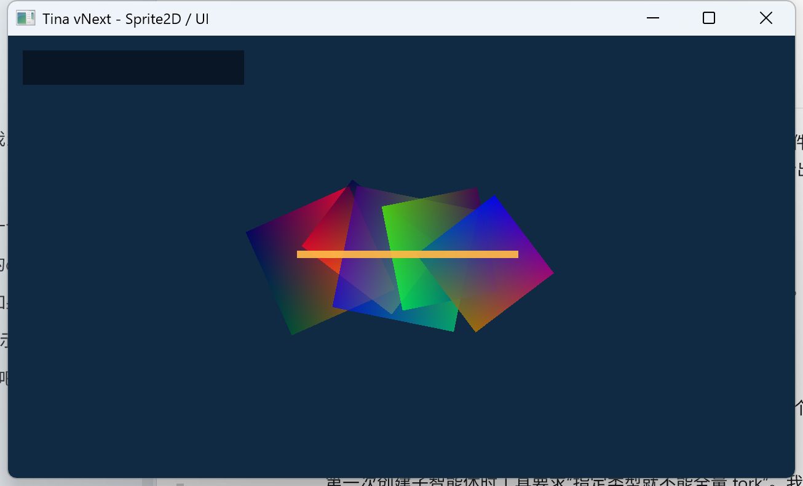
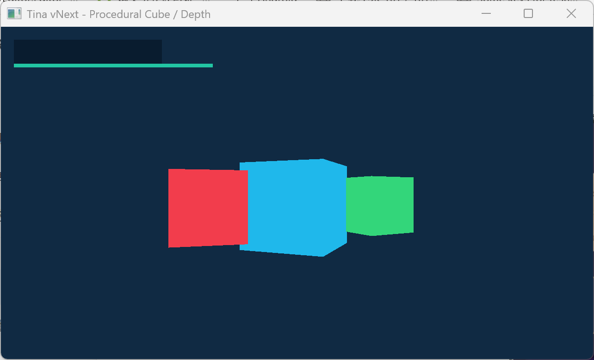
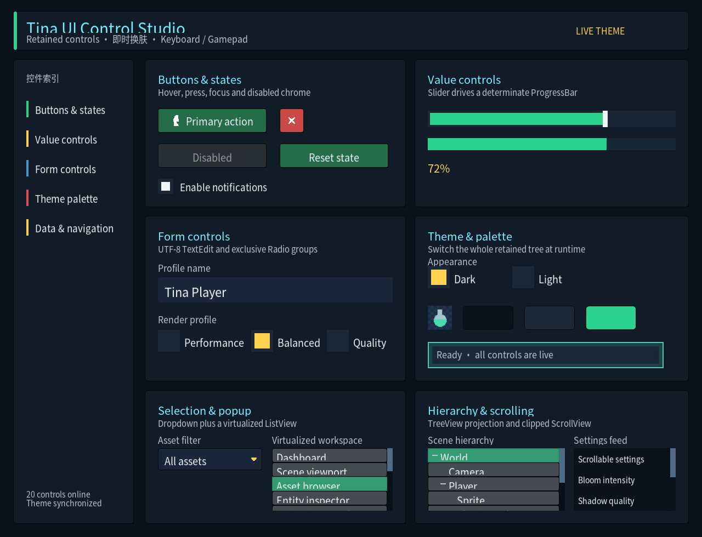

# Tina 游戏 Runtime

Tina 是一个以 C++23 为基线的 2D/3D 游戏 Runtime。当前产品路径是 vNext Desktop 与
`tina_sample_*`；Legacy `Tina.exe`、旧横版 2D 游戏和旧 UI 产品图已经退役。

当前 retained UI 仍位于 `include/tina/ui` 与 `src/ui`。因此，“Legacy UI 已删除”只表示旧产品实现
已经删除，不表示删除当前 `src/ui`。

## 效果展示

下面的图片来自 Tina vNext 的本地产品/视觉验证快照，用来说明当前 Runtime、Retained UI 与
Editor 能覆盖的创作方向。完整说明、图片来源和能力边界见 [Showcase](docs/showcase.md)。

| 2D Sprite / UI | 3D 深度与几何 | Retained UI 工作台 |
| --- | --- | --- |
|  |  |  |

可落地的游戏方向包括 TileMap/平台动作/RPG/等距 2D、带资源与场景层级的 3D 原型、以及
需要复杂菜单、背包或编辑器工具的桌面游戏。截图展示的是已验证的基础能力，不等于
对玩法脚本、联网或尚未完成的 3D 物理功能作承诺。

## 当前能力

**0.1.0 发布入口：`Tina::GameSDK` 是一个实体核心静态库（`Tina.lib` / `libTina.a`），不是多库接口聚合。**
下表是源码职责，不是一份需要游戏逐一链接的 lib 清单。内部按 OBJECT 编译，所有已启用 Tina adapter 一并归档；
Editor/host tools 不并入核心，第三方依赖自动私有传递。见 [ADR 0055](docs/adr/0055-single-runtime-archive.md)。

一行一模块；契约细节见 [Public API](docs/public-api.md)，各模块边界见对应主题文档。

| 模块 | 现在有什么 |
| --- | --- |
| Runtime | `EngineHost` 是唯一非全局组合根；`IGameApplication` 管程序生命周期，`IGameState` 承担帧行为；定容 State 栈与四相位 policy |
| Core | `Result`/`Status`、MemoryTag/PMR、generation handle、有界 `JsonDocument`/`JsonValue` JSON 解析、`JsonWriter`、编译期可剥离日志前端，以及 opt-in 的进程级最后故障报告 |
| Platform / Input | Tina 公共契约 + 私有 GLFW adapter；ordered `PlatformFrame`、Action 域、8 槽 pointer 表、Gamepad registry。Android 与 HTML5 后端已落地 |
| Render | 后端无关 `RenderFrame`/`RenderScene`，私有 bgfx；Sprite2D、PBR/IBL、CSM/spot/point shadow、HDR/Bloom/Fog/Decal，以及 Runtime 管理目标的自定义 PostProcess fragment |
| Scene | generation `EntityId`、Transform 层级、封闭 typed read view、runtime metadata、2D/3D extraction 与 `CameraFollow2D` |
| Asset | Catalog/Cooked、AssetId、Handle/Lease、Task-backed IO/Main completion、GPU upload/retirement、增量 Cooker 与 source import |
| UI | retained tree、约束布局、路由、HarfBuzz/BiDi + 按需 MSDF/color 文本与回退字体，以及 Button/Checkbox/Switch/Slider/ProgressBar/RadioButton/TextEdit/NumberField/ColorPicker、Dropdown/Menu/Dialog/Popup/Tooltip/Snackbar、TabView/SplitView/CollapsibleSection、ScrollView 与虚拟化 ListView/TreeView/VirtualGridView/DataGrid |
| Math | `Tina::Math` 是几何类型的唯一定义点：header-only，列主序右手系 `Vec`/`Quaternion`/`Mat4`/`Frustum` 与 2D/3D 几何查询 |
| Gameplay | 只依赖 Core+Math 的时序工具层：`Easing`（28 曲线）、`Scheduler`、`Action`/`ActionRunner`、`Signal<T>` |
| Animation3D | 建在 `Animator3D` **旁**的 pose 图：`Skeleton3D`/`Pose3D`、`PoseBlend3D`、`ClipSampler3D`、`BlendTree3D`、状态机 + layer/mask + root motion，以及两骨 IK |
| Navigation2D | weighted 栅格、动态阻挡、确定性分步 A*、世界坐标转换、地形成本感知路径平滑、跟随/Agent、共享分步 Flow field，以及 TileMap/Physics 桥 |
| Save | `Tina::Save` 版本化 slot 存储：primary+backup 双份 + digest 校验、`SaveSlotHealth` 恢复分级、产品拥有的 migration 图（严格递增、无降级） |
| Audio / Physics2D | backend-neutral engine + 可选 miniaudio；Box/Circle/Capsule/ConvexPolygon/Chain 与 Distance/Revolute/Prismatic joint + 可选 Box2D 3.x adapter |
| Physics3D / Gameplay3D | 可选 Jolt 5.5.0：刚体与 Character、fixed step、ray/shape cast/AABB、contact event、double global / float local floating origin；`Gameplay3D::Scene3DRuntime` 把 Prefab v5 的物理/动画接入隔离的 Scene World，见 [Physics3D](docs/physics3d.md) 与 [3D](docs/game-3d.md) |
| Network | 数值 IPv4/IPv6、owner-thread 固定容量非阻塞 UDP/TCP、HTTP/1.1、RFC 6455 WebSocket 与名字解析，统一跑在 `IByteStream` 接缝上；传输层零第三方依赖，TLS 是可选 mbedTLS adapter（`TINA_BUILD_NETWORK_TLS` / `tina_network_tls`） |
| Editor | `TinaEditor.exe`（target `tina_editor_desktop`）是引擎**之上**的工具树，由 `TINA_BUILD_EDITOR` 控制，**不属于 Game SDK**；2D/3D authoring document、bounded undo、Project Browser 与 source import（见 [Editor 2D / 3D](docs/editor-2d.md)、ADR 0041） |
| 产品门禁 | `tina_sample_2d` 覆盖 Catalog/TileMap/Navigation2D/UI/Audio/Physics2D；`tina_sample_3d` 覆盖 glTF/Prefab/Scene/Render；`tina_sample_ui_showcase` 是 24 控件工作台与 Dark/Light 实时换肤 |

**明确不在范围**（不要按已可用来设计）：Physics3D joint、compound/mesh shape、CCD、移动平台速度传递、
跨 CPU 确定性与性能预算；通用 Gameplay3D script/AI owner（当前只提供一个
Prefab 实例的 `Scene3DRuntime`）；玩法脚本（ADR 0045 Proposed，零实现）；可靠 UDP、netcode、NAT 穿透、
HTTP/2、HTTP/3、DNS 缓存、代理与证书固定（见 [网络](docs/network.md)）。

Game SDK 与公开头不暴露 bgfx、GLFW、Box2D、miniaudio、FreeType、cgltf、stb_image、MikkTSpace
或 xxHash 类型。

## 快速开始

环境要求：CMake 3.25+、Visual Studio 2026/MSVC 19.50、`VCPKG_ROOT`，源码和终端使用 UTF-8。
Windows 构建通过 `/utf-8` 保证中文源码、日志和 UI 文案不乱码。

基础 Null 图：

```powershell
cmake --preset windows-msvc-vnext
cmake --build --preset windows-vnext-debug --target tina_tests tina_ui_tests tina_runtime_ui_tests tina_sample_null --parallel 2 -- /nr:false
out\build\windows-msvc-vnext\bin\Debug\tina_tests.exe --gtest_color=yes
out\build\windows-msvc-vnext\bin\Debug\tina_ui_tests.exe --gtest_color=yes
out\build\windows-msvc-vnext\bin\Debug\tina_runtime_ui_tests.exe --gtest_color=yes
out\build\windows-msvc-vnext\bin\Debug\tina_sample_null.exe --frames=300
```

Windows bgfx 产品图：

```powershell
cmake --preset windows-msvc-vnext-bgfx
cmake --build --preset windows-vnext-bgfx-debug --target tina_sample_2d tina_sample_3d tina_tests --parallel 2 -- /nr:false
out\build\windows-msvc-vnext-bgfx\bin\Debug\tina_sample_2d.exe --frames=300 --frame-delay-ms=0 --ui-theme-demo --ui-tree-demo
out\build\windows-msvc-vnext-bgfx\bin\Debug\tina_sample_3d.exe --frames=30 --frame-delay-ms=0 --ui-theme=dark --ui-theme-demo
```

UI 控件与换肤工作台（完整文字使用 FreeType 图）：

```powershell
cmake --preset windows-msvc-vnext-bgfx-ui-freetype
cmake --build --preset windows-vnext-bgfx-ui-freetype-debug --target tina_sample_ui_showcase --parallel 2 -- /nr:false
out\build\windows-msvc-vnext-bgfx-ui-freetype\bin\Debug\tina_sample_ui_showcase.exe --frames=150 --frame-delay-ms=0 --theme=dark --auto-demo
```

完整 2D feature 图（bgfx + Physics2D + FreeType + miniaudio）：

```powershell
cmake --preset windows-msvc-vnext-bgfx-product-2d
cmake --build --preset windows-vnext-bgfx-product-2d-debug --target tina_sample_2d tina_navigation2d_tests tina_physics2d_tests tina_ui_freetype_tests tina_audio_tests tina_audio_miniaudio_tests --parallel 2 -- /nr:false
out\build\windows-msvc-vnext-bgfx-product-2d\bin\Debug\tina_sample_2d.exe --frames=300 --frame-delay-ms=0 --ui-theme-demo --ui-tree-demo
```

测试 executable 直接运行，不通过 CTest。不要以 `--clean-first` 或删除 `out/build` 作为日常验证步骤。

## 当前状态

- Legacy 产品删除及依赖/兼容扫尾：完成；仅保留 `TINA_BUILD_LEGACY=ON` 的 FATAL 拒绝开关；
- 2D 产品竖切：已形成 Windows 产品门禁；当前工作树已接入 Catalog `SpriteAnimationClip`、
  `SpriteAnimator2D` 和角色 `Idle -> Walk -> HitWall` 状态证据；
- 3D 产品：multi-mesh glTF cooking、AssetId resolver、外部 URI/size policy、baseColor/MR/normal
  Texture2D cook 与 product GPU upload/bind 已完成；Cook-Torrance GGX 直接光、cooked EnvironmentMap
  split-sum IBL、directional CSM、spot/point shadow、逐帧有界 light snapshot 与 deterministic pass
  scheduler 已落地（见 [测试](docs/testing.md) RENDER-001，全部 Done）；
- GPU 资源寿命有两件容易混为一谈的事：Texture/Mesh/EnvironmentMap/RenderTexture 已有独立 retirement，
  而**通用** GPU submission fence 不在当前契约内。内建后处理已接通 GPU，PostProcess Shader v3 将自定义
  fragment 接入同一资源链；运行证据与跨 GPU 视觉 golden 单独记录，不以源码完成替代；
- UI：24 控件 showcase、虚拟化 ListView/TreeView、Runtime facade，以及 2D Scene Explorer 和 3D
  Asset/Scene collections 已接入产品门禁；具体测试数量以本轮直接运行的 GoogleTest 输出为准；
- Task：ADR 0017 的 Desktop 交互默认值已落实为 `max(1, hw-1)` 个 CPU worker，显式配置保持不变；
- Linux tip 已有 GCC/Clang（含 sanitizer）证据；Wayland、跨 GPU/DPI 视觉 golden、Narrator/AT-SPI
  和完整 benchmark protocol 仍是后续工作。

任务状态统一维护在 [Roadmap](docs/roadmap.md) 与 [Backlog](docs/backlog.md)。架构、构建、测试和
决策分别见 [文档索引](docs/README.md)、[架构总览](docs/architecture.md)、
[构建说明](docs/building.md)、[测试说明](docs/testing.md)与 [ADR 索引](docs/adr/README.md)。

## 赞助

如果 Tina 对你的学习、研究或项目有帮助，欢迎自愿赞助维护工作。支付宝和微信二维码来自
同父目录下其他 Tina 项目的公开赞助素材；它们已复制到本仓库，后续不会依赖兄弟仓库路径。

| 支付宝 | 微信 |
| --- | --- |
|  |  |
