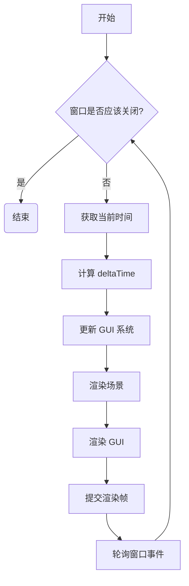

**代码逻辑梳理**

您的代码实现了一个基于 BGFX 图形库的游戏引擎框架，主要包含以下几个核心模块：

1. **应用程序 (Application):**
    *   `GameApplication` 是用户应用程序的入口点，负责初始化各个子系统（窗口、渲染器、GUI、资源管理器），并驱动主循环。
    *   `CoreApplication` 是 `GameApplication` 的基类 (目前未充分利用)。

2. **窗口系统 (Window):**
    *   `IWindow` 定义了窗口的抽象接口，包括创建、销毁、事件轮询等操作。
    *   `GLFWWindow` 是 `IWindow` 的具体实现，使用 GLFW 库来创建和管理窗口。

3. **渲染系统 (Renderer):**
    *   `IRenderer` 定义了渲染器的抽象接口，包括初始化、渲染、提交、设置纹理等。
    *   `BgfxRenderer` 是 `IRenderer` 的具体实现，使用 BGFX 图形库进行渲染。

4. **图形用户界面 (GUI):**
    *   `IGuiSystem` 定义了 GUI 系统的抽象接口。
    *   `BgfxGuiSystem` 是 `IGuiSystem` 的具体实现，使用 ImGui 库来渲染 GUI。

5. **资源管理 (Resource Management):**
    *   `ResourceManager` 负责加载、缓存、获取和卸载各种类型的资源。
    *   `Resource` 是所有资源的基类，定义了资源的通用属性和操作（加载、卸载）。
    *   `ResourceHandle` 是资源的句柄，用于引用资源。
    *   `ResourceType` 枚举定义了支持的资源类型。
    *   `TextureResource`、`ShaderResource` 等是具体资源类型的实现。

6. **工具类 (Tool):**
    *   `BgfxUtils` 提供了与 BGFX 相关的实用函数，例如加载纹理。
    *   `ShaderUniform` 管理着色器 uniform 变量。

7. **核心实用程序 (Core):**
    *   `Core.hpp` 定义了智能指针别名。
    *   `Config.hpp/cpp` 处理引擎配置。
    *   `Exception.hpp` 定义了自定义异常。
    *   `Logger.hpp/cpp` 实现了日志系统。

8. **数学库 (Math):**
    *   `Vector.hpp` 提供了向量相关的数学函数 (目前还不完善)。

9. **文件系统 (Filesystem):**
    *   `File.hpp`、`FileSystem.hpp`、`Path.hpp` 提供了文件系统操作相关的类。

**流程图**

以下是 `GameApplication` 的主循环流程图：



以下是资源加载的流程图：

```mermaid
graph TD
    A[请求加载资源 (路径)] --> B{ResourceManager 是否有该资源的缓存?};
    B -- 是 --> C{缓存中资源是否已加载?};
    C -- 是 --> H[返回缓存的资源];
    C -- 否 --> D[加载资源];
    B -- 否 --> E[根据路径创建 ResourceHandle];
    E --> F[根据资源类型创建对应的 Resource 对象];
    F --> D;
    D --> G{加载是否成功?};
    G -- 是 --> I[将 Resource 对象添加到缓存];
    I --> H;
    G -- 否 --> J[返回 nullptr];
    H --> K[返回资源];
```

**UML 类图**

```mermaid
classDiagram

    class GameApplication {
        -ScopePtr<IWindow> m_window
        -ScopePtr<IGuiSystem> m_guiSystem
        -ScopePtr<IRenderer> m_renderer
        -ScopePtr<EventHandler> m_eventHandler
        -ScopePtr<ResourceManager> m_resourceManager
        -entt::registry m_registry
        -float lastFrameTime
        +GameApplication(ScopePtr<IWindow>&&, ScopePtr<IRenderer>&&, ScopePtr<IGuiSystem>&&, ScopePtr<EventHandler>&&)
        +~GameApplication()
        +initialize()
        +run()
        +mainLoop()
        +shutdown()
        -update(float)
        -render()
        -createTestGui()
    }

    class CoreApplication {
        +CoreApplication(int, char**)
        +~CoreApplication()
        +run(bool)
        +hasBeenInterrupted : bool
        -init()
        -exit()
        -createWindow(uint16_t, uint16_t, const std::string&)
    }

    class IWindow {
        <<interface>>
        +WindowConfig
        +~IWindow()
        +create(const WindowConfig&)
        +destroy()
        +pollEvents()
        +shouldClose()
        +setEventHandler(ScopePtr<EventHandler>&&)
        +getNativeWindow()
    }
    
    class IWindow::WindowConfig {
        +std::string title
        +Vector2i resolution
        +bool resizable
        +bool maximized
        +bool fullScreen
    }

    class GLFWWindow {
        -GLFWwindow* m_window
        -ScopePtr<EventHandler> m_eventHandler
        +GLFWWindow()
        +~GLFWWindow()
        +create(const WindowConfig&)
        +destroy()
        +pollEvents()
        +shouldClose()
        +setEventHandler(ScopePtr<EventHandler>&&)
        +getNativeWindow()
    }

    class IRenderer {
        <<interface>>
        +~IRenderer()
        +init(Vector2i)
        +shutdown()
        +render()
        +frame()
        +getResolution()
        +setTexture(uint8_t, const ShaderUniform&, const ResourceHandle&)
        +submit(uint8_t, const ResourceHandle&)
    }

    class BgfxRenderer {
        -PosNormalTangentTexcoordVertex s_cubeVertices[24]
        -uint16_t s_cubeIndices[36]
        -IWindow* m_window
        -VertexBuffer m_vbh
        -IndexBuffer m_ibh
        -RefPtr<ResourceManager> m_resourceManager
        -Vector2i m_resolution
        +BgfxRenderer(IWindow*)
        +~BgfxRenderer()
        +init(Vector2i)
        +shutdown()
        +render()
        +frame()
        +getResolution()
        +setTexture(uint8_t, const ShaderUniform&, const ResourceHandle&)
        +submit(uint8_t, const ResourceHandle&)
    }
    
    class BgfxRenderer::PosNormalTangentTexcoordVertex {
        +float m_x
        +float m_y
        +float m_z
        +int16_t m_u
        +int16_t m_v
    }

    class IGuiSystem {
        <<interface>>
        +~IGuiSystem()
        +Initialize(int, int)
        +Shutdown()
        +Update(entt::registry&, float)
        +Render(entt::registry&)
    }

    class BgfxGuiSystem {
        -bgfx::VertexLayout m_layout
        +BgfxGuiSystem()
        +~BgfxGuiSystem()
        +Initialize(int, int)
        +Shutdown()
        +Update(entt::registry&, float)
        +Render(entt::registry&)
    }

    class ResourceManager {
        -std::unordered_map<ResourceHandle, RefPtr<Resource>> m_resources
        -std::unordered_map<ResourceType, RefPtr<Resource> (*)(const ResourceHandle&, const std::string&)> m_resourceFactories
        +ResourceManager()
        +~ResourceManager()
        +loadResource<T, Args...>(const std::string&, Args&&...)
        +getResource<T>(const ResourceHandle&)
        +unloadResource(const ResourceHandle&)
        +unloadAllResources()
        +registerResourceType(ResourceType, RefPtr<Resource> (*)(const ResourceHandle&, const std::string&))
    }

    class Resource {
        #ResourceHandle m_handle
        #std::string m_path
        #ResourceType m_type
        +Resource(const ResourceHandle&, const std::string&, ResourceType)
        +~Resource()
        +getHandle()
        +getPath()
        +getType()
        +isLoaded()
        +load()
        +unload()
    }

    class ResourceHandle {
        -uint64_t m_id
        +ResourceHandle()
        +ResourceHandle(uint64_t)
        +ResourceHandle(const std::string&)
        +getId()
        +isValid()
        +operator==()
        +operator!=()
        +operator<()
    }

    enum ResourceType {
        Unknown,
        Texture,
        Model,
        Shader,
        Sound
    }

    class TextureResource {
        -bgfx::TextureHandle m_textureHandle
        +TextureResource(const ResourceHandle&, const std::string&)
        +~TextureResource()
        +load()
        +unload()
        +isLoaded()
        +getTextureHandle()
    }

    class ShaderResource {
        -Shader m_shader
        +ShaderResource(const ResourceHandle&, const std::string&)
        +~ShaderResource()
        +load()
        +unload()
        +isLoaded()
        +getShader()
    }

    class Shader {
      -const std::string SHADER_PATH = "../resources/shaders/"
      -bgfx::ShaderHandle m_vertexShader = BGFX_INVALID_HANDLE
      -bgfx::ShaderHandle m_fragmentShader = BGFX_INVALID_HANDLE
      -bgfx::ProgramHandle m_program = BGFX_INVALID_HANDLE
      +Shader()
      +Shader(const std::string &name)
      +~Shader()
      +loadFromFile(const std::string &name)
      +loadShader(const std::string &path)
      +isValid()
      +getProgram()
    }

    class ShaderUniform {
        -const char *m_uniformName
        -bgfx::UniformHandle m_handle
        +ShaderUniform()
        +ShaderUniform(ShaderUniform &&other)
        +operator=(ShaderUniform &&other)
        +~ShaderUniform()
        +init(const char *uniformName, bgfx::UniformType::Enum type, uint16_t num = 1)
        +free()
        +setValue(float x, float y = 0.f, float z = 0.f, float w = 0.f)
        +setValue(const Color &color, bool needsRounding = false)
        +getHandle()
    }

    class VertexBuffer {
        -bgfx::VertexLayout m_layout;
        -bgfx::VertexBufferHandle m_handle = BGFX_INVALID_HANDLE;
        +VertexBuffer()
        +VertexBuffer(VertexBuffer&& other)
        +operator=(VertexBuffer&& other)
        +~VertexBuffer()
        +init(const void* data, uint32_t size)
        +init(const bgfx::VertexLayout& layout, const void* data, uint32_t size)
        +enable() const
        +free() const
        +getLayout()
        +handle()
    }
    
    class IndexBuffer {
        -bgfx::IndexBufferHandle m_handle = BGFX_INVALID_HANDLE;
        +IndexBuffer()
        +IndexBuffer(IndexBuffer&& other)
        +operator=(IndexBuffer&& other)
        +~IndexBuffer()
        +init(const void* data, uint32_t size)
        +enable() const
        +free() const
        +handle()
    }
    
    class EventHandler{
      +virtual void handleEvent(Event &event) = 0
    }

    GameApplication --|> CoreApplication
    GameApplication --> "1" IWindow
    GameApplication --> "1" IRenderer
    GameApplication --> "1" IGuiSystem
    GameApplication --> "1" EventHandler
    GameApplication --> "1" ResourceManager
    IWindow <|.. GLFWWindow
    IRenderer <|.. BgfxRenderer
    IGuiSystem <|.. BgfxGuiSystem
    ResourceManager --> "*" Resource
    Resource --> "1" ResourceHandle
    Resource --> "1" ResourceType
    TextureResource --|> Resource
    ShaderResource --|> Resource
    BgfxRenderer --> IWindow
    BgfxRenderer --> ResourceManager
    ShaderResource o-- Shader
    BgfxRenderer o-- IndexBuffer
    BgfxRenderer o-- VertexBuffer
    BgfxRenderer o-- ShaderUniform
    BgfxGuiSystem o--  "imgui"
    GLFWWindow o-- EventHandler
```

**说明:**

*   `--|>` 表示继承关系。
*   `-->` 表示关联关系 (一个类使用另一个类)。
*   `--*` 表示聚合关系 (一个类包含多个另一个类的实例)。
*   `--o` 表示组合关系.
*   `<<interface>>` 表示接口。
*   虚线箭头表示虚函数实现

**总结**

以上流程图和 UML 类图清晰地展示了您代码的逻辑和结构。您可以根据这些图表更好地理解各个组件之间的关系，并在此基础上进行修改和扩展。如果您有任何其他问题，请随时提出！
