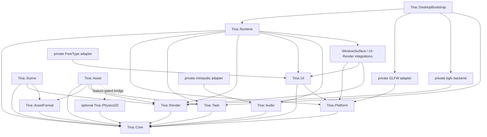

# Tina 当前架构

本文只描述当前源码与 CMake target。未来目标见 [vNext 目标架构](vnext-architecture.md)，任务优先级见
[Roadmap](roadmap.md) 与 [Backlog](backlog.md)。

## 产品边界

Tina 当前是 C++23 2D/3D 游戏 Runtime，产品入口为：

- `tina_sample_2d`：Catalog/TileMap/Scene/UI/Audio，可选 Physics2D、FreeType 和 miniaudio；
- `tina_sample_3d`：glTF cook、Catalog/Prefab、Scene extraction 与 bgfx 绘制；
- `tina_sample_null`：无窗口、无 GPU 的 Runtime 生命周期门禁；
- 其余 `tina_sample_*_infrastructure`：模块或 adapter 夹具，不等同于产品门禁。

Legacy `Tina.exe`、旧横版 2D 游戏和旧 UI 产品图已经删除。当前 retained UI 仍位于
`include/tina/ui` 与 `src/ui`；这两个目录属于 vNext 产品实现。

## 模块与依赖



虚线表示仅在 `TINA_BUILD_PHYSICS2D=ON` 时出现的可选边。实际 target 依赖以各模块
`CMakeLists.txt` 为准。

### 基础模块

| Target | 职责 | 关键边界 |
| --- | --- | --- |
| `tina_core` | Result/Status、ID、时间、文件与基础工具 | xxHash 仅 PRIVATE |
| `tina_platform` | 窗口/输入/生命周期的 backend-neutral 契约 | 不含 GLFW 类型 |
| `tina_task` | 有界 IO/CPU/Main 执行域与 `TaskGroup` | 禁止 detach/强杀 |
| `tina_render` | RenderDevice SPI、RenderScene、UI DisplayList、GPU 资源句柄 | 不含 bgfx 类型 |
| `tina_audio` | AudioEngine、voice/bus/command/completion | 不含 miniaudio 类型 |
| `tina_asset_format` | Cooked wire format 与 typed payload | Runtime 不读取源资产 |

### 产品模块

| Target | 职责 | 当前状态 |
| --- | --- | --- |
| `tina_runtime` | `EngineHost`、帧阶段、Input→Action、Runtime→UI、Render submit | 唯一正式主循环 |
| `tina_scene` | generation entity、Transform、2D/3D component 与 extraction | 当前不链接 EnTT/GLM |
| `tina_asset` | Catalog、AssetSystem、Handle/Lease、Cooker、upload/retirement | cgltf/stb_image 只在 Cooker TU |
| `tina_ui` | retained tree、layout/hit/route/paint/semantics、Widget、文本/Glyph | 当前产品 UI 位于 `src/ui` |
| `tina_physics2d` | Box2D 3.x 的 Tina-owned 生命周期与查询边界 | 可选，Box2D PRIVATE |

### 私有 adapter 与组合

| Target | 职责 |
| --- | --- |
| `tina_platform_glfw` | GLFW `NO_API` 窗口、输入、WindowSurface lease；GLFW PRIVATE |
| `tina_render_bgfx` | bgfx surface、2D/3D/UI pass 与 GPU resource；bgfx/bx PRIVATE |
| `tina_ui_freetype` | FreeType 文本 rasterizer；FreeType PRIVATE |
| `tina_audio_miniaudio` | miniaudio device/mix adapter；可选 Vorbis/Opus |
| `tina_window_surface_integration` | Platform 与 Render 之间的 native surface handoff |
| `tina_ui_render_integration` | committed UI paint 到 Render DisplayList 的窄桥 |
| `tina_bootstrap_desktop` | 注入 GLFW/bgfx/Task/可选字体的普通桌面组合入口 |

## 所有权

- `EngineHost` 是唯一非全局组合根；不新增 Singleton 或 Service Locator。
- `IGameApplication` 只负责 startup/shutdown，并创建首个 `IGameState`。
- `IGameState` 是 fixed update、frame update、Scene extraction 和 UI update 的帧行为入口。
- Platform、Task、Render、Audio backend 由 bootstrap factory 创建，初始化失败必须逆序回滚。
- 主窗口 `UIContext` 由 Runtime 私有持有；游戏只拿 root/phase-scoped facade，不拿裸指针。
- `AssetHandle` 是弱 generation lookup，`AssetLease` 跨异步/帧边界强保活。
- WindowSurface 使用 move-only lease；Render submit 的 Scene/UI view 只在调用期间借用。

## 启动事务

```text
validate EngineConfig
  -> create Clock / Platform / Task / Render / Audio
  -> query initial primary-window metrics
  -> bind primary UIContext (or explicit Headless)
  -> IGameApplication::createInitialState
  -> IGameState::onEnter through scoped UI capability
  -> commit startup UI snapshots
  -> publish Running state
```

任何步骤失败都不能发布半初始化 Host、State 或 UI snapshot。模块关闭顺序为 UI/Runtime 私有状态先退场，
再关闭 Audio、Render、Task、Platform 与 diagnostics；Task 必须 join 后才能释放其访问的 owner。

## 每帧数据流

```text
Platform::pollFrame
  -> validate WindowSurface + monotonic timing
  -> dispatch Platform lifecycle events
  -> route UI input against previous committed hit snapshot
  -> ActionMapper consumes UI consumption/claims
  -> 0..N fixedUpdate ticks
  -> updateFrame
  -> Audio completion pump
  -> extractRenderScene + commit RenderScene
  -> updateUI through phase-scoped facade
  -> commit UI structure/layout/hit/paint/semantics
  -> build UI DisplayList + expose Glyph atlas page
  -> RenderDevice::submitFrame
  -> present when surface is active
  -> latch presented Camera2D for next-frame world picking
```

输入 transition、UI route 和 Gameplay Action 是三层数据。UI consumption/claim 必须在
`ActionMapper` 前发布，避免一次点击同时激活 UI 和世界操作。UI route 读取上一份 committed hit snapshot；
本帧 `updateUI` 的布局在 Render 前提交，下一帧才参与输入命中。

## Asset 与 Render 数据流

```text
source asset
  -> tina_assetc / cgltf Cooker
  -> versioned Cooked objects + manifest.tmnft
  -> CatalogSnapshot
  -> AssetSystem request/load/pump
  -> AssetHandle / AssetLease
  -> typed payload parse
  -> GPU upload and backend-neutral binding key
  -> Scene extraction
  -> RenderFrame submit
  -> completion / retirement ledger
```

multi-mesh glTF cooking 已能为每个 mesh 生成独立 StaticMesh/Material，并由 Prefab 依赖 AssetId；当前
`tina_sample_3d` 仍只把单个 product mesh 映射到 backend key，因此不能把 Cooker 单测扩写成完整
multi-mesh 产品 E2E。相对文件或 bufferView 的 baseColorTexture 已可 cook 为 RGBA8 Texture2D 并成为
Material dependency；纹理产品绑定、安全 URI/size policy、PBR 和 multi-primitive merge 仍未完成。

## 当前 UI 边界

当前 Widget 包括 `Root`、`Panel`、`Label`、`Button`、`Checkbox`、`Slider`、`ProgressBar`、
`RadioButton` 和单行 `TextEdit`。文本使用严格 UTF-8；MSVC target 强制 `/utf-8`。可选 FreeType
负责 rasterization，UI/Render 通过 R8 Glyph atlas 与后端无关 DisplayList 连接。

ProgressBar 是非交互的 determinate range/value 控件；RadioButton 按直接父节点形成互斥组；TextEdit
按 Unicode scalar 保存 selection/caret，并支持 committed text 与 IME preedit 首切片。通用 Focus Scope、
Modal、持久 Pointer Capture、多行编辑、复杂 shaping、虚拟列表和平台 accessibility adapter 尚未完成。

## Legacy 与剩余扫尾

产品级 Legacy 删除与 CLEAN-001～003 扫尾已完成：

- vcpkg `legacy` feature 已移除；
- 无消费者 EASTL `StringUtils` 与 Clock/FrameTimer compatibility 已删除；
- miniaudio 实现注释与 FATAL 文案不再暗示 Legacy ON 可运行；
- `TINA_BUILD_LEGACY=ON` 仍为永久 FATAL 拒绝开关。

剩余跨平台证据与扩展能力见 [Backlog](backlog.md)（如 TEST-001 Linux 复验）。不得误删当前
`src/ui` 或其他 vNext 模块。

## 架构不变量

1. 公共边界使用 Tina-owned 类型与 `Result`/`Status`。
2. Game SDK 不暴露 RenderDevice、native handle 或第三方 token。
3. 具体 backend 只通过 factory/bootstrap 注入。
4. 每个有界队列、Arena、snapshot 和 packet 都有容量失败路径，不做隐式 heap fallback。
5. 资源逻辑失效与物理释放分离，异步使用必须有 Lease/Ticket/pin。
6. 测试直接运行 GoogleTest executable；样例 exit 0 与视觉证据分开记录。
7. Accepted ADR 的改变必须通过新 ADR supersede，不能只改主题文档。
