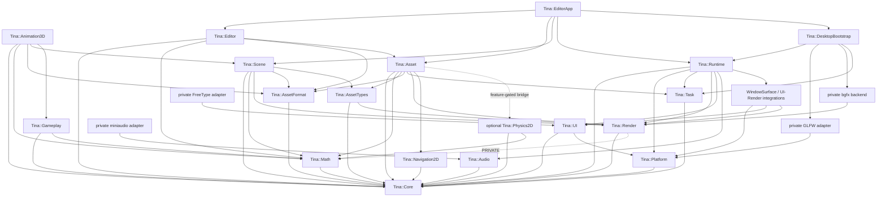

# Tina 当前架构

本文只描述当前源码与 CMake target。未来目标见 [vNext 目标架构](vnext-architecture.md)，任务优先级见
[Roadmap](roadmap.md) 与 [Backlog](backlog.md)。

## 产品边界

Tina 当前是 C++23 2D/3D 游戏 Runtime，产品入口为：

- `tina_sample_2d`：Catalog/TileMap/Navigation2D/Scene/UI/Audio，可选 Physics2D、FreeType 和 miniaudio；
- `tina_sample_3d`：glTF cook、Catalog/Prefab、Scene extraction 与 bgfx 绘制；
- `TinaEditor.exe`（target `tina_editor_desktop`）：独立 `Tina::EditorApp` 的 World2D/World3D/TileMap/
  SpriteAnimationClip canonical document、独立 path/baseline/dirty workspace session、TRS Inspector、viewport gizmo、
  Tile brush/layer/cook preview、SpriteAnimation timeline、Catalog Project Browser、固定容量且独立拥有
  authoring document/history 的 document tabs、
  资源 Inspector、Runtime preview 与 Catalog-resolved 2D/3D GPU viewport；
- `tina_sample_null`：无窗口、无 GPU 的 Runtime 生命周期门禁；
- 其余 `tina_sample_*_infrastructure`：模块或 adapter 夹具，不等同于产品门禁。

Legacy `Tina.exe`、旧横版 2D 游戏和旧 UI 产品图已经删除。当前 retained UI 仍位于
`include/tina/ui` 与 `src/ui`；这两个目录属于 vNext 产品实现。

## 模块与依赖



虚线表示仅在 `TINA_BUILD_PHYSICS2D=ON` 时出现的可选边。实际 target 依赖以各模块
`CMakeLists.txt` 为准。

### 基础模块

| Target | 职责 | 关键边界 |
| --- | --- | --- |
| `tina_core` | Result/Status、ID、时间、文件、日志/Trace 与 opt-in 最后故障报告 | xxHash、Windows DbgHelp 仅 PRIVATE；`EngineHost` 不隐式安装进程 handler |
| `tina_math` | 引擎唯一的 `Vec2/3/4`、`Quaternion`、列主序 `Mat4`、`Aabb2/3`、`Rect`、`Sphere`、`Plane`、`Ray`、`Frustum` 与几何查询 | header-only INTERFACE；只依赖 Core；不占 `ErrorDomain`/`MemoryTag`，查询失败返回 `optional`/`bool`（见 [Math](math.md)、[ADR 0035](adr/0035-math-module-boundaries.md)） |
| `tina_platform` | 窗口/输入/生命周期的 backend-neutral 契约 | 不含 GLFW 类型 |
| `tina_task` | 有界 IO/CPU/Main 执行域与 `TaskGroup` | 禁止 detach/强杀 |
| `tina_animation3d` | `Skeleton3D`/`Pose3D`/`JointMask`、pose 混合、`ClipSampler3D`、`BlendTree3D`、`AnimationGraph3D`、两骨 IK | pose 为 joint-local；不链接 Asset（只消费 payload view）也不链接 Render（palette 写进调用方 span）；建在 `Animator3D` 旁而非替代它（见 [3D 动画图](animation-3d.md)、[ADR 0037](adr/0037-animation3d-graph-boundaries.md)） |
| `tina_gameplay` | `Scheduler`/timer、`Action`/`ActionRunner` tween 与组合子、28 条 `Easing`、scoped `Signal<T>` | 只依赖 Core+Math，不知道 Scene/Asset/Physics/UI；delta 由调用方给，dispatch 重入返回 `ReentrantDispatch`（见 [Gameplay 工具层](gameplay-tooling.md)、[ADR 0036](adr/0036-gameplay-tooling-boundaries.md)） |
| `tina_render` | RenderDevice SPI、RenderScene、UI DisplayList、GPU 资源句柄 | 不含 bgfx 类型 |
| `tina_audio` | AudioEngine、voice/bus/command/completion | 不含 miniaudio 类型 |
| `tina_asset_format` | Cooked wire format 与 typed payload | Runtime 不读取源资产 |
| `tina_navigation2d` | immutable weighted grid、generation dynamic blocker、确定性四向/对角同步与分步 A* | 只依赖 Core；不创建线程，不进入 Scene World |

### 产品模块

| Target | 职责 | 当前状态 |
| --- | --- | --- |
| `tina_runtime` | `EngineHost`、帧阶段、Input→Action、Runtime→UI、Render submit | 唯一正式主循环 |
| `tina_asset_types` | `AssetHandle` 弱 generation identity、borrowed frame-resource resolver | header-only；只传递 Core/Render，不传递完整 Asset/Task/Physics |
| `tina_scene` | generation entity、Transform、封闭 typed read view、runtime metadata、2D/3D component/extraction 与 allocation-free `CameraFollow2D` | 仅通过 AssetTypes 引用弱 Handle；当前不链接 EnTT/GLM |
| `tina_asset` | Catalog、AssetSystem、Handle/Lease、Cooker、upload/retirement、Sprite2D/Mesh3D binding registry | cgltf/stb_image 只在 Cooker TU；两类 registry 都借用 AssetSystem/device，并唯一拥有各自 resident Lease/GPU/binding |
| `tina_ui` | retained Element tree、layout/hit/route/paint/semantics、文本/Glyph、accessibility action | 当前产品 UI 位于 `src/ui`；UI-004/UI-005 已完成，框架演进见 [UI 框架设计](ui-framework.md) |
| `tina_physics2d` | Box/Circle/Capsule/ConvexPolygon、Distance/Revolute/Prismatic 与查询边界 | 可选，Box2D 3.x PRIVATE |
| `tina_save` | 存档 slot 的原子写入/读取与 `SaveMigrationPipeline` schema 迁移 | 只依赖 Core+Task；进 `Tina::GameSDK` 聚合 |
| `tina_network` | backend-neutral 传输：UDP/TCP、`IByteStream`、HTTP/1.1、WebSocket、DNS | 只依赖 Core+Task；不含 socket 平台类型（Windows `ws2_32` PRIVATE）；DNS 是模块内唯一用 worker 的部分。见 [Network](network.md)、[ADR 0033](adr/0033-network-module-boundaries.md) |
| `tina_gameplay2d` | Scene 与 Physics2D 之间唯一的 2D 玩法桥 | 可选，仅在 `TINA_BUILD_PHYSICS2D` 时存在；单向权威，层级决定 shape 归属 |

### 工具模块（`editor/`，引擎之上）

这些 target 位于 `src/` 之外，因为它们**消费**引擎而不是构成引擎，因而允许依赖产品模块。
由 `TINA_BUILD_EDITOR` 控制（默认 `PROJECT_IS_TOP_LEVEL`），不属于 `Tina::GameSDK`
聚合，也不进 SDK 包。理由见 [ADR 0041](adr/0041-editor-module-boundaries.md)。

| Target | 职责 | 关键边界 |
| --- | --- | --- |
| `tina_editor` | current-schema authoring documents、Project Asset index 与 document-tab navigation state | 依赖 Core/Math/AssetFormat/**Asset**（`Navigation2DAuthoringDocument.hpp` 公开 include `tina/asset/CatalogCook.hpp`）；owner move-only，不依赖 UI/Runtime/Scene |
| `tina_editor_app` | `TinaEditor.exe` 的 UI 组合、Inspector、文件对话框、source import 编排 | 依赖 DesktopBootstrap/Asset/Editor/Runtime/Scene，全部 PRIVATE；公开面只有 `EditorApplication.hpp` |

### 私有 adapter 与组合

| Target | 职责 |
| --- | --- |
| `tina_platform_glfw` | GLFW `NO_API` 窗口、输入、WindowSurface lease；GLFW PRIVATE |
| `tina_render_bgfx` | bgfx surface、2D/3D/UI pass 与 GPU resource；bgfx/bx PRIVATE |
| `tina_ui_freetype` | FreeType 文本 rasterizer；FreeType PRIVATE |
| `tina_ui_uia` | Windows UIA 无障碍私有 adapter（可选，`TINA_BUILD_UI_UIA`）；COM PRIVATE |
| `tina_audio_miniaudio` | miniaudio device/mix adapter；可选 Vorbis/Opus |
| `tina_window_surface_integration` | Platform 与 Render 之间的 native surface handoff |
| `tina_ui_render_integration` | committed UI paint 到 Render DisplayList 的窄桥 |
| `tina_network_tls` | mbedTLS TLS 传输 adapter（可选，`TINA_BUILD_NETWORK_TLS`）；PUBLIC 只有 `Tina::Network`，mbedTLS 三个库全部 PRIVATE |
| `tina_trace_tracy` | Tracy 客户端 trace 后端（可选，`TINA_TRACE_BACKEND=tracy`）；`Tracy::TracyClient` PRIVATE，引擎 `include/` 只作私有 include |
| `tina_bootstrap_desktop` | 注入 GLFW/bgfx/Task/可选字体的普通桌面组合入口 |

## 所有权

- `EngineHost` 是唯一非全局组合根；不新增 Singleton 或 Service Locator。
- `IGameApplication` 只负责 startup/shutdown，并创建首个 `IGameState`。
- `IGameState` 是 fixed update、frame update、Scene extraction 和 UI update 的帧行为入口。
- Platform、Task、Render、Audio backend 由 bootstrap factory 创建，初始化失败必须逆序回滚。
- 主窗口 `UIContext` 由 Runtime 私有持有；游戏只拿 root/phase-scoped facade，不拿裸指针。
- `AssetHandle` 是弱 generation lookup，`AssetLease` 跨异步/帧边界强保活。
- `NavigationGrid2D`/`NavigationPathfinder2D` 由产品 State/Resources owner 持有；Pending query 只借用开始时
  同一 Grid 地址与 revision，Grid move/mutation 会使后续 `advance()` 确定性 `Invalidated`。
- `Sprite2DBindingRegistry` 是固定容量 owner-thread owner，借用 `AssetSystem`/`IRenderDevice`；每个 Entry
  唯一拥有 resident `AssetLease`、`GpuTextureId` 与 binding，并直接 handoff 到 AssetSystem retirement。
- `Mesh3DBindingRegistry` 是固定容量 owner-thread owner，借用 `AssetSystem`/`IRenderDevice`；Mesh entry
  唯一拥有 Lease/GPU/binding，Material entry 拥有 Lease/binding，共享 Texture entry 按 AssetId 去重并拥有
  Lease/GPU；retirement 失败保留 Entry 供重试。
- WindowSurface 使用 move-only lease；Render submit 的 Scene/UI view 只在调用期间借用。

## 启动事务

`EngineHost::Create` 先校验配置并创建模块（Clock / Platform / Task / Render / 可选 Audio 等），失败逆序
回滚。`run()` 内提交游戏的顺序与 `src/runtime/EngineHost.cpp` 一致：

```text
IGameApplication::createInitialState
  -> initialPrimaryWindowMetrics
  -> bind primary UIContext (or explicit Headless)
  -> IGameState::onEnter through scoped UI capability
  -> sample initialPolicy + pushCommitted onto GameStateStack
  -> commit startup UI layout/hit (and optional a11y publish)
  -> publish Running → frame loop
```

任何步骤失败都不能发布半初始化 Host、State 或 UI snapshot。模块关闭顺序为 UI/Runtime 私有状态先退场，
再关闭 Audio、Render、Task、Platform 与 diagnostics；Task 必须 join 后才能释放其访问的 owner。

## 故障诊断边界

`Tina::Core::Diagnostics::installCrashHandler()` 是进程级、opt-in 的最后兜底，不属于 Engine-owned
`Diagnostics` channel，也不把 fatal failure 变成可恢复错误。调用方应在 `main()` / `wWinMain()` 最早期安装；
`EngineHost` 与 `Desktop::CreateEngine()` 不替应用决定进程策略。当前 `TinaEditor.exe` 已安装该 handler，并把
`std::terminate`、`SIGABRT` 以及 Windows fatal SEH/purecall/invalid-parameter 的首份 best-effort 报告写到
stderr 和 `%TEMP%/tina_editor_crash.txt`。顶层可表示的 fatal `Core::Error` 也追加到同一文件；机器可读尾部分别使用
`status=crash` 与 `status=fatal`。

handler 使用固定存储并只完整报告第一次并发/级联故障；Windows backtrace 通过私有 DbgHelp 尽力解析，其他平台
当前不提供符号栈。它不是 minidump、CrashContext、跨平台 signal recovery 或“崩溃后继续运行”协议，进程损坏时
报告本身仍可能不完整。

## 每帧数据流

```text
Platform::pollFrame
  -> validate WindowSurface + monotonic timing
  -> dispatch Platform lifecycle events
  -> route UI input against previous committed hit snapshot
  -> ActionMapper consumes UI consumption/claims
  -> 0..N fixedUpdate ticks (stack top-down; policy may cut below)
  -> updateFrame (stack top-down; only top queues stack commands)
  -> commitPendingGameStateCommands (push/pop/replace/policy)
  -> Audio completion pump
  -> extractRenderScene + commit RenderScene (stack top-down)
  -> updateUI through phase-scoped facade (stack top-down)
  -> commit UI structure/layout/hit/paint/semantics
  -> build UI DisplayList + expose Glyph atlas page
  -> RenderDevice::submitFrame (+ FramePin / CPU submission ledger)
  -> present when surface is active, then close CPU submission ownership
  -> latch presented Camera2D for next-frame world picking
```

输入 transition、UI route 和 Gameplay Action 是三层数据。UI consumption/claim 必须在
`ActionMapper` 前发布，避免一次点击同时激活 UI 和世界操作。UI route 读取上一份 committed hit snapshot；
本帧 `updateUI` 的布局在 Render 前提交，下一帧才参与输入命中。

`GameStatePolicy` 两套语义（详见 [Runtime](runtime.md)）：

- `blocksFixedUpdateBelow` / `blocksFrameUpdateBelow` / `blocksRenderBelow` / `blocksUIUpdateBelow`：
  截断该相位向更下层的回调（`blocksUIUpdateBelow` **不**挡当帧 UI route）。
- `blocksGameplayInputBelow`：不截断 `fixedUpdate`/`updateFrame` 回调，但下层收到空 suppressed
  Action snapshot。

## Asset 与 Render 数据流

```text
source asset
  -> tina_assetc / cgltf Cooker
  -> versioned Cooked objects + manifest.tmnft
  -> CatalogSnapshot
  -> AssetSystem request/load/pump
  -> AssetHandle / AssetLease
  -> typed payload parse
  -> GPU upload
  -> fixed-capacity Sprite2D/Mesh3D registry validates Handle + GPU resource/dependency bundle
       Sprite2D: imported Texture2D resolves directly; authored Sprite resolves its required Texture2D
  -> RenderDevice instance allocator binds and returns monotonic non-reused keys
  -> Scene World/Particle/Trail/TileMap/3D MeshRenderer weak AssetHandle
  -> borrowed resolver asks registry for the current binding
       2D: intern packet-local Texture2D ref + owning entry borrow pin
       3D: intern packet-local Mesh3DGeometry/Material refs + owning entry borrow pins
  -> RenderFrame submit + present-return CPU frame completion
  -> registry retirement
       Sprite/Mesh/Texture: hand Entry Lease/GPU to AssetSystem; backend atomically clears bindings
       Material: clear atomic bundle, logical unload Lease, decrement shared Texture references
  -> backend-specific GPU resource retirement
```

multi-mesh / multi-primitive glTF cooking 为每个 TRIANGLES prim 生成独立 StaticMesh/Material，并由
Prefab 依赖 AssetId（多 prim 展开父+子节点）。`tina_sample_3d` 把 Cooked owner 发布到 Resources-owned
`AssetStore`；Prefab 按 AssetId 写入 weak mesh/material handle，Scene extraction 再分别解析 packet-local ref，
覆盖 multi-mesh cook -> upload/bind -> Prefab resolve -> extract/draw 的产品 E2E。相对文件或
bufferView 的 baseColor/MR/normal 贴图可 cook 为 RGBA8 Texture2D 并成为 Material dependency；产品路径
完成外部 URI/size policy、GPU binding 与 Cook-Torrance GGX metallic-roughness shading（material factors、
`Mesh3DLightingDesc` 有界0..4 directional + 0..8 point + 0..8 spot lights）。`DirectionalLight3D`/
`PointLight3D`/`SpotLight3D` 由 World 拥有，并在每帧 Scene extraction 中按稳定 Entity identity 复制为
self-contained RenderScene snapshot；PointLight3D/SpotLight3D influence sphere 在各自8灯容量检查前按 active
PerspectiveCamera3D frustum cull，spot light 额外提交 world local `-Z` 出光方向与 inner/outer cone cosine。
product-3d 从 primary-window metrics 取得实时 framebuffer extent，因此相机 aspect、light frustum 与 bgfx view rect
使用同一 surface；UI 则按 logical extent 以 right/end/stretch 约束重排，不按 client 尺寸全局缩放。产品
EnvironmentMap cooked asset 绑定 diffuse irradiance/specular prefilter cubemap 与 BRDF LUT，并由统一
`GpuEnvironmentMapId` 负责 create/validate/bind/clear/retire；固定4级联 directional CSM、单 SpotLight shadow、
单 PointLight 六面全向 shadow、startup-only shadow extent 与 deterministic pass scheduler 已完成；通用 GPU submission fence 仍未完成。Frame packet 的 FramePin 只覆盖同步
submit/present 的 CPU 借用期；Texture/Mesh/EnvironmentMap 则使用独立 readback completion marker。
Texture/Mesh retirement 同时保留 AssetLease，EnvironmentMap 由产品显式 GPU owner 负责；两类 GPU retirement
都不能用 CPU FramePin 作为完成证据。

2D World 的 `SpriteRenderer2D` 保存 copyable weak Sprite handle 与 optional weak normal Texture2D handle，
standalone `ParticleSystem2D`/`Trail2D` 只保存 weak Sprite `AssetHandle`；TileMap emit 保存 weak Tileset
`AssetHandle`；3D `MeshRenderer3D` 保存 weak StaticMesh/
Material handle。通用 allocation-free `AssetFrameResourceResolver` 位于窄 `AssetTypes` 边界；2D Scene
与3D mesh/material extraction 都直接使用该通用类型；所有路径都只在当前调用借用 resolver 与
`FrameResourceSink`，不再保留按渲染用途重命名的迁移 alias。
产品 2D base resolver 薄调用 `Sprite2DBindingRegistry::internSpriteFrameResource()/internTilesetFrameResource()`；
前者允许一步导入的 Texture2D 直接作为 Sprite2D source，也保留 authored Sprite→required Texture2D wrapper 路径，
normal resolver 则用同一 registry 的 Texture2D frame-resource seam 独立 intern normal binding；
3D resolver 调用 `Mesh3DBindingRegistry::internMeshFrameResource()/internMaterialFrameResource()`。registry
在 Asset owner thread 验证 Handle kind、CPU payload、Cooked Texture2D dependency 与 live binding，再把
binding intern 为 packet-local ref，让 resource pin 覆盖 submit/present CPU 借用期。device 只有在 backend
bind 成功后才消费候选 key，因此共享同一 device 的多个 registry 不会碰撞。allocator-managed registry
存活期间不得混入对应 caller-chosen key setter。

Scene/TileMap emit 都不保存 resolver、AssetSystem、AssetLease、Cooked payload 或 GPU handle。空 FX 不解析：
Trail 每次非空 extract 解析一次，Particle 按 live item 解析；TileMap hidden/off-camera/empty 不解析，非空
可见集合每次 emit 只解析一次。缺 resolver 或空/stale/cross-store/wrong-kind/unbound handle 映射为空 ref时
分别 fail closed 为 Scene `UnresolvedSprite` 或 Asset `SpriteBindingNotFound`，TileMap 失败清空输出。
N16.3 后 Sprite registry Entry 是 2D resident Lease/GPU/binding 的唯一 owner；N16.4 后 Mesh registry 同样
统一 Mesh Lease/GPU/binding、Material Lease/binding 与共享 Texture Lease/GPU owner。State teardown 只请求
registry retirement；backend 接受 Mesh/Texture 后原子失效 generation 与引用 binding，AssetSystem completion
pin 再释放 Lease。2D 与 3D Scene/Render item 的持久 binding key、产品手写 key table 和调用方 registered/GPU
cleanup 账簿都已删除。`ASSET-HANDLE-SCENE` 的 A1-A6 与 N16.1-N16.4 已完成。

产品 2D 导航不进入 `Scene::World`。`Asset::buildTileMapNavigation2DData()` 从当前 resident
`TileMapInstance` 的显式 solid tile layer、property-tagged visible Rectangle object 与 exact material-cost rule
生成唯一当前 immutable grid 数据；引用 chunk 未驻留、layer/object/rule 非法时原子失败。State 再创建固定容量
`NavigationGrid2D` 与 `NavigationPathfinder2D`，动态 blocker 以 owner-aware generation ID 和 per-cell 引用计数
叠加；四向/对角 A* 按目标格 traversal multiplier 计算 `10/14 × cost`，用 minimum-scaled
Manhattan/octile heuristic 并以 `f -> heuristic -> row-major index` 稳定决胜。同步 `findPath()` 与
分步 `begin()/advance()/cancel()` 共用同一 storage，`Reached/Unreachable/Cancelled/Invalidated` 均为明确结果。
当前没有独立 Cooked Navigation `AssetKind`、自动 Physics 同步或内部 worker。完整契约见
[2D 导航](navigation2d.md)。

`Scene::CameraFollow2D` 是独立于 `World::Camera2D` projection component 的 owner-thread controller；它以
dead zone、可选速度、viewport/world bounds 更新 previous/current simulation center，presentation extraction
只借用插值结果。它不拥有 Entity、World 或 Render backend。

## 当前 UI 边界

当前内建 Element kind 包括 `Root`、`Panel`、`Modal`、`Label`、`Button`、`Checkbox`、`Slider`、`ProgressBar`、
`RadioButton`、`TextEdit`（默认单行；可通过 `UITextEditMultilineConfig` 启用多行）、`ScrollView`、
`Dropdown`/`Popup`/`DropdownItem`，以及虚拟化 `ListView`/`TreeView`。UI-004 的 Focus Scope、显式 focus、
Modal barrier/焦点恢复与持久 Pointer Capture 已经完成；UI-005 的滚动、弹出组合控件与固定 row pool
集合控件也已经完成。

业务扩展当前以 Element 组合为主：第三方可组合 retained 子树、布局、Semantics、StyleRole/局部 paint、
Image/Icon content、Canvas Image/NineSlice 与现有 callback，并可在首个 retained node 前注册 StyleClass/
ColorToken、安装 node-local literal 或 token-backed BoxFill stylesheet，并可使用运行期 ColorToken 更新与
fixed-capacity direct/timeline Motion；但不能注册 Widget subclass、新 Behavior、通用 selector 或 GPU paint
callback。图片 retained tree 只保存
AssetId/geometry/tint/sampling metadata；
Runtime root-scoped resolver 在 frame packet 构建时按 `(root, AssetId)` 去重并通过通用 Texture2D ref + pin
交付 RGBA ImageQuad，NineSlice 在 committed paint 中原子展开1..9个相同 command。Button 默认仍即时切换
hover/pressed/focus/disabled 反馈，也可通过既有 paint-only transition/timeline 产生时间插值；`makeSliderElement()` 的
Focusable/Focus semantics 已与私有 keyboard-focus trait 对齐，Slider 可参与 Tab/空间导航与显式焦点；
`UI-STATE-FEEDBACK` 的 Dark/Light 产品视觉证据已完成。RangeInput 通过独立 capability command 在 focused
Slider 上消费 Arrow/D-pad 调值，不复用通用空间焦点状态机。Image、Component 与
StyleClass/pseudo-state、ColorToken reverse-dependency 运行期更新、stylesheet imageTint、paint-only transition
与 typed keyframe timeline 的产品/性能/契约切片均已落地。Timeline 源码还支持 bounded
`LayoutWidth`/`LayoutHeight`/`LayoutOffset`，由唯一 commit pipeline 从同一 sample 原子发布 Layout/Hit/Paint/
Semantics；更广 Style 属性面、layout property 与高级 playback 仍未开放，具体取舍见
[UI 框架设计](ui-framework.md)。

文本使用严格 UTF-8；MSVC target 强制 `/utf-8`。可选 FreeType 负责 rasterization，UI/Render 通过 R8
Glyph atlas 与后端无关 DisplayList 连接。ProgressBar 是非交互的 determinate range/value 控件；
RadioButton 按直接父节点形成互斥组。TextEdit 默认单行；启用 `UITextEditMultilineConfig` 后支持 LF、soft-wrap、
固定容量 visual rows、垂直滚动、二维 hit-test 与 Up/Down/Home/End。selection/caret 仍以 Unicode scalar
offset 存储，但编辑、删除、导航和生成的位置会对齐无第三方依赖的 UAX #29 grapheme 子集。
Windows GLFW 已把 committed caret 的 logical geometry 转为 DPI-scaled client pixels，并接入 IMM32
candidate/composition placement；失焦、隐藏、最小化或无效几何会清除提示并恢复 IMM32 默认策略。
BiDi/复杂 shaping、Linux 原生 XIM/Wayland preedit/candidate placement，以及 Windows 真机 IME 跟随候选窗的
人工金标仍由 `TEXT-001` 跟踪。

后端无关 `UIAccessibilityAction` seam 已支持 Focus、Invoke、Toggle、SetRangeValue 与 SetTextValue，
并在 owner thread 保留正常控件 callback/事务语义。可选 Windows UIA 私有 adapter 与 Host HWND 桥接
已把 Button/Checkbox/Slider/TextEdit 等映射到 Invoke/Toggle/RangeValue/Value patterns；Narrator/Inspect
人工金标仍由 UI-002 跟踪，Linux AT-SPI 已拆为 UI-002-LINUX。现有跨进程 HWND action gate 不替代
真实 screen reader/辅助技术验收。

当前回归还覆盖 50,000 节点深树的非递归 structure commit/destroy、layout、hit 与 paint publication；
Popup 子树归属在 layout traversal 中缓存，避免 publication 逐节点回溯祖先，使该发布步骤保持线性。
这项事实不等同于完整 dirty-range pruning 或固定机性能 hard gate。

UI Layout Debugger 是同一 `UIContext` 的可选 fixed-capacity diagnostics capability，在 Debug/Release 中始终
编译。成功 layout publication 原子替换 authored/resolved style、测量、geometry、clip、interaction metadata
双缓冲；失败保留上一份 snapshot。Runtime 只通过 `UIUpdateContext` phase facade 读取/设置 options、借用
snapshot，并复用 committed pointer-hit query。可视 outline 在 UI→Render integration 中 frame-local 追加，
不进入 retained tree、hit、Semantics 或 committed paint；Editor 通过 excluded subtree 排除 DevTools 自身。

## Legacy 与剩余扫尾

产品级 Legacy 删除与 CLEAN-001～004 扫尾已完成：

- vcpkg `legacy` feature 已移除；
- 无消费者 EASTL `StringUtils` 与 Clock/FrameTimer compatibility 已删除；
- miniaudio 实现注释与 FATAL 文案不再暗示 Legacy ON 可运行；
- A1 Sprite resolver/2D sample target alias、Core 私有转发头、assetc 旧参数、重复 GCC13 host wrapper 与
  Opaque3D unlit 死 fallback 已删除；
- `TINA_BUILD_LEGACY=ON` 仍为永久 FATAL 拒绝开关。

剩余跨平台证据与扩展能力见 [Backlog](backlog.md)（如 UI-002 的外部读屏证据、UI-002-LINUX 的
AT-SPI adapter 与 UI-003 的 OS 级 DPI/跨 GPU 矩阵）；TEST-001 Linux tip 复验已经完成。不得误删当前
`src/ui` 或其他 vNext 模块。

## 架构不变量

1. 公共边界使用 Tina-owned 类型与 `Result`/`Status`。
2. Game SDK 不暴露 RenderDevice、native handle 或第三方 token。
3. 具体 backend 只通过 factory/bootstrap 注入。
4. 每个有界队列、Arena、snapshot 和 packet 都有容量失败路径，不做隐式 heap fallback。
5. 资源逻辑失效与物理释放分离，异步使用必须有 Lease/Ticket/pin。
6. 测试直接运行 GoogleTest executable；样例 exit 0 与视觉证据分开记录。
7. Accepted ADR 的改变必须通过新 ADR supersede，不能只改主题文档。
