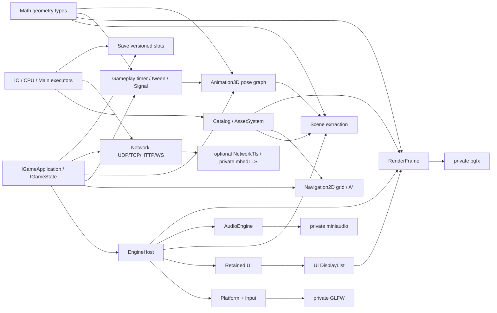

# Tina 设计导读

Tina 的设计目标不是“功能最多”，而是让游戏 Runtime 的模块边界、帧顺序和资源生命周期可以验证。
当前产品以 vNext Desktop 与 `tina_sample_2d` / `tina_sample_3d` 为准，Legacy 产品图已经退役。

## 设计原则

1. `EngineHost` 是唯一非全局组合根，模块通过明确接口和 factory 连接。
2. `IGameApplication` 管程序生命周期；`IGameState` 是唯一帧行为入口。
3. Game SDK 和公共头只暴露 Tina-owned 类型，具体 backend 保持私有。
4. 热路径结构有界、容量失败显式、稳态避免 Tina-owned 动态分配。
5. 异步取消只改变逻辑状态；物理释放等待 Lease、Ticket、completion 或 retirement 条件。
6. 源资产只在 Cooker 读取，Runtime 只消费版本化 Cooked Catalog。
7. 架构变更通过可运行垂直切片落地，每个切片必须有直接测试或 sample 证据。

## 已接受的技术边界

| 领域 | 决定 | 当前实现说明 |
| --- | --- | --- |
| 语言/编码 | C++23、UTF-8 | MSVC 使用 `/utf-8` 与 `/Zc:__cplusplus` |
| Platform | GLFW 私有 adapter，不引入 SDL/SDL3 | Null 与 GLFW 图分离 |
| Render | bgfx 是首个真实 backend | Render/Game SDK 头不含 bgfx |
| UI | Tina retained UI，输出 DisplayList | 当前实现在 `include/tina/ui` + `src/ui` |
| Asset | Catalog/Cooked + cgltf Cooker | cgltf 不进入 Runtime/public header |
| Audio | miniaudio 是可选真实 backend | backend-neutral AudioEngine 可独立测试 |
| Physics | Box2D 2D、Jolt 3D，API 分离 | Box2D adapter已实现；Jolt 尚未接入 |
| Math | `Tina::Math` 是几何类型的唯一定义点，不保留任何模块私有副本 | header-only、列主序右手系、失败用 `optional`/`bool` 故不占 `ErrorDomain`/`MemoryTag`；`Scene::Vec3`/`PhysicsVec2` 等旧重复定义已删除（[ADR 0035](adr/0035-math-module-boundaries.md)） |
| Gameplay | `Tina::Gameplay` 时序工具层只依赖 Core+Math，不引入 coroutine | `Easing`/`Scheduler`/`Action`/`Signal<T>`，固定容量、单 owner、delta 由调用方给；占 `ErrorDomain::Gameplay = 17`（[ADR 0036](adr/0036-gameplay-tooling-boundaries.md)） |
| Animation3D | `Tina::Animation3D` pose 图建在 `Animator3D` **旁**，不替代也不迁移它 | pose 为 joint-local、root motion 从 pose 中移除并单独上报；SkinnedMesh wire v2 加骨骼名称；占 `ErrorDomain::Animation3D = 18`（[ADR 0037](adr/0037-animation3d-graph-boundaries.md)） |
| Network | 自研传输，不引入 asio/libuv/curl；TLS 是可选独立模块 | owner-thread readiness 多路复用（每帧一次 `WSAPoll`/`poll`），除 DNS 外零 worker 零锁；`Tina::NetworkTls` 用 mbedTLS 且信任锚取平台 store；公开头不出现 socket/Winsock/mbedTLS 类型（[ADR 0033](adr/0033-network-module-boundaries.md)） |
| Save | `Tina::Save` 只做版本化 slot 存储，不定义游戏 payload 语义 | slot 文件名由 `SaveStore` 生成故调用方文本不进路径；primary+backup 双份 + digest 校验与 `SaveSlotHealth` 恢复分级；migration 图由产品拥有且每版本恰一条严格递增边（无降级）；owner-thread 命令面，async 经 `ITaskSystem`。尚无 ADR |
| Script | 玩法脚本是 `IGameState` 的客人而非第二套引擎；若做只做 Luau | C++ 拥有帧循环，脚本按相位被 pump；`require` 是 cook 期依赖不是文件系统搜索；宿主 API 白名单默认拒绝，v1 无 coroutine（[ADR 0045](adr/0045-script-module-boundaries.md)，**Proposed**）。当前零实现，不可当契约引用 |
| ECS | 如采用 EnTT，只能是 Scene 私有实现 | 当前 `tina_scene` 不链接 EnTT |
| 容器 | 标准库/`std::pmr` + 少量专用有界结构 | 不恢复 EASTL 产品依赖 |
| 测试 | GoogleTest executable 直接运行 | 不使用 CTest 调度 |
| Profiling | Tina Trace/Metrics + 可选 Tracy | None + 可选 Tracy zone adapter、Runtime FrameUpdate consumer 与 `tina_bench` schema v1 已有；Metrics 与 session/capture 控制面仍后置 |

决策理由见 [ADR 索引](adr/README.md)，状态汇总见[设计冻结清单](design-freeze.md)。

## 系统协作



`Math` 是 header-only 的几何类型定义点，被 Scene/Render/Physics/Gameplay/Animation3D 共用，图中只画了主要消费者。
`Gameplay`、`Animation3D`、`Network`、`Save` 由游戏代码在合法 frame phase 内自行驱动（delta 与 pump 由调用方给），
`EngineHost` 不代为调度；`Animation3D` 建在 `Animator3D` 旁而非替代它。

游戏状态写 gameplay model、Scene extraction 和 UI retained state。Runtime 决定它们在帧内的调用顺序，
adapter 负责把 Tina-owned 数据翻译到第三方库。游戏代码不能越过 Runtime 直接驱动具体 backend。

## 三条关键数据流

### 输入

```text
OS/GLFW events
  -> bounded PlatformFrameView
  -> UI route against prior committed snapshot
  -> consumption + continuous claims
  -> ActionMapper
  -> fixed-step and frame action snapshots
  -> IGameState
```

这条顺序保证 UI 拦截先于 Gameplay mapping。输入溢出、失焦、reset 和同帧 Down/Up 都必须有显式语义，
不能依靠“当前 held 状态”猜测历史 transition。

### 资源

```text
source -> Cooker -> Cooked Catalog -> request/load -> Handle/Lease
       -> typed decode -> upload -> ReadyGpu
       -> Sprite2D Registry Entry {Lease, GPU, binding}
          -> packet-local FrameResourceRef -> AssetSystem retirement
       -> Mesh3D Registry {Mesh Lease/GPU/binding, Material Lease/binding, shared Texture Lease/GPU}
          -> packet-local FrameResourceRef -> AssetSystem retirement
```

`AssetId` 表示稳定逻辑身份，`ContentHash` 表示内容；二者不可混用。Handle 是弱查询，Lease 负责跨
Task/Render/Audio 生命周期保活。两类 registry 都固定容量并由 owner thread 串行访问。Sprite2D registry
借用 AssetSystem、RenderDevice 与可选 PMR，每个 Entry 唯一拥有 resident Lease/GPU/binding；extraction
把 binding intern 到当前 packet，entry borrow pin 阻止活跃帧 retirement，Render item 只携带 packet-local
`FrameResourceRef`。Mesh3D registry 借用 AssetSystem/device/PMR，唯一拥有 Mesh Lease/GPU/binding、Material
Lease/binding 与按 AssetId 去重的共享 Texture Lease/GPU；geometry/material extraction 同样只写 packet-local
ref，active frame pin 阻止 retirement，State 不保留第二份 cleanup owner。
binding key 在单个 RenderDevice 实例的同类 allocator namespace 内唯一且单调不复用；多个 registry 可安全
共享 device。Mesh/Material namespace 相互独立，Material 三张纹理与 factors 原子发布；caller-chosen
direct binding 与同类 allocator 共用 namespace，registry 管理期间不得混用。

resident TileMap 可经 `Asset::buildTileMapNavigation2DData()` 原子派生唯一当前 weighted
row-major grid。Tile material rule 以完整 flags 精确匹配 `[1,16]` traversal cost；产品 State/Resources owner
持有固定容量 `NavigationGrid2D` 与 `NavigationPathfinder2D`，Scene、Runtime、Render、Physics2D 和 TaskSystem
都不隐式取得导航 owner。动态 blocker 使用 generation ID 与 per-cell 引用计数；四向/对角同步与分步 A*
复用 Create 时预分配 storage，公开确定性整数 `pathCost`，并显式区分严格防切角与允许切角策略。

`Scene::CameraFollow2D` 是独立于 World `Camera2D` projection component 的 allocation-free owner-thread
controller。fixed update 在 dead zone、可选最大速度、viewport 与 world bounds 下事务式推进 previous/current
simulation center；render extraction 只读取 presentation interpolation，不把跟随策略塞进 Scene World。

### UI 与渲染

```text
UI mutation -> dirty/layout -> committed hit/paint/semantics
            -> UI-Render bridge -> DisplayList + Glyph atlas
            -> RenderFrame -> private bgfx UI pass
```

UI 不调用 bgfx。Render 不读取 UI 节点对象，只同步消费当前 submit 调用内的后端无关数据。
当前 UI 是 per-window owner-thread retained Element tree，输入读取上一份 committed hit，
structure/layout/hit/paint/semantics 候选全部成功后原子发布。Button 已有 hover/pressed/focus/disabled
反馈；fixed-capacity paint-only Motion、reduced-motion 与 stylesheet `BackgroundColor` transition 已落地。
Image/Icon 与 NineSlice 的 authoring、committed paint、root-scoped resolve/pin、
RGBA ImageQuad/backend、产品/失效/尺寸矩阵与 `ui_image_nineslice_v1` 性能证据已经落地；Component/Behavior
的全池 reservation/counter 与 `ui_component_build_v1` 也已关闭；强类型 StyleClass、node-local pseudo-state、
startup-only ColorToken registry/value、literal/token-backed BoxFill stylesheet、Runtime startup facade、
`ui_style_state_v1`、运行期 reverse-dependency token 更新、stylesheet imageTint 与产品 Visual 门禁已落地。
typed keyframe timeline 已按 ADR 0026 覆盖 paint 属性与 bounded `LayoutWidth`/`LayoutHeight`/`LayoutOffset`；
layout candidate transaction 与 `ui_motion_layout_v1` 已落地并通过统一确定性 gate。更广属性面仍未开放，具体边界见
[UI 框架设计](ui-framework.md)。

## 当前产品完成度

| 产品面 | 已有 | 仍缺 |
| --- | --- | --- |
| 2D | Catalog TileMap v3 stream root + deferred TileMapChunk、固定容量 Camera/layer demand/cancel/unload、retain-window demand-recency LRU、resident generation dirty cache；稳定 layer/object ID、对象 101/102 消费、角色/碰撞、allocation-free CameraFollow2D；Physics2D Box/Circle/Capsule/ConvexPolygon + sensor + Distance/Revolute/Prismatic joint；SpriteAnimationClip/Animator；Navigation2D immutable weighted grid、generation dynamic blocker/revision、确定性四向/对角同步/分步 A*、path cost 与 material-cost TileMap 转换；World Sprite、standalone Particle/Trail 与 TileMap emit 保存 weak AssetHandle 并借用共享 resolver；Sprite2D base/optional-normal 使用 packet-local `FrameResourceRef`；owner-thread fixed-capacity Sprite registry 唯一拥有 resident Lease/GPU/binding 并交给 AssetSystem retirement；frame-scoped PointLight2D + ShadowOccluder2D 硬/finite-source 软阴影、resolved/pixel-snapped Camera2D culling 与 derivative-TBN normal map；advanced input、UI 设置、文本、Audio；可选 Box2D/FreeType/miniaudio | TileMap 优先级 IO/editor/自动 gameplay 生成、独立 Cooked Navigation/editor bake/Physics 自动同步、完整 FX asset/editor/GPU simulation、Chain/高级约束、跨 GPU lighting exact golden |
| 3D | multi-mesh/multi-prim SPLIT cook、authored/MikkTSpace tangent、唯一 P3N3T4UV2、SkinnedMesh/AnimationClip3D + Animator3D CPU pose + GPU skinning、Resources-owned AssetStore、Prefab/Scene weak Mesh/Material Handle、engine-provided/State-owned fixed-capacity Mesh3D registry、packet-local geometry/material ref、Mesh/Material/共享 Texture 统一 owner、原子 material bundle、baseColor/MR/normal 采样、material factors、Cook-Torrance GGX + cooked EnvironmentMap split-sum IBL、World DirectionalLight3D/PointLight3D/SpotLight3D→逐帧 RenderScene snapshot、point/spot influence-sphere frustum culling、固定4级联 directional CSM、固定单 SpotLight shadow 与固定单 PointLight 六面 shadow、三类 startup-only 可配置 D16 extent（默认1024/1024/512）、三类3×3 PCF、显式 Opaque/Blend、统一 static/skinned back-to-front 排序与 Transparent3D、deterministic pass scheduler、实时 framebuffer camera aspect、responsive product UI、URI 安全、Texture/Mesh/EnvironmentMap retirement marker | post、跨 GPU golden、Jolt 3D gameplay |
| UI | Tree/layout/hit/route/paint/semantics、文本/Glyph、Focus Scope/Modal/Pointer Capture、ScrollView、Dropdown/Popup、虚拟 ListView/TreeView；Element/recipe authoring、完整预算 Component transaction、六类 Behavior side store 与 node/text/canvas/Behavior reservation/counter、统一 RoundedRect；Image/Icon content、Canvas Image/NineSlice、root-scoped resolver/pin、RGBA ImageQuad、产品/失效/尺寸矩阵与固定 workload；StyleClass、node-local pseudo-state、ColorToken registry/value 与 reverse-dependency 运行期更新、literal/token-backed BoxFill/imageTint stylesheet、Runtime startup facade 与固定 workload；fixed-capacity paint-only transition + typed paint/bounded-layout keyframe timeline、Style BackgroundColor reservation/activation、reduced-motion；多行 TextEdit（LF/soft-wrap/滚动/二维 hit/navigation）、UAX #29 grapheme 边界编辑与 Windows IMM32 caret/candidate placement；Slider Focusable/Focus semantics、RangeInput Arrow/D-pad 独立调值 command 与 Dark/Light 交互状态矩阵已关闭；accessibility action seam、Windows UIA Invoke/Toggle/RangeValue/Value patterns、HWND 桥接与跨进程 action gate | 更广 Style/layout 属性面与高级 Motion playback；BiDi/复杂 shaping、Linux 原生 XIM/Wayland preedit/candidate placement、Windows 真机 IME 人工金标、Narrator/Inspect 金标、AT-SPI |
| Runtime | State 栈/commands、四相位阻断、`blocksGameplayInputBelow` 空 snapshot、FramePin/CPU ledger、固定步长、bounded Task shutdown + Host-enforced TaskSystem deadline | 通用 GPU submission fence、多 World、Runtime 内置 Asset/World |
| Math | 七个公开头：`Vec2/3/4`、`Quaternion`、列主序右手系 `Mat4`、`Aabb2/3`、`Rect`、`Sphere`、`Plane`、`Ray`、`Frustum` 与几何查询；全部旧重复定义（`Scene::Vec3`/`Vec2`/`Quaternion`、`PhysicsVec2`、三处私有副本）已删除且无别名残留；四个数值等价性回归把被删实现原样复制进测试逐元素比对；`tina_math_tests` 114 例 | `OBB`/`Mat3`/SIMD **明确不在范围**（[ADR 0035](adr/0035-math-module-boundaries.md)），非缺口 |
| Gameplay | `Easing`（28 曲线）、`Scheduler`/`TimerId`（`Repeat`、per-timer `ignoresTimeScale`、暂停）、`Action`/`ActionRunner`（`tween`/`delay`/`call` 叶子与 `sequence`/`parallel`/`repeat` 组合子）、`Signal<T>`/`SignalSubscription`（`emit` 立即 + `post`/`drain` 延迟）；已进安装 package | 单元测试**落地中**（`tina_gameplay_tests` target 已建，`ActionAuthoringTests`/`ActionRunnerTests` 两个源文件尚缺故当前无法链接）；sample 消费面缺；coroutine 与 tween 的 relative/reverse/speed 变体明确不在范围 |
| Animation3D | `Skeleton3D`/`Pose3D`/`JointMask`、`PoseBlend3D`、`ClipSampler3D`（三播放模式 + 负速度）、`BlendTree3D`（Clip/Blend2/Blend1D/Additive）、`AnimationGraph3D`（状态机 + crossfade + layer/mask + root motion）、两骨解析解 IK；SkinnedMesh wire v2 加逐 joint 64 字节骨骼名称（cooked joint index 是不可反推的排列，名称是唯一稳定身份） | **无 sample/Editor 消费者**（`AnimationGraph3D` 在 `samples/` 与 `editor/` 零命中，目前只有 `tests/` 一个消费者；`samples/3d_product` 用的是 `Animator3D`）；retargeting 与 pose-aware bounds 按 [ADR 0037](adr/0037-animation3d-graph-boundaries.md) 不在范围 |
| Network | 数值 IP/endpoint、UDP、readiness poller、TCP 连接与 listener、`IByteStream`、HTTP/1.1、WebSocket、DNS；可选 `Tina::NetworkTls`（mbedTLS，信任锚取平台 store）；请求走私面 fail closed；`samples/network` 是 tests 之外首个消费者，headless 无 GPU 无 EngineHost | **Linux 一次未验证**（十个组件的 POSIX 分支写了但从未编译或运行，含六条 trust-store bundle 路径探测，为当前最大未知面）；全部测试在 loopback，真实丢包/乱序/MTU 分片/NAT 未覆盖；无证书固定，不委托验证裁决给 OS |
| Save | 版本化 slot 存储：primary+backup 双份 + digest 校验、`SaveSlotHealth` 五级恢复分级（`Empty`/`Healthy`/`PrimaryOnly`/`RecoverableFromBackup`/`Unrecoverable`）、slot 文件名由 `SaveStore` 生成故调用方文本永不成为路径组件、产品拥有的 migration 图（每版本恰一条严格递增边、无降级）、owner-thread 命令面 + 经 `ITaskSystem` 的 async handle（facade 销毁后仍有效）；`tina_save_tests` 44 例 | **尚无 ADR**，也无 sample/产品消费者（目前只有 `tests/` 一个消费者）；wire schema 仍为 v1；cloud/跨设备同步与 slot 加密未涉及 |
| 性能 | `tina_bench` schema v1 + provisional 结论；UI 50,000 节点深树 structure/layout/hit/paint 非递归回归，Popup publication 为线性步骤；UI clean/dirty/route/virtual collection、Image/NineSlice、完整 Component/Style/transition、`ui_motion_timeline_v1` 与 `ui_motion_layout_v1` workload 均有 seed 0/1/2 确定性 gate | 完整 dirty-range pruning、固定门禁机 hard gate、多进程 MAD |

## 游戏侧正确姿势（摘要）

1. `IGameApplication` 只造初始 `IGameState` 并处理 `onShutdown`。
2. 帧逻辑只在 State：`fixedUpdate` → `updateFrame`（可排队栈命令）→ `extractRenderScene` → `updateUI`。
3. 产品入口用 `Tina::Desktop::CreateEngine` + `EngineHost::run`；测试才手写 factories。
4. 输入只消费 Action snapshot；UI 先 route，再 ActionMapper，再（按 policy）suppressed 下层输入。
5. 资源只走 Cooked Catalog + Handle/Lease；不在 Runtime 解析源 glTF/工程场景格式。

更细的帧序与 policy 见 [Runtime](runtime.md)；公共面见 [Public API](public-api.md)。上手阅读顺序见
[文档索引](README.md)。

## 如何推进

短期工作只从 [Backlog](backlog.md) 选取验收条件完整的任务。实现顺序遵循：

1. 保持文档/契约与 tip 源码一致（本索引与 runtime/public-api 为优先同步面）；
2. 在已完成 TileMap layer/stream、Physics2D 与 advanced input 契约上继续做独立垂直切片；
3. TileMap priority IO/editor、UI-002/UI-002-LINUX/UI-003、通用 submission fence 与 bench
   hard gate 均保持独立任务，不把任一首切片扩写成完整产品能力。

任何“完成”声明都必须指出证据类型：单元测试、集成测试、sample 生命周期、结构化 JSON 或人工视觉。
进程 exit 0 不自动证明画面正确；Cooker 单测也不自动证明产品 E2E。
