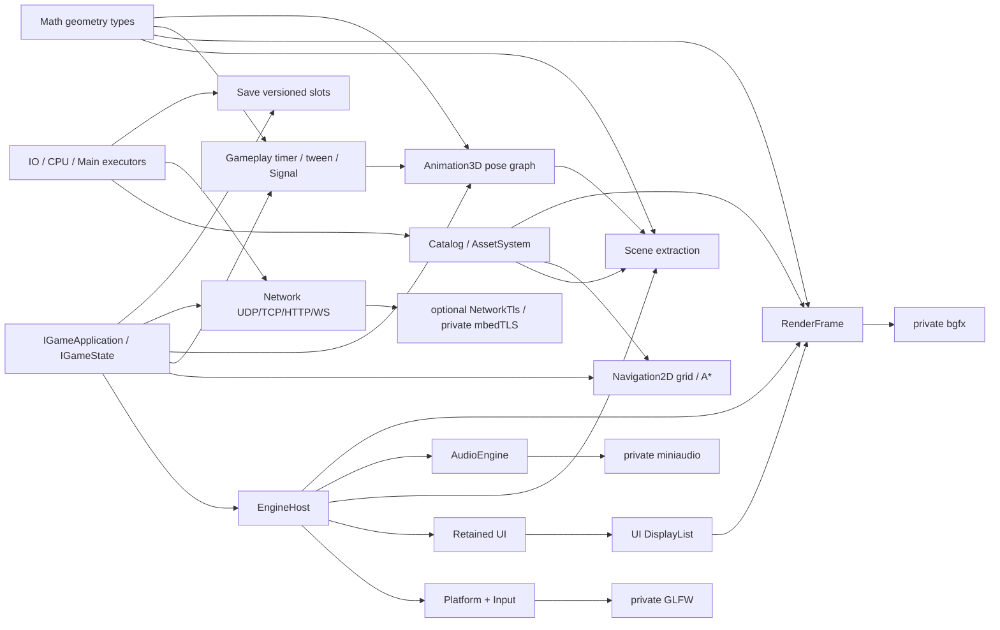

# Tina 设计导读

Tina 的设计目标不是“功能最多”，而是让游戏 Runtime 的模块边界、帧顺序和资源生命周期可以验证。
当前产品以 vNext Desktop 与 `tina_sample_2d` / `tina_sample_3d` 为准，Legacy 产品图已经退役。

## 设计原则

1. `EngineHost` 是唯一非全局组合根，模块通过明确接口和 factory 连接。
2. `IGameApplication` 管程序生命周期；`IGameState` 是唯一帧行为入口。
3. Game SDK 和公共头只暴露 Tina-owned 类型，具体 backend 保持私有。
4. 内存按需增长、热路径复用、缓存预算化；硬限制必须有依据，扩容/OOM 保持原子性。是否预分配以 workload 与帧时间证据决定，不要求所有场景固定容量。见 [内存策略](memory-policy.md)。
5. 异步取消只改变逻辑状态；物理释放等待 Lease、Ticket、completion 或 retirement 条件。
6. 源资产只在 Cooker 读取，Runtime 只消费版本化 Cooked Catalog。
7. 架构变更通过可运行垂直切片落地，每个切片必须有直接测试或 sample 证据。

## 已接受的技术边界

| 领域 | 决定 | 当前实现说明 |
| --- | --- | --- |
| 语言/编码 | C++23、UTF-8 | MSVC 使用 `/utf-8` 与 `/Zc:__cplusplus` |
| Platform | GLFW 私有 adapter，不引入 SDL/SDL3 | Null 与 GLFW 图分离 |
| Render | bgfx 是首个真实 backend | Render/Game SDK 头不含 bgfx |
| UI | Tina retained UI，输出 DisplayList | 当前实现在 `include/tina/ui` + `src/ui` |
| Asset | Catalog/Cooked + cgltf Cooker | cgltf 不进入 Runtime/public header |
| Audio | miniaudio 是可选真实 backend | backend-neutral AudioEngine 可独立测试 |
| Physics | Box2D 2D、Jolt 3D，API 分离 | Box2D 已实现；Jolt 5.5.0 Physics3D rigid-body/floating-origin 首切片已落地，见 [Physics3D](physics3d.md) |
| Math | `Tina::Math` 是几何类型的唯一定义点，不保留任何模块私有副本 | header-only、列主序右手系、失败用 `optional`/`bool` 故不占 `ErrorDomain`/`MemoryTag`；`Scene::Vec3`/`PhysicsVec2` 等旧重复定义已删除（[ADR 0035](adr/0035-math-module-boundaries.md)） |
| Gameplay | `Tina::Gameplay` 时序工具层只依赖 Core+Math，不引入 coroutine | `Easing`/`Scheduler`/`Action`/`Signal<T>`，按需稳定 registry、单 owner、显式 delta；保留追赶/迭代/延迟队列预算（[ADR 0036](adr/0036-gameplay-tooling-boundaries.md)、[0065](adr/0065-demand-grown-runtime-owners.md)） |
| Animation3D | `Tina::Animation3D` pose 图建在 `Animator3D` **旁**，不替代也不迁移它 | pose 为 joint-local、root motion 从 pose 中移除并单独上报；SkinnedMesh wire v2 加骨骼名称；占 `ErrorDomain::Animation3D = 18`（[ADR 0037](adr/0037-animation3d-graph-boundaries.md)） |
| AssetFormat | cooked wire 的 parse/encode 失败走自己的 domain，不再借用 `ErrorDomain::Asset` | `ErrorDomain::AssetFormat = 19`；历史 value 1–12 与 17 保留，Asset 仍从 13 起跳过 17 |
| Network | 自研传输，不引入 asio/libuv/curl；TLS 是可选独立模块 | owner-thread readiness 多路复用（每帧一次 `WSAPoll`/`poll`），除 DNS 外零 worker 零锁；`Tina::NetworkTls` 用 mbedTLS 且信任锚取平台 store；公开头不出现 socket/Winsock/mbedTLS 类型（[ADR 0033](adr/0033-network-module-boundaries.md)） |
| Save | `Tina::Save` 只做版本化 slot 存储，不定义游戏 payload 语义 | slot 文件名由 `SaveStore` 生成故调用方文本不进路径；primary+backup 双份 + digest 校验与 `SaveSlotHealth` 恢复分级；migration 图由产品拥有且每版本恰一条严格递增边（无降级）；owner-thread 命令面，async 经 `ITaskSystem`。尚无 ADR |
| Script | 玩法脚本是 `IGameState` 的客人而非第二套引擎；若做只做 Luau | C++ 拥有帧循环，脚本按相位被 pump；`require` 是 cook 期依赖不是文件系统搜索；宿主 API 白名单默认拒绝，v1 无 coroutine（[ADR 0045](adr/0045-script-module-boundaries.md)，**Proposed**）。当前零实现，不可当契约引用 |
| ECS | 如采用 EnTT，只能是 Scene 私有实现 | 当前 `tina_scene` 不链接 EnTT |
| 容器 | 标准库/`std::pmr` + 少量专用有界结构 | 不恢复 EASTL 产品依赖 |
| 测试 | GoogleTest executable 直接运行 | 不使用 CTest 调度 |
| Profiling | Tina Trace/Metrics + 可选 Tracy | None + 可选 Tracy zone adapter、Runtime FrameUpdate consumer 与 `tina_bench` schema v1 已有；Metrics 与 session/capture 控制面仍后置 |

决策理由见 [ADR 索引](adr/README.md)，状态汇总见[设计冻结清单](design-freeze.md)。

## 系统协作



`Math` 是 header-only 的几何类型定义点，被 Scene/Render/Physics/Gameplay/Animation3D 共用，图中只画了主要消费者。
`Gameplay`、`Animation3D`、`Network`、`Save` 由游戏代码在合法 frame phase 内自行驱动（delta 与 pump 由调用方给），
`EngineHost` 不代为调度；`Animation3D` 建在 `Animator3D` 旁而非替代它。

游戏状态写 gameplay model、Scene extraction 和 UI retained state。Runtime 决定它们在帧内的调用顺序，
adapter 负责把 Tina-owned 数据翻译到第三方库。游戏代码不能越过 Runtime 直接驱动具体 backend。

## 三条关键数据流

### 输入

```text
OS/GLFW events
  -> bounded PlatformFrameView
  -> UI route against prior committed snapshot
  -> consumption + continuous claims
  -> ActionMapper
  -> fixed-step and frame action snapshots
  -> IGameState
```

这条顺序保证 UI 拦截先于 Gameplay mapping。输入溢出、失焦、reset 和同帧 Down/Up 都必须有显式语义，
不能依靠“当前 held 状态”猜测历史 transition。

### 资源

```text
source -> Cooker -> Cooked Catalog -> request/load -> Handle/Lease
       -> typed decode -> upload -> ReadyGpu
       -> Sprite2D Registry Entry {Lease, GPU, binding}
          -> packet-local FrameResourceRef -> AssetSystem retirement
       -> Mesh3D Registry {Mesh Lease/GPU/binding, Material Lease/binding, shared Texture Lease/GPU}
          -> packet-local FrameResourceRef -> AssetSystem retirement
```

`AssetId` 表示稳定逻辑身份，`ContentHash` 表示内容；二者不可混用。Handle 是弱查询，Lease 负责跨
Task/Render/Audio 生命周期保活。资源 registry 使用按需稳定存储并由 owner thread 串行访问。Sprite2D registry
借用 AssetSystem、RenderDevice 与可选 PMR，每个 Entry 唯一拥有 resident Lease/GPU/binding；extraction
把 binding intern 到当前 packet，entry borrow pin 阻止活跃帧 retirement，Render item 只携带 packet-local
`FrameResourceRef`。Mesh3D registry 借用 AssetSystem/device/PMR，唯一拥有 Mesh Lease/GPU/binding、Material
Lease/binding 与按 AssetId 去重的共享 Texture Lease/GPU；geometry/material extraction 同样只写 packet-local
ref，active frame pin 阻止 retirement，State 不保留第二份 cleanup owner。
binding key 在单个 RenderDevice 实例的同类 allocator namespace 内唯一且单调不复用；多个 registry 可安全
共享 device。Mesh/Material namespace 相互独立，Material 三张纹理与 factors 原子发布；caller-chosen
direct binding 与同类 allocator 共用 namespace，registry 管理期间不得混用。

resident TileMap 可经 `Asset::buildTileMapNavigation2DData()` 原子派生唯一当前 weighted
row-major grid。Tile material rule 以完整 flags 精确匹配 `[1,16]` traversal cost；产品 State/Resources owner
持有 blocker 按需增长的 `NavigationGrid2D` 与预分配查询工作区的 `NavigationPathfinder2D`，Scene、Runtime、Render、Physics2D 和 TaskSystem
都不隐式取得导航 owner。动态 blocker 使用 generation ID 与 per-cell 引用计数；四向/对角同步与分步 A*
复用 Create 时预分配 storage，公开确定性整数 `pathCost`，并显式区分严格防切角与允许切角策略。

`Scene::CameraFollow2D` 是独立于 World `Camera2D` projection component 的 allocation-free owner-thread
controller。fixed update 在 dead zone、可选最大速度、viewport 与 world bounds 下事务式推进 previous/current
simulation center；render extraction 只读取 presentation interpolation，不把跟随策略塞进 Scene World。

### UI 与渲染

```text
UI mutation -> dirty/layout -> committed hit/paint/semantics
            -> UI-Render bridge -> DisplayList + Glyph atlas
            -> RenderFrame -> private bgfx UI pass
```

UI 不调用 bgfx。Render 不读取 UI 节点对象，只同步消费当前 submit 调用内的后端无关数据。
当前 UI 是 per-window owner-thread retained Element tree，输入读取上一份 committed hit，
structure/layout/hit/paint/semantics 候选全部成功后原子发布。Button 已有 hover/pressed/focus/disabled
反馈；fixed-capacity paint-only Motion、reduced-motion 与 stylesheet `BackgroundColor` transition 已落地。
Image/Icon 与 NineSlice 的 authoring、committed paint、root-scoped resolve/pin、
RGBA ImageQuad/backend、产品/失效/尺寸矩阵与 `ui_image_nineslice_v1` 性能证据已经落地；Component/Behavior
的全池 reservation/counter 与 `ui_component_build_v1` 也已关闭；强类型 StyleClass、node-local pseudo-state、
startup-only ColorToken registry/value、literal/token-backed BoxFill stylesheet、Runtime startup facade、
`ui_style_state_v1`、运行期 reverse-dependency token 更新、stylesheet imageTint 与产品 Visual 门禁已落地。
typed keyframe timeline 已按 ADR 0026 覆盖 paint 属性与 bounded `LayoutWidth`/`LayoutHeight`/`LayoutOffset`；
layout candidate transaction 与 `ui_motion_layout_v1` 已落地并通过统一确定性 gate。更广属性面仍未开放，具体边界见
[UI 框架设计](ui-framework.md)。

## 当前产品完成度

以下按 `ae5d5981` 源码校准能力，不把历史测试数量当完成度。逐模块证据、缺陷触发条件与验收建议见
[2026-09-13 审查](module-audit-2026-09-13.md)；本轮未构建或运行测试。

| 产品面 | 已有源码 / 消费面 | 当前边界与下一步 |
| --- | --- | --- |
| 2D | Catalog TileMap stream/demand/priority、dirty cache、CameraFollow、SpriteAnimation、等距投影与排序、Cooked Navigation/Physics 桥、FX asset/document；Physics2D 含 Chain 与三类 joint；Sprite/normal/lighting、weak Handle/Lease/packet-local ref 链 | Scene2DRuntime F3 已实现 Stopping/终态重试，运行验收待授权；FX EditorApp、真实导入闭环与跨 GPU lighting 继续推进，GPU simulation 后置 |
| 3D / Physics3D / Gameplay3D | glTF 多 mesh/prim、PBR/IBL、static/skinned/透明与 MASK、三类 shadow、GPU retirement；内建 GPU 后处理与独立 PostProcess Shader（当前 payload v4）；Jolt rigid body/Character/contact/shape cast/floating origin 与 Scene3DRuntime | 当前链路的真实 GPU、installed consumer、Editor Play/Stop 与跨平台证据需对账；joint/compound/mesh shape/CCD 属后续扩展，不再把整个 Jolt gameplay 或 post 写成未实现 |
| UI / Text / Accessibility | retained Element/事务/commit、Flex/Grid、虚拟控件、Style/Motion、Image/NineSlice/Line/Ellipse；HarfBuzz/FriBidi + MSDF/color 与回退字体；grapheme 编辑、Windows IMM32、Clipboard、Windows UIA bridge | Linux 原生 IME、Windows 真机候选窗与 Narrator/Inspect、AT-SPI、跨 DPI/GPU 仍需独立证据；圆角子树 clip/backdrop 是明确后置能力 |
| Runtime / Task / Platform | State 栈、四相位 policy、输入扇出、FramePin、固定步长、Host/Task/Audio 可重试关闭；GLFW/Android/iOS/HTML5 adapter 与外驱 tick | F1 自动 worker 上限、F8 失败可观测性；移动手柄/恢复的真机证据。通用 GPU submission fence 未承诺；不因多 World 需求把所有产品 owner 塞入 Host |
| Math | Vec/Quaternion/Mat4/包围体/视锥与几何查询统一到 header-only Tina::Math，旧别名/副本已删除 | F6 逆矩阵窄化范围；OBB/Mat3/SIMD 按 [ADR 0035](adr/0035-math-module-boundaries.md) 不在当前范围 |
| Gameplay | Easing、Scheduler、Action/ActionRunner、Signal 已实现并安装；五组单测源码已接线 | F2/F4/F5：Signal 生命周期/顺序与工厂 OOM；优先真实 owner 消费，不再声称 Action 测试文件缺失 |
| Animation3D | pose/blend tree/graph、crossfade/layer/mask/root motion/IK；已有 `samples/3d_animation_graph` 与 `samples/3d_ik_chain` | Editor 动画 authoring 与更复杂角色组合另验；retargeting/pose-aware bounds 不因示例存在就自动完成 |
| AI / Navigation | 稀疏 typed Blackboard、BehaviorTree/FSM；Navigation2D 分步 A*/Agent/FlowField 与桥；Navigation3D 体素 volume/pathfinder | F7 析构重入与 NAV-GRID-PMR-001 已有源码修复、blocker 按需增长；运行和真实玩法 owner 验收待补，Navigation3D 不是 navmesh |
| Localization | immutable locale 表、稳定 key、cook producer、Asset bridge 与测试接线 | 产品语言选择/回退、缺失文本与字体组合验收 |
| Network | UDP/TCP/listener、readiness、IByteStream、HTTP/1.1、WebSocket、DNS 与可选 mbedTLS；`samples/network` 消费 | 当前基线 POSIX、非 loopback、TLS 信任库与 installed consumer 独立验收；不承诺可靠 UDP/netcode/证书固定或 OS 完整信任裁决 |
| Save | primary/backup + digest/health、显式 repair、版本化不透明 payload、产品 migration、同步/异步 handle | [Save](save.md) 已补主题文档；下一步是产品 consumer。原子可见性不等于掉电持久化，也无云同步/加密承诺 |
| Editor | current-schema documents、history/tabs、project/import、保存与 dirty-close、2D/3D viewport、隔离 PlaySession | 真实导入/保存重开/Play→Stop/退出优先于新增面板；取消仍同步 join，需要测尾延迟，不以 auto-demo 代替人工验收 |
| SDK / 性能 | 单一 GameSDK archive、feature/tuple/build-id、安装 consumer 机制；Trace/bench 与确定性 workload | 发布包与源码指纹对账；固定机 hard gate、median/MAD、dirty-range 与真实负载的尾延迟仍需测量 |

## 游戏侧正确姿势（摘要）

1. `IGameApplication` 只造初始 `IGameState` 并处理 `onShutdown`。
2. 帧逻辑只在 State：`fixedUpdate` → `updateFrame`（可排队栈命令）→ `extractRenderScene` → `updateUI`。
3. 产品入口用 `Tina::Desktop::CreateEngine` + `EngineHost::run`；测试才手写 factories。
4. 输入只消费 Action snapshot；UI 先 route，再 ActionMapper，再（按 policy）suppressed 下层输入。
5. 资源只走 Cooked Catalog + Handle/Lease；不在 Runtime 解析源 glTF/工程场景格式。

更细的帧序与 policy 见 [Runtime](runtime.md)；公共面见 [Public API](public-api.md)。上手阅读顺序见
[文档索引](README.md)。

## 如何推进

短期工作只从 [Backlog](backlog.md) 选取验收条件完整的任务。实现顺序遵循：

1. 保持文档/契约与 tip 源码一致（本索引与 runtime/public-api 为优先同步面）；
2. 先集中关闭审查中的默认参数、回调、失败与资源终态问题，再验收真实 Editor/游戏消费链；
3. UI-002/UI-002-LINUX/UI-003、通用 submission fence 与 bench hard gate 保持独立任务，
   不把源码、编译或首个示例扩写成完整产品能力。

任何“完成”声明都必须指出证据类型：单元测试、集成测试、sample 生命周期、结构化 JSON 或人工视觉。
进程 exit 0 不自动证明画面正确；Cooker 单测也不自动证明产品 E2E。
