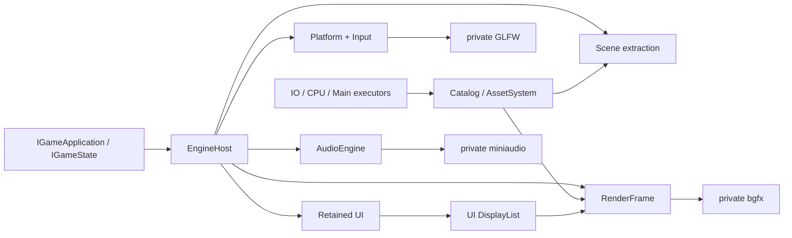

# Tina 设计导读

Tina 的设计目标不是“功能最多”，而是让游戏 Runtime 的模块边界、帧顺序和资源生命周期可以验证。
当前产品以 vNext Desktop 与 `tina_sample_2d` / `tina_sample_3d` 为准，Legacy 产品图已经退役。

## 设计原则

1. `EngineHost` 是唯一非全局组合根，模块通过明确接口和 factory 连接。
2. `IGameApplication` 管程序生命周期；`IGameState` 是唯一帧行为入口。
3. Game SDK 和公共头只暴露 Tina-owned 类型，具体 backend 保持私有。
4. 热路径结构有界、容量失败显式、稳态避免 Tina-owned 动态分配。
5. 异步取消只改变逻辑状态；物理释放等待 Lease、Ticket、completion 或 retirement 条件。
6. 源资产只在 Cooker 读取，Runtime 只消费版本化 Cooked Catalog。
7. 架构变更通过可运行垂直切片落地，每个切片必须有直接测试或 sample 证据。

## 已接受的技术边界

| 领域 | 决定 | 当前实现说明 |
| --- | --- | --- |
| 语言/编码 | C++23、UTF-8 | MSVC 使用 `/utf-8` 与 `/Zc:__cplusplus` |
| Platform | GLFW 私有 adapter，不引入 SDL/SDL3 | Null 与 GLFW 图分离 |
| Render | bgfx 是首个真实 backend | Render/Game SDK 头不含 bgfx |
| UI | Tina retained UI，输出 DisplayList | 当前实现在 `include/tina/ui` + `src/ui` |
| Asset | Catalog/Cooked + cgltf Cooker | cgltf 不进入 Runtime/public header |
| Audio | miniaudio 是可选真实 backend | backend-neutral AudioEngine 可独立测试 |
| Physics | Box2D 2D、Jolt 3D，API 分离 | Box2D adapter已实现；Jolt 尚未接入 |
| ECS | 如采用 EnTT，只能是 Scene 私有实现 | 当前 `tina_scene` 不链接 EnTT |
| 容器 | 标准库/`std::pmr` + 少量专用有界结构 | 不恢复 EASTL 产品依赖 |
| 测试 | GoogleTest executable 直接运行 | 不使用 CTest 调度 |
| Profiling | Tina Trace/Metrics + 可选 Tracy | `tina_bench` schema v1 已有；Trace/Metrics 与 Tracy adapter 仍后置 |

决策理由见 [ADR 索引](adr/README.md)，状态汇总见[设计冻结清单](design-freeze.md)。

## 系统协作



游戏状态写 gameplay model、Scene extraction 和 UI retained state。Runtime 决定它们在帧内的调用顺序，
adapter 负责把 Tina-owned 数据翻译到第三方库。游戏代码不能越过 Runtime 直接驱动具体 backend。

## 三条关键数据流

### 输入

```text
OS/GLFW events
  -> bounded PlatformFrameView
  -> UI route against prior committed snapshot
  -> consumption + continuous claims
  -> ActionMapper
  -> fixed-step and frame action snapshots
  -> IGameState
```

这条顺序保证 UI 拦截先于 Gameplay mapping。输入溢出、失焦、reset 和同帧 Down/Up 都必须有显式语义，
不能依靠“当前 held 状态”猜测历史 transition。

### 资源

```text
source -> Cooker -> Cooked Catalog -> request/load -> Handle/Lease
       -> typed decode -> upload -> ReadyGpu
       -> Sprite2DBindingRegistry -> RenderDevice key allocator -> frame key use
       -> unbind -> GPU retirement
```

`AssetId` 表示稳定逻辑身份，`ContentHash` 表示内容；二者不可混用。Handle 是弱查询，Lease 负责跨
Task/Render/Audio 生命周期保活。Sprite2D registry 固定容量并由 owner thread 串行访问，只借用 Store 与
RenderDevice；它不拥有 GPU/Lease/retirement，State 必须先成功 unbind 再 destroy/retire texture。
binding key 在单个 RenderDevice 实例的 allocator namespace 内唯一且单调不复用；多个 registry 可安全共享
device。caller-chosen direct binding 与 allocator 共用 namespace，registry 管理期间不得混用。

### UI 与渲染

```text
UI mutation -> dirty/layout -> committed hit/paint/semantics
            -> UI-Render bridge -> DisplayList + Glyph atlas
            -> RenderFrame -> private bgfx UI pass
```

UI 不调用 bgfx。Render 不读取 UI 节点对象，只同步消费当前 submit 调用内的后端无关数据。

## 当前产品完成度

| 产品面 | 已有 | 仍缺 |
| --- | --- | --- |
| 2D | Catalog TileMap v3 stream root + deferred TileMapChunk、固定容量 Camera/layer demand/cancel/unload、retain-window demand-recency LRU、resident generation dirty cache；稳定 layer/object ID、对象 101/102 消费、角色/碰撞、Physics2D Box/Circle/Capsule + sensor + Distance joint、SpriteAnimationClip/Animator；World Sprite、standalone Particle/Trail 与 TileMap emit 保存 weak AssetHandle 并借用共享 resolver；owner-thread fixed-capacity Sprite binding registry；advanced input、UI 设置、文本、Audio；可选 Box2D/FreeType/miniaudio | 统一 FrameResourceRef、TileMap 优先级 IO/editor/自动 gameplay 生成/旧 schema migration、完整 FX asset/editor/GPU simulation、更多 shape/joint、2D lighting/navigation |
| 3D | multi-mesh/multi-prim SPLIT cook、upload/bind、Prefab、Scene extract、baseColor/MR/normal 采样、material factors、单一有界0..4 directional-light 提交、URI 安全、Texture/Mesh retirement marker | 完整 PBR/IBL/shadow、light component/culling、通用 pass system、Scene AssetHandle 产品化 |
| UI | Tree/layout/hit/route/paint/semantics、文本/Glyph、控件集；Windows UIA + HWND 桥接首切片 | Focus Scope、Modal/Capture、多行/复杂 shaping、虚拟化、Narrator 金标/AT-SPI |
| Runtime | State 栈/commands、四相位阻断、`blocksGameplayInputBelow` 空 snapshot、FramePin/CPU ledger、固定步长、bounded Task shutdown + Host-enforced TaskSystem deadline | 通用 GPU submission fence、多 World、Runtime 内置 Asset/World |
| 性能 | `tina_bench` schema v1 + provisional 结论 | 固定门禁机 hard gate、多进程 MAD、更多 workload |

## 游戏侧正确姿势（摘要）

1. `IGameApplication` 只造初始 `IGameState` 并处理 `onShutdown`。
2. 帧逻辑只在 State：`fixedUpdate` → `updateFrame`（可排队栈命令）→ `extractRenderScene` → `updateUI`。
3. 产品入口用 `Tina::Desktop::CreateEngine` + `EngineHost::run`；测试才手写 factories。
4. 输入只消费 Action snapshot；UI 先 route，再 ActionMapper，再（按 policy）suppressed 下层输入。
5. 资源只走 Cooked Catalog + Handle/Lease；不在 Runtime 解析源 glTF/工程场景格式。

更细的帧序与 policy 见 [Runtime](runtime.md)；公共面见 [Public API](public-api.md)。上手阅读顺序见
[文档索引](README.md)。

## 如何推进

短期工作只从 [Backlog](backlog.md) 选取验收条件完整的任务。实现顺序遵循：

1. 保持文档/契约与 tip 源码一致（本索引与 runtime/public-api 为优先同步面）；
2. 在已完成 TileMap layer/stream、Physics2D 与 advanced input 契约上继续做独立垂直切片；
3. TileMap priority IO/editor、UI-002/UI-003、完整 PBR、通用 submission fence 与 bench hard gate 均保持
   独立任务，不把任一首切片扩写成完整产品能力。

任何“完成”声明都必须指出证据类型：单元测试、集成测试、sample 生命周期、结构化 JSON 或人工视觉。
进程 exit 0 不自动证明画面正确；Cooker 单测也不自动证明产品 E2E。
