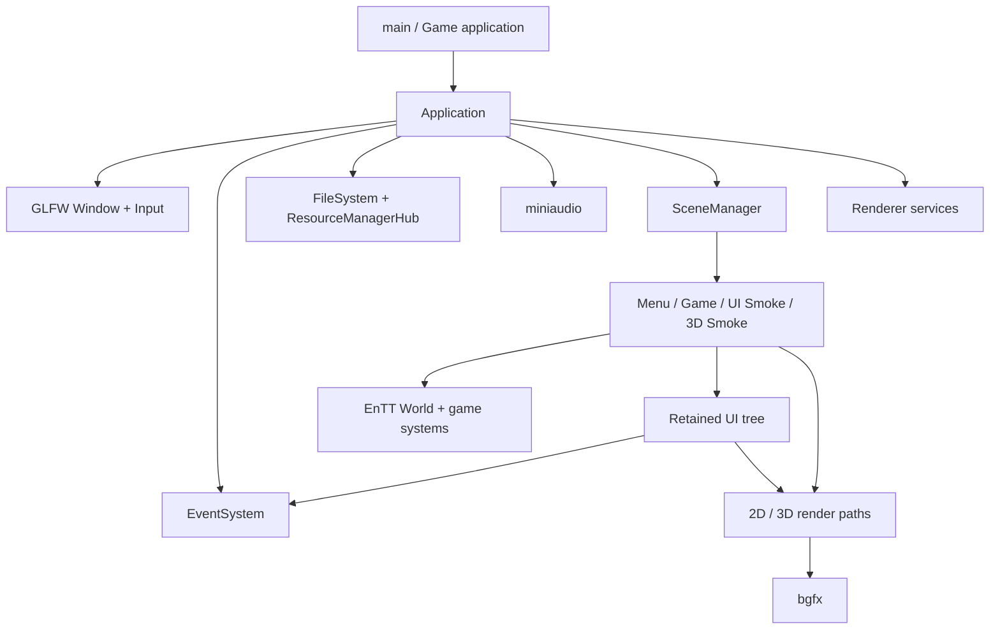

# Tina 设计导读

这份文档用于回答三个问题：当前引擎是什么、各模块如何协作、下一步为什么这样推进。它描述设计边界，不替代各主题文档中的实现细节。

## 一句话定位

Tina 当前是一套以现有游戏为验证载体的小型 2D/3D Runtime；vNext 的目标是形成模块边界
清晰、生命周期可验证、可持续扩展的游戏 Runtime。我们支持完整目标架构重构，但通过
可运行的垂直切片迁移，而不是围绕旧接口无限修补或一次替换后长期无法运行。

完整模块、接口、数据流和迁移门禁见 [Tina vNext 目标架构](vnext-architecture.md)；
Core 专项设计及 Carbon Core 取证见 [tina_core 设计](core.md)；性能/内存与线程模型分别见
[性能预算与内存系统](performance-memory.md)和 [Task System](task-system.md)。公共 API、平台
输入、Audio、依赖治理和风险分别见 [公共接口](public-api.md)、[Platform/Input](platform-input.md)、
[Audio](audio.md)、[依赖治理](dependencies.md)与[风险登记](risks.md)。
游戏入口、2D 和3D的具体用法分别见[游戏程序入口与状态栈](gameplay.md)、
[2D 游戏架构](game-2d.md)和[3D 游戏架构](game-3d.md)。

## 已确定的技术边界

| 领域 | 当前决定 | 原因 |
| --- | --- | --- |
| 语言与编码 | Tina target 已统一为 C++23、UTF-8，MSVC 使用 `/utf-8`；Windows MSVC 19.50、Linux GCC 13.4 与 Clang 22.1.8 + libstdc++15.2 已通过门禁 | 语言升级必须同时保留 Legacy 回归与独立 vNext 构建，不能只改文档 |
| 窗口与基础输入 | GLFW，不引入 SDL/SDL3 | 保持平台层单一；Windows IME 仅用 IMM32 补充 |
| 渲染 | bgfx | 先复用成熟后端，不在当前阶段自研 RHI |
| UI | Tina 自研 Retained UI | 服务游戏内 UI；vNext 用带 owner 的 generation `UINodeId` 管理交互生命周期 |
| ECS | EnTT | 当前仍暴露 registry 与 `entt::entity`；新接口应逐步收敛到 Tina `EntityId` |
| 容器与内存 | vNext 不依赖 EASTL；默认标准库与 `std::pmr`，只自研少量固定容量/生命周期专用结构 | 不重写 STL；把性能投入到零帧分配、数据布局、Arena 和可观测预算 |
| Hash | xxHash 保留为私有后端 | 用于 ContentHash、缓存和 StringId；不作为 AssetId、EntityId 或安全签名 |
| 性能基线 | 中端桌面1080p，120 FPS设计目标、60 FPS硬门禁 | 记录 phase 与 p50/p95/p99；稳态 Fixed/Extraction/无变化UI 的 Tina-owned 动态分配为0 |
| Profiling | Tina Trace/Metrics + 可选 Tracy | Tracy 负责定位；正式 `tina_bench` 关闭插桩并负责回归 |
| 音频 | miniaudio | 单一轻量音频后端 |
| 2D 物理 | Box2D 3.x；现有封装尚未接入玩法 | 保留必要的 TileMap AABB，不提前统一 2D/3D 物理 API |
| 3D 物理 | Jolt 已确定为唯一目标后端，但尚未接入 | PhysX、Bullet、Rapier 不进入依赖或备用实现 |
| 测试 | GoogleTest 1.17.0，直接运行 `tina_tests` | 不使用 CTest 调度，失败由进程返回码表达 |

## 当前模块与所有权



`Application` 目前仍是组合根和主循环所有者，这是“当前事实”而不是目标架构。vNext 会以
非全局 `EngineHost` 取代它；迁移期间先建立新接口和测试，由垂直切片逐步接管功能，旧
`Application` 不再作为新模块的依赖中心。

## 当前每帧数据流

```text
Frame timing
  -> Input begin frame
  -> GLFW poll / window state
  -> queued Event dispatch
  -> resource completion budget
  -> application event hook
  -> bounded fixed simulation (60 Hz, max 4 steps)
  -> variable application and Scene update
  -> UI update / layout / routed input
  -> Scene render and application render hook
  -> Input end frame
  -> deferred tasks
  -> bgfx frame submit/present
```

输入快照、普通 Event Queue 和 UI routed event 是三条不同通道。它们可以在同一帧中协作，但不能共享隐式泵送点或绕过各自的生命周期规则。

## 当前实现与目标边界

| 领域 | 当前实现 | 近期目标 | 暂不建设 |
| --- | --- | --- | --- |
| Runtime | `Application` 持有多数服务 | `EngineHost`、阶段 Context、`IGameApplication` + Runtime-private GameStateStack，按垂直切片接管 | 新全局组合根、长期双向桥接旧/新 Runtime |
| Scene/ECS | Scene 栈、延迟操作、Scene 自有 UI roots；World 仍暴露 EnTT/bgfx | 测试切换提交点，并逐步引入 `EntityId` 与 Render Scene Extraction | 编辑器式多 World 管理 |
| UI | Retained Tree、路由事件、焦点、IME、虚拟列表 | UIContext/dirty/PaintCache/DisplayList 零 bgfx边界，之后补表单控件和语义 | 用 UI 系统直接承担完整编辑器 |
| Render | 多条 2D/3D 路径直接提交 bgfx | RenderFrame、Game SDK/Render SPI/backend 三层隔离；游戏不接触 RenderDevice/bgfx | 自研多后端 RHI、完整 Render Graph |
| Asset | 按路径异步读取，主线程 completion 有任务预算 | 分离 CPU decode 与 GPU upload，再设计稳定 AssetId/Cooker | 当前直接上完整热重载编辑器管线 |
| Physics | Box2D 工具封装尚未接入玩法，Jolt 尚未集成 | 2D 正式接入 Box2D，3D 只接入 Jolt，并分别建立性能门禁 | 第三套物理后端或强行统一 2D/3D Physics API |

## 推荐推进顺序

Carbon 对应模块取证已经完成，详细证据和采纳/拒绝矩阵见
[Carbon Engine 参考取证](carbon-reference.md)。新的决定是先冻结完整 vNext 目标，再按以下
垂直切片实施：

1. **设计冻结**：确认 Core、Runtime、Scene、Render、Asset、UI 的所有权、接口和依赖图；
2. **Null Runtime**：Core/Task/Headless Platform、新 `EngineHost`、失败回滚、固定帧阶段、
   Metrics、NullRenderDevice、`tina_bench` 连续300帧/10,000帧；
3. **Platform/UI**：GLFW、最小私有 Surface/UI Pass、后端无关 DisplayList、中文字体和 IMM32；
4. **Scene/2D**：generation `EntityId`、Camera2D/Sprite、TileMap feature 边界和 Render Scene Extraction；
5. **Render/3D**：内部 typed handle/Pass Scheduler、Perspective/depth、Mesh/Material/Shader ABI；
6. **Asset/Cooker**：CPU Decode/GPU Upload 双队列、AssetId、Manifest 和最小静态 glTF；
7. **产品能力**：Checkbox/Slider 设置页、miniaudio 生命周期和必要的可访问语义；
8. **Legacy 删除**：旧接口零引用且全部门禁通过后，独立删除旧 target、源码和依赖。

每一步都必须能独立构建、直接运行 GoogleTest，并至少通过对应的 2D、UI 或 3D 冒烟路径。
进程返回 0 只能证明运行和释放链路；画面正确、实体手柄兼容性等结论必须单独记录证据。

## 设计讨论的默认基线

在没有新的产品需求前，默认把 Tina 设计为“游戏优先的 Runtime”，而不是“编辑器优先的通用引擎”：

- 现有 2D 游戏和 3D Smoke Scene 是架构验收载体；
- UI 优先满足菜单、设置、HUD、对话框和长列表；
- Renderer 优先保证明确的资源所有权和 Pass 顺序；
- Asset pipeline 优先支持可重复构建，不追求首期在线编辑；
- 新抽象必须消除现有复杂度或建立可测试边界，不能只为了名称更像成熟引擎。
- “自研容器”只指 `StaticVector`、`InlineFunction`、Frame Arena、generation SlotMap 等具有
  明确引擎契约的结构；不自研通用 Vector、String、HashMap、智能指针或算法库。

“完整重构”指目标边界允许不兼容旧 API，不代表放弃小提交、持续运行和逐步删除。设计冻结
前只更新文档与取证；开始源码迁移时使用独立 worktree，保持主工作区未提交修改原样不动。
