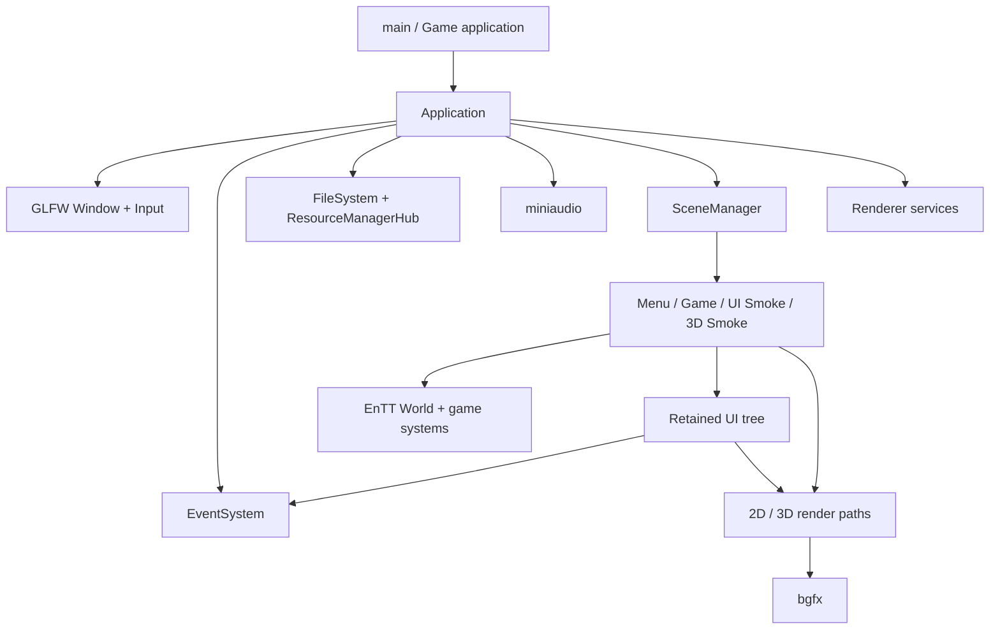

# Tina 设计导读

这份文档用于回答三个问题：当前引擎是什么、各模块如何协作、下一步为什么这样推进。它描述设计边界，不替代各主题文档中的实现细节。

## 一句话定位

Tina 当前是一套以现有游戏为验证载体的小型 2D/3D Runtime。近期目标是让 Runtime、Scene、资源、渲染和自研 UI 的生命周期稳定且可测试，而不是立即建设编辑器、完整自研 RHI 或通用商业引擎。

## 已确定的技术边界

| 领域 | 当前决定 | 原因 |
| --- | --- | --- |
| 语言与编码 | 目标基线为 C++23、UTF-8，MSVC 使用 `/utf-8`；当前 CMake 尚为 C++20 | 后续独立恢复 C++23，不能只改文档而跳过跨平台验证 |
| 窗口与基础输入 | GLFW，不引入 SDL/SDL3 | 保持平台层单一；Windows IME 仅用 IMM32 补充 |
| 渲染 | bgfx | 先复用成熟后端，不在当前阶段自研 RHI |
| UI | Tina 自研 Retained UI | 服务游戏内 UI，并用 generation `NodeId` 管理交互生命周期 |
| ECS | EnTT | 当前仍暴露 registry 与 `entt::entity`；新接口应逐步收敛到 Tina `EntityId` |
| 音频 | miniaudio | 单一轻量音频后端 |
| 2D 物理 | Box2D 3.x；现有封装尚未接入玩法 | 保留必要的 TileMap AABB，不提前统一 2D/3D 物理 API |
| 3D 物理 | Jolt 已确定为唯一目标后端，但尚未接入 | PhysX、Bullet、Rapier 不进入依赖或备用实现 |
| 测试 | GoogleTest 1.17.0，直接运行 `tina_tests` | 不使用 CTest 调度，失败由进程返回码表达 |

## 当前模块与所有权



`Application` 目前仍是组合根和主循环所有者。这个职责偏重，但在初始化回滚、Scene 延迟操作和渲染资源边界尚未全部获得测试前，不应直接替换成大型 `EngineHost` 重写。

## 当前每帧数据流

```text
Frame timing
  -> Input begin frame
  -> GLFW poll / window state
  -> queued Event dispatch
  -> resource completion budget
  -> application event hook
  -> bounded fixed simulation (60 Hz, max 4 steps)
  -> variable application and Scene update
  -> UI update / layout / routed input
  -> Scene render and application render hook
  -> Input end frame
  -> deferred tasks
  -> bgfx frame submit/present
```

输入快照、普通 Event Queue 和 UI routed event 是三条不同通道。它们可以在同一帧中协作，但不能共享隐式泵送点或绕过各自的生命周期规则。

## 当前实现与目标边界

| 领域 | 当前实现 | 近期目标 | 暂不建设 |
| --- | --- | --- | --- |
| Runtime | `Application` 持有多数服务 | 补齐失败回滚、析构顺序和阶段测试，再逐步提取 Context | 一次性替换全部 Runtime API |
| Scene/ECS | Scene 栈、延迟操作、Scene 自有 UI roots；World 仍暴露 EnTT/bgfx | 测试切换提交点，并逐步引入 `EntityId` 与 render extraction | 编辑器式多 World 管理 |
| UI | Retained Tree、路由事件、焦点、IME、虚拟列表 | 完成 action 生命周期、常用表单控件、可访问语义和截图门禁 | 用 UI 系统直接承担完整编辑器 |
| Render | 多条 2D/3D 路径直接提交 bgfx | 先统一 Pass/View 所有权，再引入 typed handle 与 UI Display List | 自研多后端 RHI、完整 Render Graph |
| Asset | 按路径异步读取，主线程 completion 有任务预算 | 分离 CPU decode 与 GPU upload，再设计稳定 AssetId/Cooker | 当前直接上完整热重载编辑器管线 |
| Physics | Box2D 工具封装尚未接入玩法，Jolt 尚未集成 | 2D 正式接入 Box2D，3D 只接入 Jolt，并分别建立性能门禁 | 第三套物理后端或强行统一 2D/3D Physics API |

## 推荐推进顺序

1. 先补生命周期门禁：Button action、Application 初始化回滚、Scene 延迟操作、GPU 资源计数。
2. 再补游戏真正会使用的 UI：Checkbox、Slider，以及可注入的手柄导航测试和基础可访问语义。
3. 统一 Render Pass/View 与 UI Display List，避免新控件继续扩大 bgfx 直接依赖。
4. 在渲染资源所有权稳定后建设 Cooked Asset、AssetId 和最小 glTF cooker。
5. 只有上述契约稳定后，再评估是否需要把 `Application` 收敛为 `EngineHost/EngineContext`。

每一步都必须能独立构建、直接运行 GoogleTest，并至少通过对应的 2D、UI 或 3D 冒烟路径。进程返回 0 只能证明运行和释放链路；画面正确、实体手柄兼容性等结论必须单独记录证据。

## 设计讨论的默认基线

在没有新的产品需求前，默认把 Tina 设计为“游戏优先的 Runtime”，而不是“编辑器优先的通用引擎”：

- 现有 2D 游戏和 3D Smoke Scene 是架构验收载体；
- UI 优先满足菜单、设置、HUD、对话框和长列表；
- Renderer 优先保证明确的资源所有权和 Pass 顺序；
- Asset pipeline 优先支持可重复构建，不追求首期在线编辑；
- 新抽象必须消除现有复杂度或建立可测试边界，不能只为了名称更像成熟引擎。
