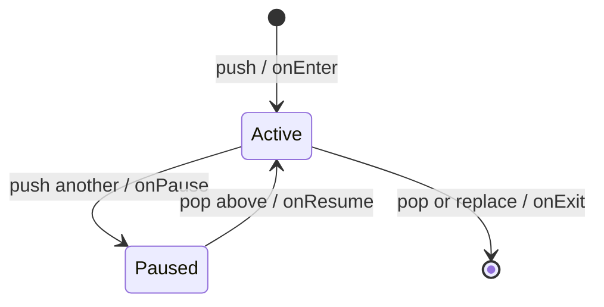

# Scene 与 ECS

## Legacy 当前 Scene 栈

`SceneManager` 持有 Scene 所有权，只有栈顶 Scene 参与 fixed update、variable update 和 render。它同时负责 `onEnter`、`onExit`、`onPause`、`onResume` 生命周期。



当前操作规则：

- `push`：暂停旧栈顶、停用旧 UI roots，配置新 Scene 后调用 `onEnter`；
- `pop`：先停用 UI 和事件，再调用栈顶 `onExit`，最后恢复下一层 Scene；
- `replace`：退出并销毁旧栈顶，再进入新 Scene；
- `clear`：从栈顶开始逐个退出；
- Scene 正在分发 fixed/variable update 时，直接操作会转换为 pending operation；
- pending operation 统一在 variable update 末尾按入队顺序提交，避免在回调栈中销毁当前 Scene。

Scene 切换目前缺少完整自动化门禁。下一步应覆盖：回调中 push/pop/replace、同帧多个操作、暂停/恢复顺序、UI roots 激活、空栈和退出时 pending operation 的处理。

vNext 迁移时旧 Scene 转为 `IGameState`，不照搬二值 `onPause/onResume`。GameStatePolicy 分别决定
Fixed Update/Frame Update/Gameplay Input/UI Input/Render 是否向下传播；push/replace 使用事务 enter，失败保留旧栈，
pop/replace 的 exit `noexcept` 且恰好一次。旧 pending operation 只有在这些门禁齐全后才删除。

## Legacy 当前 World/ECS

`World` 使用 EnTT 保存角色组件并持有输入、AI、移动、碰撞和渲染系统。当前实现仍存在明显的边界泄漏：

- `World` 公共接口直接返回 `entt::entity` 和 `entt::registry`；
- `GameScene` 直接查询和修改 registry；
- `World` 直接依赖具体 `TileMap`、输入结构、Renderer/ShaderManager 和 bgfx view ID；
- 玩法 ECS 碰撞与独立 Box2D `Physics2D` 尚未形成清晰职责划分。

因此，“EnTT 仅作为内部存储”和“World 不依赖输入、TileMap、Renderer”目前是目标契约，不是已完成事实。

## 推荐收敛方式

不应一次性重写整个 World。按调用面逐步收口：

1. 增加带 generation 的 Tina `EntityId`，先用于新接口；旧 `entt::entity` 接口保留到调用点迁移完成。
2. 把 `createCharacter`、控制对象切换、Transform/Renderable 修改等高频操作改成明确的 World command/query。
3. GameScene 不再直接访问 registry 后，才把 registry getter 降为模块内部接口。
4. 把输入快照转换为玩法 command，World 不读取 GLFW 或全局输入状态。
5. 把渲染改为 extraction：World 只输出后端无关 RenderScene；Game component 保存 AssetHandle/
   材质语义，不保存 GPU handle，Render 内部才映射 pass/resource。
6. TileMap 属于 gameplay feature，通过只读 `IGridCollisionProvider` 传给角色/碰撞系统；Box2D
   保持独立 2D 模块，不与未来 3D 物理强行统一。

目标数据流：

```text
PlatformFrameView -> UI consumption/claims -> game commands -> fixed-step World systems
World components -> Render Scene Extraction -> RenderScene --+
                                                    +-> RenderFrame -> Pass Scheduler
IGameState UI model -> retained UI tree -> DisplayList+
```

## vNext 内存与并行契约

- EnTT 组件池属于 `World` 的 Scene memory domain，组件不得保存 FrameArena 指针；
- fixed phase 中只读或写入互不相交 chunk 的系统可以提交 CPU Task；结构变化只写每 Worker
  私有 command buffer；
- barrier 后按稳定 worker/chunk/index 顺序合并 command，再统一创建、销毁和修改层级；
- 每个 fixed substep 都执行 previous snapshot → jobs/barrier → command commit → transform
  propagation；第 N 步提交对第 N+1 步可见；
- 新 Transform 令 previous=current，销毁后不进入 extraction；Render 只在 previous/current 的
  position/quaternion/scale 间插值，不逐元素插值矩阵；
- Render Scene Extraction 把连续 `RenderItem` 写入当前帧 Render Arena，Renderer 不回查 World；
- `EntityId` 的 generation 在任务开始和提交两端校验，迟到任务不能修改复用后的 slot；
- 只有 profiling 证明系统工作量覆盖调度成本时才并行，小集合继续直接 for-loop。

M8-A 已将 identity/transform 基础落为独立 `tina_scene`。当前 standalone `World` 仍在 owner thread
立即修改层级，使用 `updateWorldTransforms()` 做两阶段 scratch 计算和成功后发布；`setParent()` 默认
`KeepWorld`，`KeepLocal` 必须显式指定，`destroyEntity()` 默认提升直接子节点，`destroySubtree()` 才递归
删除。固定容量 dense live index 让子树删除不依赖逐实体线性查找。因为当前 `WorldTransform` 仍是
position/quaternion/scale 三元组，非均匀父 scale 与旋转子节点造成的 shear 会返回明确诊断，不能静默近似。

M8-B 只在 `tina_render`/Runtime integration 层提供已解析的 Camera2D/Sprite2D writer 和
`RenderFrame::primaryWorldScene` handoff；`Scene::World` 当前没有 Camera/Sprite component storage、阶段末
command buffer 或 Asset capability，`RenderSceneExtractionContext` 也不暴露 World view。Headless/Null
infrastructure sample 因此验证 CPU extraction/lifetime，不等同于可见 Sprite、bgfx pass 或正式 2D 产品。

内存容量、零稳态分配和基准工作负载见 [性能预算与内存系统](performance-memory.md)；任务
barrier、取消和确定性合并见 [Task System](task-system.md)。

层级命令必须写明语义：reparent 默认保持 world，也可显式 keep-local；父实体销毁默认把子
实体 reparent 到 root 并保持 world，递归销毁使用独立命令。批量 commit 在包含本批所有新边
的临时图上检测循环后才修改 registry。Quaternion 写入时归一化，近零值返回错误；非均匀
scale 可用于渲染，但物理后端不支持时必须拒绝/显式近似。首期每个启用 World pass 的
primary RenderView 恰好选择一个 active Camera，零个或多个都产生确定诊断；纯 UI/Present
帧允许没有 World view/Camera。

## 近期验收条件

- Scene pending operation 有确定且经过测试的提交点；
- Scene 暂停后不再接收玩法或 UI 输入，恢复时焦点状态合法；
- stale `EntityId` 不能解析到复用后的实体；
- 新增 World API 不暴露 EnTT、bgfx、GLFW 或具体 UI 类型；
- fixed update 只修改 Simulation 状态，渲染提取不反向修改 World。
- reparent keep-world/keep-local、父销毁、同批循环、Quaternion 异常、World view 零/多 Camera
  诊断及纯 UI 零 Camera 合法路径均有测试；
- 50,000活跃 Transform 与20,000可见 RenderItem 的固定基准记录 p50/p95/p99，稳态
  command/extraction 的 Tina-owned 动态分配增量为0。

游戏入口、2D TileMap/Camera/Sprite 和3D Mesh/Material/Prefab 的完整落点分别见
[游戏程序入口与状态栈](gameplay.md)、[2D 游戏架构](game-2d.md)和[3D 游戏架构](game-3d.md)。
