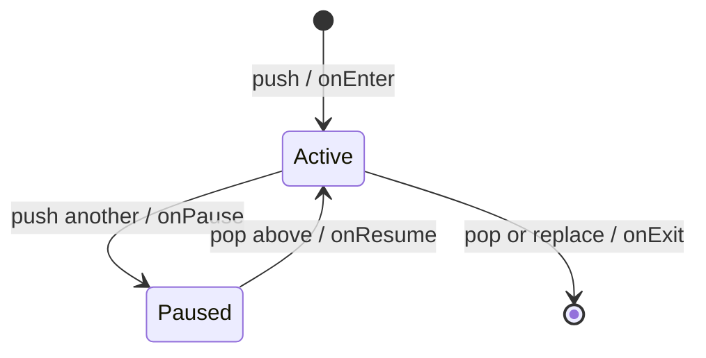

# Scene 与 ECS

## 当前 Scene 栈

`SceneManager` 持有 Scene 所有权，只有栈顶 Scene 参与 fixed update、variable update 和 render。它同时负责 `onEnter`、`onExit`、`onPause`、`onResume` 生命周期。



当前操作规则：

- `push`：暂停旧栈顶、停用旧 UI roots，配置新 Scene 后调用 `onEnter`；
- `pop`：先停用 UI 和事件，再调用栈顶 `onExit`，最后恢复下一层 Scene；
- `replace`：退出并销毁旧栈顶，再进入新 Scene；
- `clear`：从栈顶开始逐个退出；
- Scene 正在分发 fixed/variable update 时，直接操作会转换为 pending operation；
- pending operation 统一在 variable update 末尾按入队顺序提交，避免在回调栈中销毁当前 Scene。

Scene 切换目前缺少完整自动化门禁。下一步应覆盖：回调中 push/pop/replace、同帧多个操作、暂停/恢复顺序、UI roots 激活、空栈和退出时 pending operation 的处理。

## 当前 World/ECS

`World` 使用 EnTT 保存角色组件并持有输入、AI、移动、碰撞和渲染系统。当前实现仍存在明显的边界泄漏：

- `World` 公共接口直接返回 `entt::entity` 和 `entt::registry`；
- `GameScene` 直接查询和修改 registry；
- `World` 直接依赖具体 `TileMap`、输入结构、Renderer/ShaderManager 和 bgfx view ID；
- 玩法 ECS 碰撞与独立 Box2D `Physics2D` 尚未形成清晰职责划分。

因此，“EnTT 仅作为内部存储”和“World 不依赖输入、TileMap、Renderer”目前是目标契约，不是已完成事实。

## 推荐收敛方式

不应一次性重写整个 World。按调用面逐步收口：

1. 增加带 generation 的 Tina `EntityId`，先用于新接口；旧 `entt::entity` 接口保留到调用点迁移完成。
2. 把 `createCharacter`、控制对象切换、Transform/Renderable 修改等高频操作改成明确的 World command/query。
3. GameScene 不再直接访问 registry 后，才把 registry getter 降为模块内部接口。
4. 把输入快照转换为玩法 command，World 不读取 GLFW 或全局输入状态。
5. 把渲染改为 extraction：World 输出后端无关 Render Scene，Renderer 消费并分配 bgfx view/pass。
6. TileMap 碰撞通过小接口或只读查询传入；Box2D 保持独立 2D 模块，不与未来 3D 物理强行统一。

目标数据流：

```text
Input Snapshot -> game commands -> fixed-step World systems
World components -> render extraction -> Render Scene -> Renderer/bgfx
Scene state -> UI model/actions -> retained UI tree -> UI Display List
```

## 近期验收条件

- Scene pending operation 有确定且经过测试的提交点；
- Scene 暂停后不再接收玩法或 UI 输入，恢复时焦点状态合法；
- stale `EntityId` 不能解析到复用后的实体；
- 新增 World API 不暴露 EnTT、bgfx、GLFW 或具体 UI 类型；
- fixed update 只修改 Simulation 状态，渲染提取不反向修改 World。
