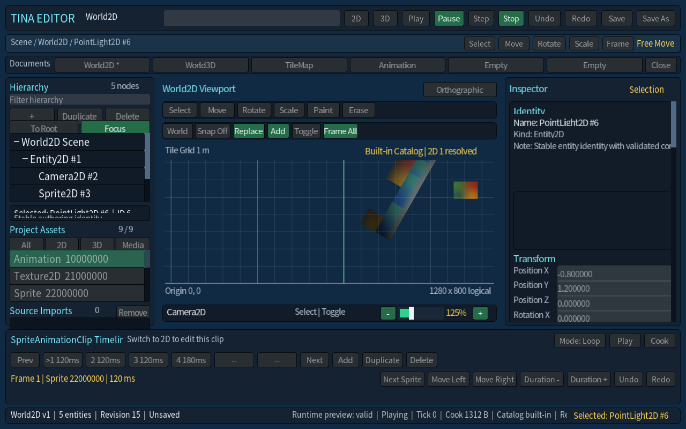
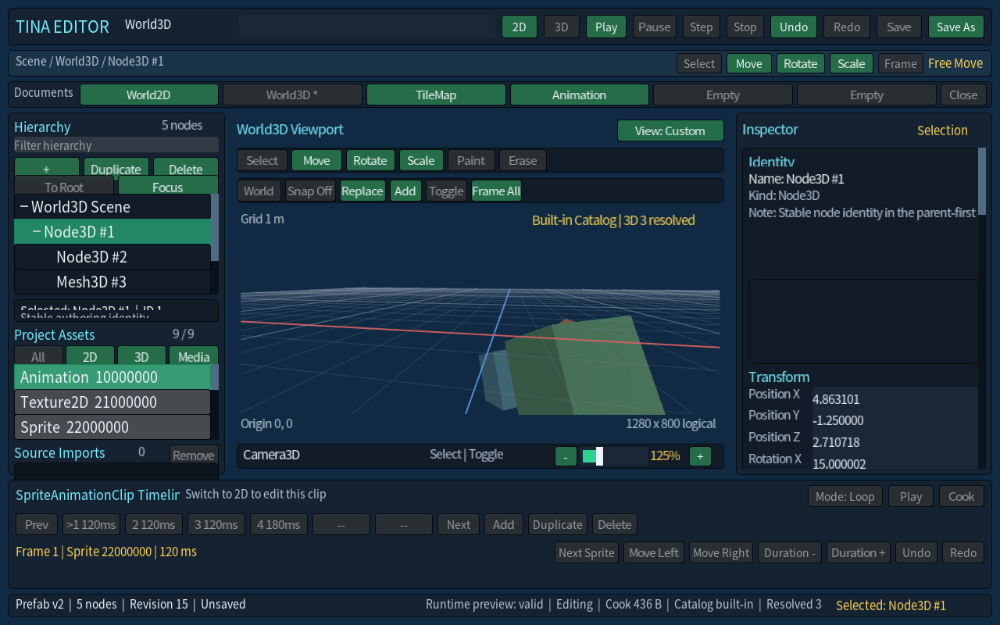

# Tina Showcase

本页用少量真实快照说明 Tina vNext 当前可以承载的游戏与工具方向。图片来自本仓库已有的
产品/视觉验证产物，复制后作为文档资产提交；图片是展示证据，不替代源码、CMake target、
测试或 ADR 对当前事实的定义。

## 运行时效果

### 2D Sprite、UI 与 TileMap 方向

这张图来自 `Tina vNext - Sprite2D / UI` 视觉验证快照，展示 Sprite2D、渐变材质、UI 条带和
窗口化 Runtime 组合。对应的产品路径是 `tina_sample_2d`，可继续组合 Catalog、TileMap、
Scene、Navigation2D、Audio、Physics2D 和 retained UI，适合平台动作、RPG、等距地图、工具型
2D 界面等方向。

### 3D 深度与几何基础

这张图来自 `Tina vNext - Procedural Cube / Depth` 视觉验证快照，重点是 3D 几何、深度和
RenderFrame 提交链路。`tina_sample_3d` 还覆盖 glTF cook、Prefab、Scene extraction、材质与
bgfx 绘制；更完整的 PBR/IBL、阴影、动画和资源导入边界请以 [3D 文档](game-3d.md) 为准。

### Retained UI 与主题切换

这张图来自 FreeType 文本路径下的 UI showcase，展示按钮状态、Slider/ProgressBar、TextEdit、
Radio、Dropdown、虚拟化列表/树和 Dark/Light 主题。它适合游戏菜单、背包/任务面板、设置页、
调试工具和编辑器面板等桌面交互场景。

## Editor authoring

### 2D authoring

`TinaEditor.exe` 的 2D authoring 快照展示 World2D 层级、Project Assets、SpriteAnimation 时间线、
Inspector 和运行时预览。它对应引擎之上的 Editor 工具树，不属于 `Tina::GameSDK`。

### 3D authoring

3D authoring 快照展示 World3D 层级、Mesh/Prefab 资源和 viewport 操作。Editor 仍按
[Editor 2D / 3D](editor-2d.md) 的当前契约演进，图片中的某一次 revision 不应被当成 API 版本号。

## 能做什么与不能据此承诺什么

| 方向 | 当前可据源码/target 规划的内容 | 仍需单独确认或不在当前范围 |
| --- | --- | --- |
| 2D 游戏 | Sprite2D、TileMap、Scene、Navigation2D、Audio、Physics2D、动画与 retained UI | 具体玩法规则、关卡内容与发行级美术资源需要游戏项目自己实现 |
| 3D 游戏 | glTF/Prefab/Scene、PBR/IBL、阴影、动画图、资源导入与 bgfx Render | 通用 Gameplay3D 脚本/AI owner、Jolt joint/CCD 等边界仍不应按已完成设计 |
| 工具与菜单 | Retained UI 控件、文本、主题、虚拟化集合、Editor authoring | 跨平台视觉 golden、完整无障碍产品验收仍按各自门禁执行 |

## 赞助素材

支付宝和微信二维码来自同父目录下其他 Tina 项目的公开素材，并已复制为本仓库自己的文档
资产，避免文档依赖兄弟仓库路径。

| 支付宝 | 微信 |
| --- | --- |
|  |  |

## 图片来源记录

- `tina-2d-sprite-ui.png`：`out/validation/m9c-sprite2d-ui-frame-a.png`
- `tina-3d-depth.png`：`out/validation/m9b-visual-frame-a.png`
- `tina-ui-showcase.png`：`artifacts/screenshots/agent-inspect-20260803/showcase-freetype-dark/20260803-093312/frame-03.png`
- `tina-editor-2d.png`：`artifacts/screenshots/editor-ring-100pct/2d/20260810-194215/frame-12.png`
- `tina-editor-3d.png`：`artifacts/screenshots/editor-ring-100pct/3d/20260810-194251/frame-12.png`
- `alipay.jpg` / `wechat.jpg`：同父目录的 `QtTinaSkia/doc/sponsor/`；对应 `Tinalux/sponsor/` 文件已做 SHA-256 一致性核对。
