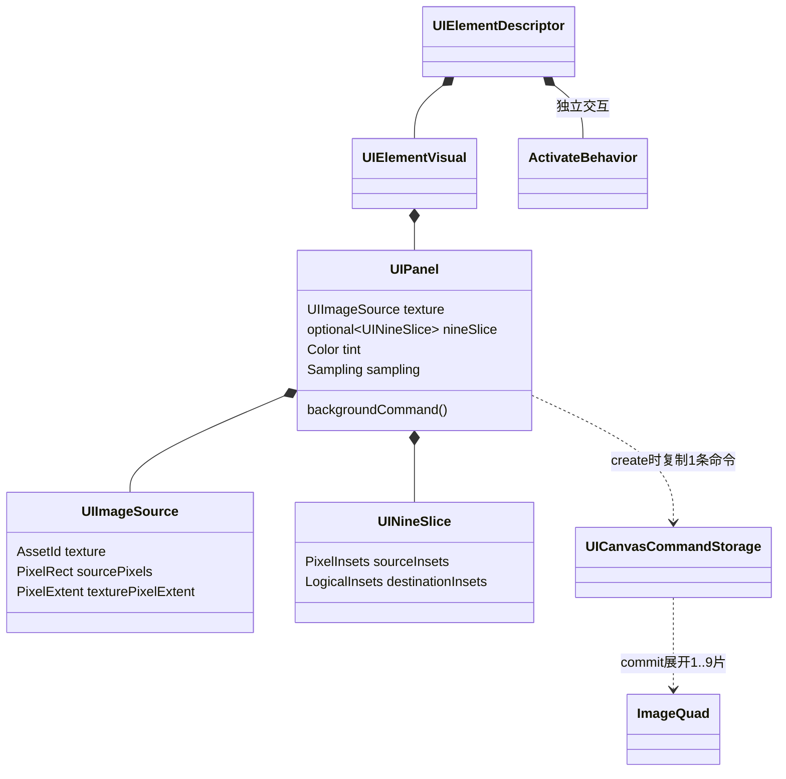

# 多语言渲染现状报告与 MSDF 交付

日期：2026-09-07。以本轮开始时的工作区源码为诊断基线；已有未提交修改被保留并迁移。仓库不存在名为 `FontCache`、`TextRenderer`、`Layout.cpp` 的当前产品类/文件，实际对应如下。

## 1. 修改前的多语言现状

| 问题 | 实际实现与结论 |
| --- | --- |
| 字体读取/栅格化 | `src/ui/freetype/FreeTypeTextRasterizer.cpp`：`FT_Get_Char_Index → FT_Load_Glyph → FT_Render_Glyph(FT_RENDER_MODE_NORMAL)`，读取 `FT_Bitmap` 的 GRAY/MONO，**不是 SDF/MSDF**。 |
| 图集 | `UIContext::Create` 实际硬编码 **512×512 R8，1024 slots**，不是 4096×4096。`UIGlyphAtlasCapacity` 允许最高 4096×4096 / 1,048,576 slots，但实际可放字形还受像素面积和 shelf fragmentation 限制，不能把 slot 上限称作 CJK 覆盖数。 |
| 查找与生成 | 已按出现的字符插入图集，不是启动全字体加载；但按 codepoint/字号缓存、线性扫描 slot，而且重复文本仍会重复 FreeType raster，不能缓存 contextual glyph ID。 |
| 整形 | vcpkg/CMake/运行时均未集成 HarfBuzz。逐 scalar 前进，没有 GSUB/GPOS 和 BiDi。阿拉伯语连接形、lam-alef、混合 RTL/LTR 顺序；泰语组合标记定位；天城文连字/前置元音均不可靠。UTF-8 正确解码不等于正确整形。 |
| 回退 | rasterizer 可以开多个 face，但 UI 只使用单个 `textFace`，没有按 cluster 的字体回退链。缺字取 glyph 0，通常为字体 `.notdef`（豆腐块/空白），这条正常缺字路径本身不是崩溃路径。 |
| Emoji | 未用 `FT_LOAD_COLOR`，仅接受 GRAY/MONO。缺 Emoji 可能得到 `.notdef`；彩色 bitmap 可能报 unsupported mode，ZWJ/variation selector/flag 不会被正确组合。 |
| 错误降级 | `UITextPaintEmitter`/编辑 painter 遇 raster/atlas 错误会退回整段 SolidQuad，容易把“图集满”“格式失败”误判为缺字体。 |

## 2. 渲染瓶颈诊断表

不能仅凭“模糊”两个字给某张未提供的截图分配根因占比；下面是源码可复现的机制，而非虚构的 GPU 观测。

| 机制 | 源码证据 | 修改前现象/判别 | 本次修复 |
| --- | --- | --- | --- |
| **位图放大插值** | 纹理创建设置 Point，但 `BgfxRenderDevice::submitUI` 的 `setTexture(..., samplerFlags)` 覆盖为 clamp + mip-point，**最终 min/mag 为线性**；旧 glyph emitter 未传入设备 scale，放大固定大小 coverage。 | 固定坐标，将 framebuffer/logical 比从 1 改到 1.25/1.5/2，边缘 coverage 被放大。仅改变 filter 不能补回轮廓信息。 | 直接从轮廓生成 RGB 距离；median + `fwidth`，DPI 不重新放大低分辨率 coverage。 |
| **每字形边界取整导致变形** | `UIRenderDisplayList::projectRect` 对左右/上下分别 floor/ceil，整数 bounds 又成为 GPU 四角。 | 例：x=100.2、w=9、scale=1.5，理想宽 13.5，cover bounds 可能为 14；移动小数位置时宽度还会跳。**这不是 FreeType raster 算法错误，也不是简单“没取整”。** | Glyph 用 exact subpixel vertices；cover AABB 只供 cull/clip，不再改变采样比例。 |
| **基线/行原点亚像素相位** | emitter 的 `normalizeFloat` 只规范 ±0，并非 pixel snap。当前工作区虽已加入 `UITextRasterScale`，此前没有完整接到 Runtime/paint。 | 保持字号与 DPI 不变，只以 0.25 logical px 平移，可隔离 coverage 相位变化；不能和字号缩放混为同一个变量。 | `UITextPixelSnap::{None,Baseline,RunOrigin}` 只吸附共享原点，保留字距/offset/宽高；Runtime 给 color/placeholder 接入真实 framebuffer scale。 |
| **字形边界串色** | 原图集没有 filter gutter。 | 相邻 glyph 在线性过滤与放大时可能互相采样；不能归因字体轮廓。 | RGBA8 图集每字形增加一 texel gutter；MSDF 自身另有 distance-range padding。 |
| **错误被方块掩盖** | raster/atlas 失败后整段 SolidQuad。 | 超预算和真正 missing glyph 外观混在一起。 | 前者返回结构化错误、保留旧 snapshot；后者保留 `.notdef` 并给 `missingGlyphCount`。 |
| **重复 CPU 工作** | 旧每次 measure/raster 按字符重新 load/render，atlas 查找线性。 | 是否主导帧耗时仍需 profiling，不能由代码量宣称具体提升倍数。 | 字符串有界 interning、glyph-index 图像 cache、Atlas hash lookup；只为 UI 实际出现的 glyph 生成 MSDF。 |

## 3. 当前实现与数据流

```text
字体字节（primary + 显式 fallback，owner 复制）
  → strict UTF-8 / grapheme / FriBidi / script+face runs
  → TextShaper / HarfBuzz GlyphRun
      ├─ visual glyph IDs + advances + offsets + UTF-8 cluster ranges
      └─ logical scalar map → wrapping / caret / selection / hit
  → glyph-index cache miss
      ├─ FreeType outline → msdfgen RGB MSDF
      └─ supported color glyph → premultiplied RGBA
  → bounded RGBA8 UIGlyphAtlas
  → committed Glyph paint → exact pixel vertices
  → bgfx median/derivative shader 或 color branch
```

- `TextShaper.h` / `TextShaper.cpp` 是独立封装；公共头不包含第三方类型。
- `IUITextRasterizer` 的 `glyphs` 是真正字形，不再能按 UTF-8/scalar 索引访问；`scalars` 是独立逻辑映射。
- 默认 atlas **2048×2048×4 = 16 MiB / 4096 slots**，另有 **16 MiB / 4096 images** 的 cold-generation cache。没有 2 万汉字预加载。字号/DPI 不复制轮廓 MSDF，color bitmap 以实际 strike 分别缓存。
- paint count 使用实际整形后 glyph 数；raster/atlas 失败向上传播。编辑 selection/preedit 不再通过切碎字符串绘制而破坏 Arabic/Indic 连接。
- 每行重新整形以获得该行的 BiDi/连接形。caret/pointer 的横向定位使用视觉 cluster 位置，而不是按逻辑顺序累加 UTF-8 字符宽度。
- 字体、缓存和文字均有显式预算。当前无隐式 LRU/page eviction；满页返回错误，不使已提交 UV 悬空。现有 backend 在 page revision 改变时仍整页上传，未声称实现 GPU 局部更新。

### 资源烘焙

`tina_msdfgen` 是调用 msdfgen **库**的 Tina host 工具，和 runtime miss 共用生成代码，不是伪造上游 CLI 参数。Python 只编排构建和 UTF-8 string interning，不依赖 Pillow/fontTools。

```powershell
python tools/fonts/bake_ui_font.py --msdfgen <host-tina_msdfgen.exe> `
  --font <font.ttf-or-otf> --strings <UTF8-ui-strings.txt> --output <output-stem>
```

产物：

- `.png`：RGB 距离图集（RGBA 容器）。
- `.json`：schema、font fingerprint、尺寸、distance range、glyph index、UV、nominal advance、bearing、image kind。
- `.tmsdf`：运行时直接消费的 schema v1 cache seed，严格校验字体 fingerprint/face/索引/预算，不在 runtime 再解 PNG。

`tina_target_stage_ui_font()` 自动建立 compile-time cook 依赖并把三件产物和字体一起 stage/install。`TINA_UI_FONT_STRINGS` 指定 UI 字符串文件；默认 seed 只含少量常用界面文字。未预烘焙的新 UI 字形照常按需生成。Cross build 必须显式提供 host `TINA_MSDFGEN_EXECUTABLE`，不能执行目标平台的 cooker。

### 字体回退接线

`TINA_UI_FALLBACK_FONT_PATHS` 是按优先级排列的分号列表，最多七个 fallback；构建时会 stage 显式 manifest，运行时环境变量可覆盖。选择含 CJK、Arabic、Devanagari、Thai 与 Emoji 覆盖的字体；引擎不自动扫描 OS 字体，也不把缺失 font pack 伪装成全 Unicode 支持。

`resolveUiFontBytes()` 返回 `bytes / atlasBytes / fallbackBytes`；`CreateEngineOptions` 接收对应三项，现有 Desktop 产品已接线。直接 UI owner 在创建任何节点前调用 `openTextFont()`、`addFallbackFont()` 和 `primeFontGlyphCache()`。不支持运行中换字体，避免在 paint 事务失败时破坏旧 snapshot 的 UV。Windows 字体环境变量经 UTF-16 API 转 UTF-8，支持中文路径。

## 4. 布局清理

- 真实入口是 `UIContextLayout.cpp`，不是旧 `Layout.cpp`。本轮没有发现还在使用上一版所称的具体 legacy 类，不能凭名称删除有效实现。
- `UILayoutAxisConstraint/UILayoutConstraints` 取代 scratch 中可互相矛盾的 “definite bool + extent float”。
- viewport 只在根的 prepare 转换为约束；`measureLayout` 不再接收 viewport，也不从窗口尺寸补非根节点。
- Measure 和 Arrange 统一调用 `resolveConstrainedBorderSize`；删除重复 `resolveLengthNoFallbackCount` / `resolveIntrinsicLengthNoFallbackCount`，统计是同一算法的可选接收器。
- 父约束 → intrinsic measure → 容器分配 → tight content 约束 → 同一 committed placement。Flex、Grid、真正 Overlay、ScrollView 的容器职责保留；固定容量 convergence/rollback 也保留，不把它们误删为兼容垃圾。
- “上一版”的额外指令不在本任务上下文中；本轮只执行本次明确的边界，不声称补全未提供细则。

## 5. UIPanel 类图与使用



```cpp
Tina::UI::UIElementDescriptor skinnedButton(Tina::UI::UIImageSource texture)
{
    using namespace Tina::UI;
    auto button = makeButtonElement("保存");
    button.visual.panel = UIPanel{
        .texture = texture,
        .nineSlice = UINineSlice{
            .sourceInsets = {8, 8, 8, 8},
            .destinationInsets = UIEdgeSpacing::All(8.0F),
        },
    };
    return button;
}
```

UIPanel 的“纹理持有”是 UI-safe 的 `UIImageSource` 身份/元数据组合；GPU texture 与 AssetLease 仍由原有 resolver/pin owner 保活。背景命令按最终 border box 自适应，不增加 layout node、不影响 intrinsic size、click/focus/semantics、不引入控件继承树。沿用 Canvas 的 box-chrome 后、控件/content 前顺序；NineSlice source/destination insets 独立校验，小目标按现有比例压缩角片，公共边界共用同一像素切线。

## 6. UTF-8 与验证

- C/C++ 继续全 target MSVC `/utf-8`；新增源码/文档 UTF-8。
- Python 显式 `utf-8-sig` 读 manifest、`utf-8` 写入和 subprocess 解码；去重整行而非拆散 shaping context。
- Windows cooker 从 UTF-16 command line 转 UTF-8；文件经 Core UTF-8/binary IO，不依赖 ACP。
- 验证按 maintainer 最新要求：全部代码/文档完成后，**主会话直接**集中编译、运行 GoogleTest；不再创建或复用卡住的 gate 智能体。

统一门禁必须覆盖：真实 font shaping 的 glyph index/cluster/RTL/mark offsets；fallback / missing glyph；MSDF RGB、cache 字号复用与预算；color alpha；cook→seed roundtrip/损坏拒绝；exact glyph vertices、DPI baseline、shader 编译；父约束/百分比/深树/事务；UIPanel 自适应 NineSlice、无交互变化及槽位回滚。

**2026-09-07 主会话验证：** 复用 `out/build/windows-msvc-vnext-bgfx-product-2d`，MSVC 19.50 / Debug；HarfBuzz 14.2.0、FriBidi 1.0.16、msdfgen 1.13、FreeType 2.14.3。首次依赖下载中断后重下并核对 SHA-512；没有 clean-first。结果如下，原始日志/XML/截图位于 `artifacts/ui-msdf-20260907`（不提交生成物）。

| 验证 | 结果 |
| --- | --- |
| UI | 全套 846 项，首次 845 通过；旧的分段 selection paint 顺序断言迁移后，相关 emitter 10/10 通过，未重复运行整套 |
| UIFreetype / TextShaper | 最终 12/12，无 skip；真实 CJK、Arabic 数字前缀 BiDi、Devanagari/Thai 标记、Latin ligature、Emoji ZWJ/color、fallback、cache、seed 和轮廓内外符号 |
| UI-Render integration / bgfx | 33/33、143/143；exact float glyph edges、DPI shared baseline、RGBA upload、bgfx shader 编译 |
| Runtime UI | 全套 151 项，首次 150 通过；Enter 已是 submit 消费事件，补回调 exactly-once 断言后失败项复测通过 |
| Core/Runtime/Render | 全套 654 项，首次 651 通过；修正 JSON 正整数安全 signed 读取，迁移已公开的 binding-key 回收断言，相关 24/24 通过（含新增 JSON 边界用例） |
| Asset | 397/397，最终复测 397/397；旧交接列出的 retirement/GPU-owner 失败没有在当前工作区复现 |
| Editor / EditorApp | 146/146、25/25；TinaEditor 2D/3D 各 70 帧 auto-demo 退出 0 |
| Scene / RenderScene / UIA | 193/193、95/95、14/14 |
| Gameplay / Gameplay2D / AI | 129/129、1/1、3/3；不把基础 AI 单测称为产品消费闭环 |
| Navigation2D / Navigation3D / Localization | 39/39、38/38、20/20；Navigation3D 仍是 voxel A*，不是 navmesh |
| 字体 cook | 实际字符串产生 114 个唯一 glyph、missing=0、imageBytes=590724，输出 PNG/JSON/TMSDF；未枚举 charmap |
| 产品与截图 | 2D 300 帧、3D 30 帧均退出 0。2D 的 70 帧试跑未到完整玩法验收条件，之后使用正式 300 帧。Windows 1920×1080 截图两帧连续非空，首帧白屏被 gate 排除 |

真实截图发现并修复了一项新管线缺陷：CFF 与 TrueType 的 winding 相反，未经统一时 MSDF 符号颠倒、形成反色矩形。按 msdfgen exterior-distance 判据统一轮廓方向，补 CFF/TTF 的外部透明、内部有墨迹像素测试，最终截图确认反色底块消失。另按上游 PNG writer 语义饱和无对应边通道的 infinity sentinel，仍拒绝 NaN。不能用“单测通过/画面非空”替代这一检查。

SDK 已完成 Debug 构建/安装、341 个安装头的第三方边界扫描、独立 DesktopBootstrap consumer configure/build。仅安装 Debug，因此 consumer 明确 `CMAKE_CONFIGURATION_TYPES=Debug`；未声称 Release SDK 验证。字体工具的实际 PE DLL 闭包随 SDK 安装，脚本一并发布，安装版工具已实际烘焙成功。

COLRv1 paint graph、OpenType-SVG、Thai 词典断行、完整 Unicode 编辑、真机 IME、多显示器混合 DPI、跨 GPU 像素金标、Linux/Android/iOS 和 Physics3D 本轮未验证。没有实测性能提升倍数。字体链缺少字符/序列时仍会缺字，不能凭算法生成不存在的字形。

## 7. 容量政策修订

[ADR 0052](adr/0052-demand-driven-memory-policy.md) 已接受按需增长、热路径复用与字节预算策略，固定容量不再是全引擎不变量。本次单页 atlas / bounded scratch 是已验证的当前实现，不是最终多页/弹性存储架构；后续迁移必须保持借用 span、已提交 UV 和 GPU 寿命，不能只把默认数字调大。

## 8. 资源收尾

- 常驻 buildTree：`out/build/windows-msvc-vnext-bgfx-product-2d`，前 16,016,843,508 bytes，后 16,368,967,101 bytes，按维护规则保留供增量编译。
- 临时 SDK：`artifacts/ui-msdf-20260907/sdk`，326,107,548 bytes；consumer buildTree：同目录 `sdk-consumer`，123,206,674 bytes。递归删除被执行策略拒绝，均仍保留，未声称释放；后续允许清理时应只删这两个明确目录。
- process：收尾核验本仓库 CMake/MSBuild/compiler/test/sample 进程为 0；其他项目的构建没有干预。
- agent：`ui_msdf_gate` 保持 interrupted，未复用/未新建，无后台验证工作；记录未删除。
- container/volume/image：本轮未创建；cache：使用现有 vcpkg 下载/二进制缓存并新增字体依赖，不执行全局清理，缓存占用未单独核验。
- 字体 cooker 临时 `tina-font-*` 目录已由 TemporaryDirectory 回收，定向检查未残留；日志/XML/PNG 作为验证证据保留，不纳入提交。
