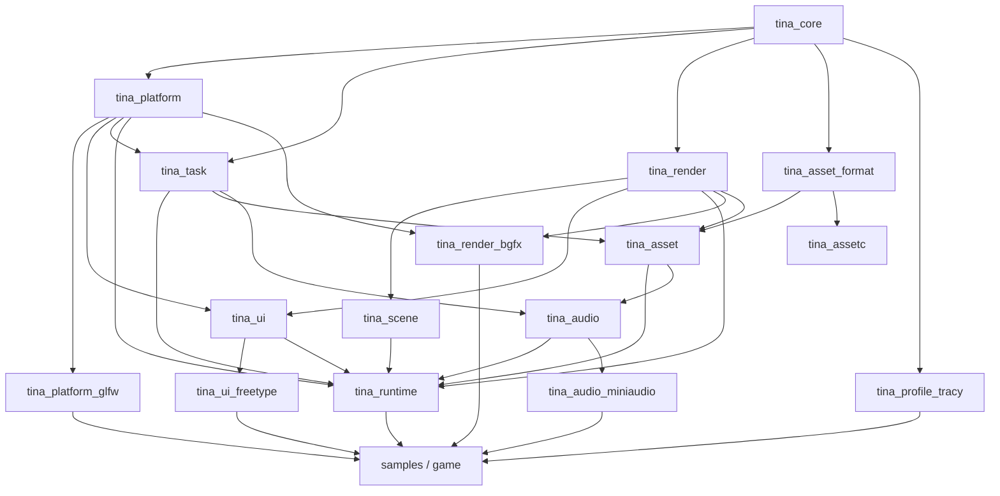
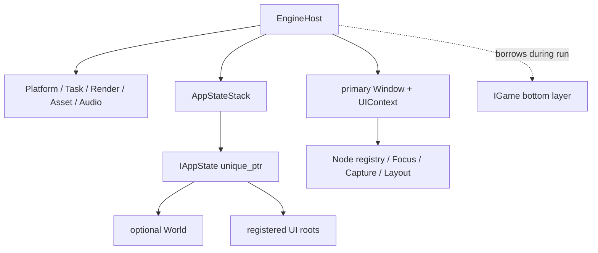

# Tina vNext 目标架构

> 状态：设计讨论稿。本文描述完整目标，不代表相关接口已经在当前源码中落地。

## 设计结论

Tina vNext 采用完整架构重构，但不采用一次提交替换全部 Runtime 的方式。目标架构先整体
设计，实施时按可运行的垂直切片迁移；每个切片都必须直接运行 GoogleTest，并至少保留
一个可见、可退出、可验证资源回收的 2D、UI 或 3D 路径。

这两点并不冲突：

- 目标必须完整，避免围绕旧 `Application` 不断打补丁；
- 迁移必须渐进，避免几个月后才第一次构建、运行和发现边界错误；
- 旧实现只在新切片覆盖同一能力并通过门禁后删除；
- Carbon Engine 只提供设计证据，不成为 Tina 的依赖、API 兼容目标或代码模板。

## 不可变技术边界

| 领域 | vNext 决定 |
| --- | --- |
| 平台 | Windows 与 Linux |
| Windows 主门禁 | Visual Studio 2026 / MSVC 19.50 |
| 语言 | 目标 C++23；所有 Tina target 统一后再宣称迁移完成 |
| 编码 | 源码、文档、资源清单和日志均为 UTF-8；MSVC 强制 `/utf-8` |
| 窗口与基础输入 | GLFW；不使用 SDL/SDL3 |
| Windows IME | IMM32，只存在于 Windows 平台适配层 |
| 渲染 | bgfx 是首个且唯一真实后端；公共层不暴露 bgfx 类型 |
| ECS | EnTT 只作为 `tina_scene` 内部存储 |
| 容器 | 不依赖 EASTL；默认标准库与 `std::pmr`，只自研少量引擎专用固定容量结构 |
| Hash | xxHash 作为私有实现保留，不进入公共类型，不承担安全校验 |
| Profiling | Tina-owned Trace/Metrics 前端；Tracy 是可选 Profile 后端，正式 benchmark 默认关闭 |
| UI | Tina 自研 Retained UI，不使用 RmlUi/ImGui 作为游戏 UI |
| 音频 | miniaudio 后端，位于独立模块 |
| 测试 | GoogleTest 1.17.0，直接执行测试程序；不使用 CTest 调度 |
| Carbon | 本地 `temp/carbon-engine` 只读参考，不提交、不链接、不打包 |

## 模块边界

首期目标 target 如下。目录可以先在单一仓库内演进，但依赖方向必须从第一条垂直切片
开始执行。

| Target | 职责 | 允许依赖 | 禁止内容 |
| --- | --- | --- | --- |
| `tina_core` | 基础类型、Result、时间、诊断、UTF-8 路径/原子 IO、ID/Hash、轻量内存统计、少量专用容器 | 标准库、OS-specific `.cpp`、私有 xxHash adapter | GLFW、bgfx、EnTT、EASTL、游戏逻辑、全局服务 |
| `tina_platform` | Window/Input/Event 公共描述、Headless backend、线程命名和不透明 Render surface | `tina_core`、OS 最小适配 | GLFW 公共类型、文件/资产 IO、Scene、Renderer、UI Widget |
| `tina_platform_glfw` | GLFW Window/Input/Gamepad、DPI、Windows IMM32 的具体 backend | core/platform、GLFW、OS API | Scene、Asset、UI Widget、bgfx 类型 |
| `tina_task` | 有界任务队列、协作取消、后台工作与主线程 completion | `tina_core`、`tina_platform` 的线程命名能力 | Asset 类型、渲染命令、强杀线程 |
| `tina_runtime` | 组合根、生命周期、Frame Pipeline、Event Queue、AppStateStack | core/platform/task 及 scene/asset/render/ui/audio 公共接口 | 具体 GLFW/bgfx/miniaudio factory、Singleton、Service Locator、玩法 |
| `tina_scene` | World、generation `EntityId`、Transform、Camera、render components | core、render descriptors、EnTT 内部实现 | GLFW 输入、TileMap 玩法、bgfx 类型 |
| `tina_asset` | Asset 状态机、依赖、取消、CPU completion 与 GPU upload 协议 | core/task、render 接口、asset_format | 直接解析源 glTF、具体 bgfx 调用 |
| `tina_asset_format` | Runtime/Cooker 共享的 Cooked header、schema、类型、依赖和 hash 编解码 | core | Asset registry、窗口、GPU、源格式 parser |
| `tina_render` | typed handle、资源描述、RenderScene、DisplayList、Pass Scheduler | core | bgfx 公开类型、Scene registry、平台窗口细节 |
| `tina_render_bgfx` | bgfx 设备实现、shader/texture/buffer 上传与 Present | core/platform/render、bgfx | 游戏组件、源资产解析 |
| `tina_ui` | Retained Tree、布局、路由输入、焦点、Widget、DisplayList、Glyph Atlas 和字体 rasterizer 接口 | core、platform InputFrame、render 描述 | bgfx/FreeType 类型、全局 UI 状态、隐式布局 |
| `tina_ui_freetype` | FreeType glyph rasterizer 的具体 adapter | core、ui、FreeType | Widget/Scene、Render backend、全局字体服务 |
| `tina_audio` | AudioEngine、Bus/voice generation handle、实时命令/完成队列、Disabled backend | core/task、asset lease | miniaudio 类型、World/ECS、callback 内 IO/分配 |
| `tina_audio_miniaudio` | miniaudio 设备/callback/stream backend | core、audio、miniaudio | Gameplay/World/UI、Asset registry 直接查询 |
| `tina_profile_tracy` | Tina Trace 到 Tracy 的可选编译期 adapter | core、固定版本 Tracy Client | Engine 公共 API、发布包强制依赖 |
| `tina_assetc` | 源资产验证、Cook、Manifest 和原子写盘 | core、asset_format、固定源格式工具 | Runtime 窗口、在线 GPU 依赖 |
| samples/tests | 选择具体 factories，执行2D/UI/3D垂直验收和模块契约测试 | 公共接口、所需具体 backend | 访问模块内部存储绕过契约 |

`tina_core` 内部会按职责分目录，但首期仍保持一个物理 target；只有出现真实的链接、构建
时间或平台依赖需求时才拆 target，避免用大量微型库制造复杂度。



箭头表示“被依赖方 → 使用方”。禁止形成 Runtime、Scene、UI、Asset、Render 之间的环。
跨模块协作通过小接口、不可变帧数据或 generation handle 完成。

## 容器、内存与 Hash 决策

vNext 不链接 EASTL。当前 `tina_core_legacy` 及旧代码继续使用 EASTL 只是迁移事实，新 target
不得 include EASTL 头文件或通过 Tina alias 间接使用。Legacy 零引用后同时删除 EASTL、
EABase 和旧 `EASTLAlloc.cpp`。

移除 EASTL 不等于自研 STL。下列通用能力直接使用标准库：

- 动态连续数组、字符串、Map/Set、智能指针、Optional、Variant 与算法；
- 有生命周期分区需求时使用 `std::pmr` 容器和 Tina-owned `memory_resource`；
- 跨模块接口优先 `std::span`、`std::string_view`、typed handle 和 descriptor，不传递容器
  所有权。

Tina 只实现具有明确引擎语义、标准库不能直接表达的最小结构：

| 类型 | 契约 | 首个使用者 |
| --- | --- | --- |
| `StaticVector<T, N>` | 对象内存储、永不回退到堆、满容量显式失败、可导出 `span` | Render/UI 帧命令 |
| `InlineFunction<Signature, Bytes>` | 固定内联存储、禁止堆分配、过大 callable 编译期拒绝 | Event/Task 小回调 |
| `FrameArena` | 线性分配、对齐校验、整帧 reset、当前/峰值统计 | Render Extraction/UI Layout |
| `GenerationPool<T, Tag>` | index + generation、stale handle 失败、slot 复用可测试 | Entity/Node/Render/Asset handle |
| `SpscRingQueue<T, N>` | 固定容量、单生产者/单消费者、明确 full/empty | 只有 Audio/Upload profiling 证明需要时 |

不首期自研 DynamicVector、String、HashMap、SharedPtr、Sort 或通用无锁容器。每个 Tina 专用
结构必须先有调用场景、容量策略、溢出行为、异常/析构契约和 GoogleTest，再进入 Core。

xxHash 与 EASTL 分开决策。vNext 保留 xxHash 为私有算法后端：`ContentHash` 使用明确版本的
128 位算法支持增量 Cook 和缓存；`StringId` 可使用固定64位算法/seed，并在 Debug 保存原文
检测碰撞。`AssetId` 是独立稳定128位身份，generation handle 是 index + generation。路径
相等不能只比较 Hash，安全签名或不可信包完整性也不能使用非密码学 xxHash。

完整预算、MemorySystem、FrameArena 复用点和跨模块资源矩阵见
[性能预算与内存系统](performance-memory.md)。Task Executor、背压、barrier 和 shutdown
状态机见 [Task System 与线程生命周期](task-system.md)。

## Runtime 所有权与公共接口

`EngineHost` 是 vNext 的唯一组合根。它接管模块实例和主循环，但不成为可从任意位置访问
的全局对象。早期草案只有 `Create(config)`，这不足以同时满足“Runtime 不依赖具体 backend”
和“Null Runtime 不链接 GLFW/bgfx”；最终接口显式接收 factory bundle：

```cpp
struct EngineConfig;
struct EngineFactories;

class EngineHost final {
public:
    static Core::Result<std::unique_ptr<EngineHost>> Create(
        EngineConfig config,
        EngineFactories factories);

    Core::Result<RunExitReason> run(IGame& game);
};

class IFrameClient {
public:
    virtual ~IFrameClient() = default;
    virtual Core::Status fixedUpdate(FixedUpdateContext& context) = 0;
    virtual Core::Status update(UpdateContext& context) = 0;
    virtual Core::Status extractRender(RenderExtractionContext& context) = 0;
    virtual Core::Status updateUI(UIUpdateContext& context) = 0;
};

class IGame : public IFrameClient {
public:
    virtual ~IGame() = default;
    virtual Core::Status onStart(StartContext& context) = 0;
    virtual void onStop(StopContext& context) noexcept = 0;
};
```

生产 executable 负责构造 `GlfwPlatformFactory + BgfxRenderFactory + FreeTypeRasterizerFactory +
MiniaudioBackendFactory`；Null sample 使用 `HeadlessPlatformFactory + NullRenderFactory +
DisabledUI/DisabledAudioFactory`。Factory
只创建实例，成功后所有权立即转交 EngineHost 并登记逆操作。`EngineConfig` 是可验证的纯值
配置，不偷偷保存 owning service；具体 factory 也不能通过全局注册表发现。

阶段 Context 是不可复制、只在当前回调有效的 capability view：

| Context | 可访问能力 | 明确禁止 |
| --- | --- | --- |
| `StartContext` | 注册初始 AppState、加载请求、订阅与启动事务回滚 | 保存 Context、直接拥有 Engine module |
| `StateEnterContext` | 暂存 World/UI roots/订阅/TaskGroup 与回滚动作，commit 前不可接收输入 | 直接激活 root、修改旧栈、保存 Context |
| `StateExitContext` | 释放状态订阅/资源并读取只读退出原因 | 新建 Task/Asset/Window、重新激活自身 |
| `FixedUpdateContext` | fixed timing、Simulation Action、World query/command、当前 TaskGroup | Frame/UI Action、Window/bgfx、保存 FrameArena span |
| `UpdateContext` | real/unscaled delta、Frame Action、Asset query、状态切换请求 | Simulation edge、直接 commit 状态、阻塞 IO |
| `RenderExtractionContext` | interpolation、只读 World view、`RenderSceneBuilder` | 修改 World、保存 builder/descriptor |
| `UIUpdateContext` | Retained roots/model action、UI dirty 请求 | 每帧重建 UIContext、直接提交 bgfx |
| `StopContext` | 只允许撤销订阅/状态和查询关闭诊断 | 创建新 Asset/Task/Window |

所有 frame callback 返回 `Status`。Builder 同时保存 sticky first-error；Runtime 在回调返回后
检查两者，`CapacityExceeded`、device failure 或异常都会转成结构化 `Error`，不能继续提交
半帧。C++ exception 保持开启以兼容标准库与第三方，但会在 Engine、IGame、Task、C callback
边界捕获；热点正常路径不通过 throw 控制流程。

### AppState、World 与 UI 所有权

`IGame` 是永久 bottom layer，EngineHost 在 `run()` 期间借用它；Runtime 拥有 overlay
`AppStateStack`，其中每项是 `unique_ptr<IAppState>`。`IAppState` 实现与 `IFrameClient` 相同
的阶段回调，并声明 fixed、variable、gameplay input、UI input、render 五类向下阻断规则。

`IAppState` 另有事务式 `onEnter(StateEnterContext&) -> Status`、`onExit(StateExitContext&) noexcept`
和 enter 时冻结的 `StatePolicy`。vNext 不保留另一套二值 `onPause/onResume`：一个状态可能只被
阻断 Fixed/Input 但继续 Render，二值 Paused 无法准确表达。Runtime 每帧按 policy 计算各 phase
可见集合；状态需要改变策略时提交 policy-change request，并同 push/pop 一样只在 Deferred
Cleanup 生效。



AppState 可以拥有一个 World 和若干 UI root，但不拥有窗口级 `UIContext`。vNext 不再保留
第二套并列的 SceneManager 栈；旧 Scene 在迁移时转换成 IAppState，World 只是数据世界。
首期只有一个 primary Window/UIContext，多窗口保留 `WindowId` 扩展点但不进入验收范围。

Update/Input 从栈顶向下传播直到对应 block flag；Render 从最底可见层向上构建。所有
push/pop/replace 请求只排队，在 Deferred Cleanup 的唯一提交点执行；当前帧回调集合保持
稳定，新状态完成 enter 和首轮显式 layout 后，从下一帧开始接收输入。旧状态退出时先注销
UI roots/订阅并停止自己的 TaskGroup，再释放 World。

push/replace 在旧栈仍完整时先构造新状态并运行 enter transaction；失败就逆序撤销新状态，
旧栈和 phase policy 不变，且不调用新状态 `onExit`。成功后才原子提交 stack/policy，再对被
替换状态调用一次 `onExit` 并销毁。pop 先从下一帧 dispatch 集合移除目标、撤销 roots/focus/
capture、停止 TaskGroup，再调用一次 `onExit`。`onExit` 抛出属于 invariant failure，不能恢复
成“半退出”状态。

### Engine 状态

```text
Create: Constructing -> Ready
run:    Ready -> Starting -> Running -> Stopping -> Stopped
                      \-> Failed ----/
```

- `Create` 失败不返回 EngineHost，已成功模块逆序回滚；
- `run()` 每个 EngineHost 只允许调用一次；窗口关闭、游戏请求退出和 fatal error 都映射为
  `RunExitReason`，错误仍通过 `Result` 保留上下文；
- `onStart` 的状态/订阅注册属于 Start transaction；成功才 commit，失败自动撤销且不调用
  `onStop`；
- `onStart` 成功后 `onStop` 恰好一次，即使帧回调失败也一样；`onStop` 必须 `noexcept`；
- 析构 Ready 但未 run 的 Host 只关闭模块；Stopped/Failed 再次 shutdown 幂等；
- Context、builder、`span/string_view` 和 FrameArena 数据禁止保存到回调之外。

以下基础契约不变：

- `Create` 返回 `Result`，不得产生可运行的半初始化对象；
- 每个成功初始化阶段立刻登记逆序回滚动作；
- Runtime 析构顺序必须由测试固定，不能依赖静态对象退出顺序；
- 禁止 `Application::instance()`、Singleton 与 Service Locator。

## Frame Pipeline

主线程每帧只有一个明确顺序：

```text
Platform Poll
  -> InputFrame Finalize (Snapshot + ordered transitions)
  -> Event Queue
  -> Asset CPU Completion
  -> Audio Completion
  -> UI Input Routing (上一帧已提交布局)
  -> Gameplay Action Mapping
  -> Fixed Simulation Loop (60 Hz, max 4 steps)
       for each tick:
         Snapshot Previous Transform
         Fixed Jobs -> Barrier
         Stable Command Merge -> Commit
         World Transform Propagation
  -> Variable Update
  -> Render Extraction
  -> UI Model Commit / Layout / Display List
  -> GPU Upload Budget
  -> Render Pass Scheduler
  -> Present
  -> Deferred Cleanup
       AppState transition commit
       generation/deferred resource retire
```

状态和数据流约束：

- InputFrame、普通 Event Queue、UI routed event 是三条独立通道；InputFrame 同时保留最终设备
  状态和有序 transition，不能用单个 pressed/released 布尔值代替同帧事件顺序；
- UI 输入先于玩法 Action Mapping，消费掩码阻止同一 Pointer/Key 同时触发 UI 与玩法；UI
  使用上一帧稳定布局；每个 Pointer transition 最多 hit-test 一次，新 root 首次 layout 前不开放命中；
- `pressed/released` Action 只由下一个实际 fixed tick 消费一次；本帧0个 tick 时保留，4个
  tick 时也不会重复4次；held state 可供每个 tick 读取；
- Action Map 将输入显式分为 Simulation/Frame domain：Simulation edge 只进 Fixed Context，
  Frame edge 只进当帧 Update Context，禁止同一隐式 edge 被 variable/fixed 各执行一次；
- 每个 fixed substep 都在 barrier 后提交自己的 World commands，使第 N 步结果对第 N+1 步
  可见；遍历中不直接破坏实体/层级；
- Render Extraction 生成当前帧不可变 `RenderScene`，Renderer 不访问 EnTT registry；
- UI 每帧最多批量布局一次，hit-test 和 render 不允许隐式触发布局；
- CPU completion 与 GPU upload 是两个队列，分别按任务数、字节数和时间预算；
- GPU Asset 在 Upload 阶段成功后只进入“下一帧可见”的 ready snapshot；当前帧 extraction/UI
  不因中途完成而观察到不同资源状态；
- Present 后只执行延迟销毁和回收，不重新进入玩法更新；
- 所有跨帧句柄都带 generation，迟到任务必须重新校验。

Runtime 记录未裁剪 `realDelta`，但 Simulation accumulator 使用经验证的有限、非负、上限
配置（默认250 ms）的 delta。最多4步后丢弃超额时间债务、保留小于一个 fixed delta 的余量，
并增加 dropped-time metric。暂停只停止对应 AppState 的 gameplay/fixed/variable dispatch；
Platform、UI、Asset、Audio 和必要 Render 仍推进。最小化窗口跳过无效 surface 的 Render/
Present 并使用平台等待避免 busy loop，但继续处理关闭和异步完成。

## Scene 与 Render Extraction

`World` 对外只暴露 Tina 的 `EntityId { index, generation }`、组件命令和查询接口，EnTT
registry 只存在于实现文件中。

统一空间约定：右手坐标系、Y-up、-Z forward、单位米，2D 位于 XY 平面。Transform 至少
包含 `LocalTransform`、`Parent` 和缓存的 `WorldTransform`；层级变更必须检测循环并通过
阶段末 command commit 生效。

Transform 命令采用确定语义：reparent 默认保持 WorldTransform 并重新计算 local，调用方也可
显式选择 keep-local；父实体销毁默认把子实体 reparent 到 root 并保持 world，递归销毁必须
使用单独命令。一次批量 commit 先在临时依赖图上检测包含“本批新边”的循环，再按稳定
EntityId 顺序应用。Quaternion 写入时归一化，接近零长度返回错误；非均匀 scale 允许用于
渲染层级，但物理 adapter 必须拒绝或显式近似不支持的组合。

每个 fixed tick 开始把 current 复制为 previous，tick commit 后传播 current WorldTransform；
新实体令 previous=current，已销毁实体不进入下一次 extraction。Render 按 interpolation alpha
在 previous/current 间插值 position/rotation/scale，不对完整矩阵逐元素插值。首期每个
RenderScene 的每个启用 World pass 的 `RenderView` 显式选择一个 active Camera；同一 view
零个或多个 Camera 都返回诊断而非依赖遍历偶然顺序。纯 UI/Present 或 Headless 帧可以没有
World view 和 Camera；首期只支持一个 primary World view，多视口/画中画后置。

`RenderSceneBuilder` 从 World 提取 Camera、Mesh、Sprite 和 UI 所需的只读数据。Scene
组件保存 Tina typed handles 和材质/几何引用，不保存 bgfx handle。这样 NullRenderDevice
与 bgfx 后端能消费同一份描述。

## Render 设备与 Pass

公共 `RenderDevice` 只提供 generation typed handle 和资源描述。首期只需要 Buffer、Texture、
Sampler、Shader、Pipeline 等实际被 2D/UI/3D 使用的资源，不建设完整多后端 RHI。

首期声明式 Pass 为：

1. `Opaque3D`；
2. `Sprite2D`；
3. `UI`；
4. `Present`。

Pass 显式声明名称、顺序、读写资源及 clear/load/store 语义。执行失败后停止依赖 Pass，
调度器仍负责归还帧临时资源。`NullRenderDevice` 使用相同接口验证 Pass 顺序、无效 generation、
重复释放和 300 帧零泄漏生命周期；bgfx 类型只存在于 `tina_render_bgfx`。

上述是 enabled pass 的稳定相对顺序，不强制提交空 draw。纯 UI 帧可跳过 Opaque3D/Sprite2D，
Headless 的 Present 是可计数 no-op；启用集合在执行前由不可变 RenderScene/Surface 状态决定。

RenderDevice 只允许主线程调用资源 create/destroy、`beginFrame`、submit 和 `endFrame/present`；
bgfx 可以拥有内部线程，但 Tina 不从任意 Worker 并发提交。设备状态固定为：

```text
Uninitialized -> Ready -> FrameOpen -> Ready
Ready/FrameOpen -> SurfaceSuspended -> Ready
任意活动状态 -> DeviceLost/Fatal -> ShuttingDown -> Stopped
```

- Window resize/content-scale 事件只在帧边界更新 surface；0×0/minimized 进入 Suspended，不创建
  零尺寸 attachment，也不 busy-present；
- 首期 device lost 作为结构化 fatal run error 并安全退出，不承诺透明重建所有 GPU 资源；
- `beginFrame/endFrame` 不成对、跨 device/owner 使用 handle、重复 destroy 和 submit stale
  generation 都是可测试错误；Debug handle 增加 owner cookie，避免相同 index/generation 在
  另一个 registry 中被误解析；
- deferred destroy 由 backend completion/frame fence 决定，不能硬编码“延迟 N 帧即安全”；
- Pass 失败停止依赖提交，但仍关闭 marker、回收 CPU frame data，并把已提交 GPU ticket 转入
  正常 retire；
- UI/layout 使用左上原点、Y-down 的逻辑坐标；唯一一次转换发生在 UI Render extraction，
  世界/Scene 始终保持右手 Y-up，禁止在 layout、hit-test 和 shader 中各自翻转。

GPU p99 只有 backend 提供校准 timestamp、有效样本标记和延迟 frame mapping 时才是硬门禁；
CPU submit 时间或 bgfx 估算 stats 只能标为 informational。完整测量口径见
[性能预算与内存系统](performance-memory.md)。

## Asset 与 Cooker

Runtime 只读取 Cooked Asset，不直接解析源 glTF、图片、字体或 shader。资产状态为：

```text
Unloaded -> Queued -> Loading -> ReadyCpu -> UploadQueued -> Ready
                                  |              |
                                  +-> Failed     +-> Failed
任意未完成状态 -> Cancelled
```

每个异步操作携带 Asset slot generation 和 cancellation token。后台线程只做 IO、解析和 CPU
构建；需要 GPU 的步骤进入主线程 upload queue。CPU-only Asset 在 main completion 成功后可
Ready；GPU Asset 只有 upload 成功提交并生成有效 Render handle 后才能 Ready，而且统一从
下一帧 ready snapshot 可见。稳定 128 位 `AssetId` 用于逻辑身份，内容 Hash 用于增量 Cook
和缓存，二者不得混用。

AssetId 由显式 import 一次分配并保存在 Asset Catalog/metadata，普通 cook 遇到缺失/重复 ID
直接失败；它不从路径或内容 Hash 推导。移动保留 ID，复制为新 Asset 必须获得新 ID。Cook
cache key 覆盖源内容、规范化设置、依赖 Cooked Hash、Cooker/schema/type/shader ABI 与目标
平台；锁定输入必须生成 byte-for-byte 确定产物，绝对路径、机器名和时间戳不得进入产物。

`AssetHandle<T>` 是可复制的弱 generation lookup，不延长 payload 生命周期；跨异步任务、
Render upload 或 Audio playback 保存数据时必须持有 `AssetLease<T>` 强引用。Lease 计数归零
只表示可以进入 eviction/retire，不代表 GPU 或 callback 已物理停止使用。首期不做自动 LRU；
只有显式 unload/shutdown 会启动退役，避免隐藏的帧间抖动。

GPU upload 返回 `UploadTicket`。Ticket 拥有 staging allocation，并在 backend completion/fence
确认后释放；逻辑取消只能阻止 Ready 提交，不能提前回收已经交给 GPU 的内存。GPU destroy
同样进入 `DestroyQueued -> Retiring -> Released` 账本，generation slot 可逻辑失效，但物理
资源计数在 backend 确认后才递减。Audio voice 使用相同原则持有 `AssetLease<AudioClip>`，
callback ACK 前不能释放 PCM。

Asset 依赖必须形成可验证 DAG：加载前检测 self/cycle，父 Asset 在 Ready 前要求所有必需依赖
Ready；依赖失败附加完整 chain 并令父失败，可选依赖使用类型明确的 fallback。Retry 创建新
request generation，旧 completion 永远不能复活新请求。损坏 Cooked 文件在分配大 payload
前检查 magic、schema、type、platform、size、alignment、dependency count 和 ContentHash。

`tina_assetc` 固定流程：

```text
Parse Source
  -> Validate Source
  -> Build Cooked Representation
  -> Validate Cooked Representation
  -> Atomic Write
  -> Update Manifest
```

Runtime 与 Cooker 只通过 `tina_asset_format` 共享版本化 wire schema，不共享 registry、任务或
GPU 类型。首期 header 至少包含 magic、schema version、asset type/version、target platform、
endianness、payload size/alignment、dependency table 和 ContentHash。Cooker 在 staging 目录
写完并重新读取验证所有产物后，最后原子替换 Manifest；崩溃时旧 Manifest 仍只引用旧的完整
产物，不能出现新清单指向半文件。

首期 glTF 只支持静态三角形 Mesh、节点层级、Position/Normal/UV0/Index、基础颜色和纹理。
源解析固定使用 MIT、单文件、无额外依赖的 `cgltf v1.15`，源码版本和许可证进入依赖清单；
Skin、Animation、Morph 与压缩扩展返回明确诊断，不静默忽略。Shader 只接受 bgfx `shaderc`
离线产物，Cooked shader 记录 backend/profile 与接口版本；Runtime 不调用 shader compiler。

## 自研 UI

现有 UI 的 generation `NodeId`、Capture/Target/Bubble、Pointer Capture、Focus、Modal Focus
Scope、Theme/DPI、Scroll/List、TextEdit/IME 和手柄导航是应迁移的有效能力，不因 vNext
重构而丢弃。

vNext 中每个 Window 拥有一个 `UIContext`。UI 树只输出后端无关的 Quad、Text、Clip
Display List，由 Render 层批处理。布局采用 Measure/Layout 与 Flex 子集；每个有序 Pointer
transition 最多 hit-test 一次。Button、Panel、Label、Checkbox、Slider 等 Widget 复用同一套节点、
action 和 routed event 契约，不通过全局回调访问 Runtime。

早期 `IGame::buildUI(UIContext&)` 容易被理解为 Immediate UI 式每帧重建，现已改为
`updateUI(UIUpdateContext&)`：AppState 在 enter/exit 时创建、注册和销毁 retained roots，
每帧只更新 model、style 和 dirty state。Runtime 先用上一帧已提交布局路由输入，再在玩法
Update 后统一执行 model commit、最多一次 layout 和 DisplayList build。UI action 请求的
AppState 变化在 Deferred Cleanup 提交，新状态从下一帧接收输入，因此不会发生点击穿透或
路由中销毁当前树。

## 迁移策略

设计冻结后再创建独立 `codex/` 分支和 worktree。主工作区未提交内容不复制、不 stash、
不代替用户提交。实施按以下垂直切片推进：

1. **Null Runtime**：`tina_core + tina_platform(headless) + tina_task + tina_runtime +
   tina_render/NullRenderDevice + tina_tests + tina_bench + tina_sample_null`，并为最终 Context/
   shutdown 建立 scene/asset/ui/audio 的最小契约和 Empty/Disabled 生命周期壳；连续运行300帧和
   10,000帧，覆盖初始化失败回滚、阶段顺序和析构；不链接 GLFW/bgfx/EnTT/FreeType/miniaudio/
   Tracy/cgltf，也不实现 World、Asset load、Widget/Glyph 或真实音频；
2. **Platform/UI**：GLFW 输入、中文字体、IMM32、Label/Button/Modal 形成可运行 UI 样例；
3. **Scene/2D**：generation Entity、Transform、Camera、Sprite extraction 形成 2D 样例；
4. **Render/3D**：Pass Scheduler、bgfx typed handle、Perspective、depth、静态 Cube 形成 3D
   样例；
5. **Asset**：双阶段队列、Cooked Manifest、纹理和静态 glTF 从 cooker 进入 2D/3D；
6. **产品 UI/Audio**：设置页 Checkbox/Slider 接入 miniaudio 与 fullscreen；
7. **Legacy 删除**：确认旧接口零引用后，按模块独立删除旧 target/实现和无用依赖，不执行
   模糊的整目录删除。

每个切片包含代码、GoogleTest、构建/运行证据、UTF-8 文档和一个可回滚提交。只有新分支
合入最新已提交的 `dev` 并再次通过门禁后，才允许合并回干净的主工作区。

首个 Null/Bench 提交通过后，Tracy adapter 作为同里程碑的第二个独立提交接入：它只增加
Profile preset、`tina_profile_tracy`、capture/shutdown test 和 A/B 证据，不与 GLFW/bgfx/UI
迁移混合。这样 Trace 前端先由空 backend 验证语义，再验证 Tracy，不让 profiler 成为启动
Runtime 的前置条件。

迁移期间旧 `Tina` executable 与新 `tina_sample_*` 并存：旧 target 只允许修阻断迁移的 bug，
新 target 禁止链接 `Tina::CoreLegacy`、EASTL/EABase 或 include 旧聚合头。第一条新可运行切片
建立后加入 `TINA_BUILD_LEGACY`：双架构迁移期默认 ON 以保留当前游戏基线，同时提供明确的
vNext-only preset 设为 OFF；当新2D/UI/3D/Audio 覆盖门禁后先把默认翻为 OFF，M12 再删除选项
和旧源码。CI 分别构建 Legacy ON 和 vNext-only OFF。每个旧模块用“旧符号/target → 新替代 →
`rg` 零引用 → Windows/Linux/test/smoke 证据 →
独立删除提交”清单退役。旧 API、原始资源路径、场景、存档和玩法行为不承诺二进制或数据
兼容；需要保留的数据必须通过显式 converter，而不是长期桥接两套 Runtime。

## 验收门禁

- Visual Studio 2026 / MSVC 19.50 Debug/Release configure、build 与直接执行 `tina_tests`；
- Linux GCC 与 Clang 构建；正式支持前还要运行 GLFW/bgfx 2D/UI/3D，Clang sanitizer 只有真实
  运行通过后才能标记完成；
- NullRenderDevice 300帧 smoke 与10,000帧 lifecycle/benchmark；
- 2D 显示 Sprite、中文 Label 和可交互 Button；
- UI 验证 Modal、Focus、Pointer Capture、TextEdit/IME、Checkbox 与 Slider；
- 3D 显示透视相机下的静态 Mesh，验证 depth 与资源释放；
- 初始化失败点、Frame accumulator、Scene command、Asset cancel、Pass 顺序、UI layout/routing
  都有直接 GoogleTest；
- 进程退出码、日志、资源计数和实际画面分别记录，不能用退出码 0 代替视觉结论。

## 剩余冻结事项

Backend factory、阶段 Context、AppState/World/UI 所有权、C++ exception、32位 generation 回绕
retire、XXH3-128、Asset Handle/Lease/Ticket、Trace/Tracy 和 `tina_bench` schema/统计协议均已
形成 Accepted ADR 或候选决定。尚未闭合的是：

1. 建立稳定的 hard-gate machine profile；当前开发机只产生 provisional 结果；
2. 用户确认合成 workload 是否匹配预期游戏规模；
3. 各垂直切片根据实测 peak 冻结 FrameArena、Task queue/stack、Render/UI/Upload/Audio 容量；
4. 固定 Linux vNext 工具链版本、sanitizer preset 和截图 reference profile。

统一决策状态、实现前 P0 选择和明确后置范围集中维护在
[vNext 设计冻结清单](design-freeze.md)。若本文与冻结清单冲突，应先修正文档，不能由实现
代码自行选择另一套语义。
