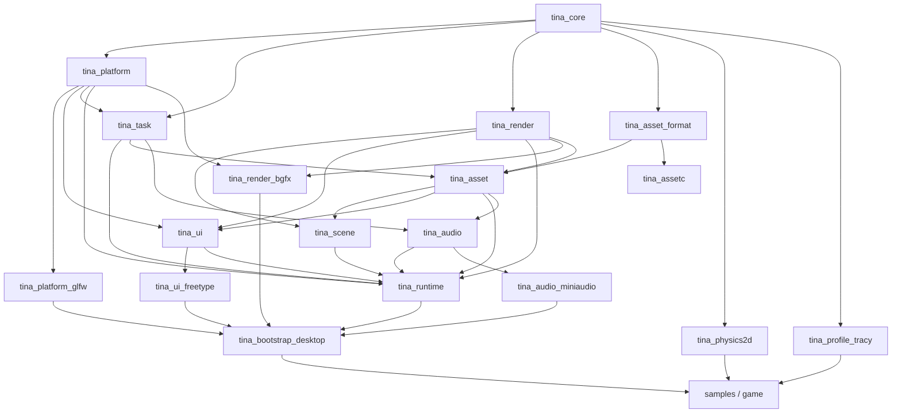
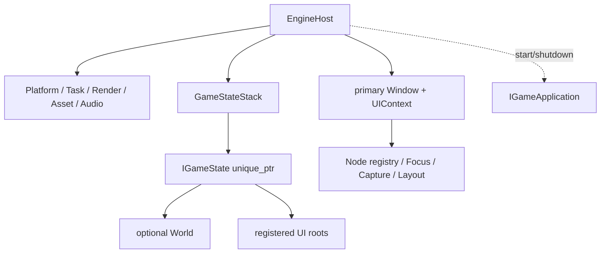

# Tina vNext 目标架构

> 状态：目标架构已冻结并按 M6–M12 分批实施；各章节的“已落地”状态以 Roadmap 和测试记录为准。

## 设计结论

Tina vNext 采用完整架构重构，但不采用一次提交替换全部 Runtime 的方式。目标架构先整体
设计，实施时按可运行的垂直切片迁移；每个切片都必须直接运行 GoogleTest，并至少保留
一个可见、可退出、可验证资源回收的 2D、UI 或 3D 路径。

这两点并不冲突：

- 目标必须完整，避免围绕旧 `Application` 不断打补丁；
- 迁移必须渐进，避免几个月后才第一次构建、运行和发现边界错误；
- 旧实现只在新切片覆盖同一能力并通过门禁后删除；
- Carbon Engine 只提供设计证据，不成为 Tina 的依赖、API 兼容目标或代码模板。

## 不可变技术边界

| 领域 | vNext 决定 |
| --- | --- |
| 平台 | Windows 与 Linux |
| Windows 主门禁 | Visual Studio 2026 / MSVC 19.50 |
| 语言 | C++23；Tina 自有 target 已统一，Linux GCC 13.4 与 Clang 22.1.8 + libstdc++15 ASan/UBSan 已实测 |
| 编码 | 源码、文档、资源清单和日志均为 UTF-8；MSVC 强制 `/utf-8` |
| 窗口与基础输入 | GLFW；不使用 SDL/SDL3 |
| Windows IME | IMM32，只存在于 Windows 平台适配层 |
| 渲染 | bgfx 是首个且唯一真实后端；公共层不暴露 bgfx 类型 |
| ECS | EnTT 只作为 `tina_scene` 内部存储 |
| 容器 | 不依赖 EASTL；默认标准库与 `std::pmr`，只自研少量引擎专用固定容量结构 |
| Hash | xxHash 作为私有实现保留，不进入公共类型，不承担安全校验 |
| Profiling | Tina-owned Trace/Metrics 前端；Tracy 是可选 Profile 后端，正式 benchmark 默认关闭 |
| UI | Tina 自研 Retained UI，不使用 RmlUi/ImGui 作为游戏 UI |
| 音频 | miniaudio 后端，位于独立模块 |
| 测试 | GoogleTest 1.17.0，直接执行测试程序；不使用 CTest 调度 |
| Carbon | 本地 `temp/carbon-engine` 只读参考，不提交、不链接、不打包 |

## 模块边界

首期目标 target 如下。目录可以先在单一仓库内演进，但依赖方向必须从第一条垂直切片
开始执行。

| Target | 职责 | 允许依赖 | 禁止内容 |
| --- | --- | --- | --- |
| `tina_core` | 基础类型、Result、时间、诊断、UTF-8 路径/原子 IO、ID/Hash、轻量内存统计、少量专用容器 | 标准库、OS-specific `.cpp`、私有 xxHash adapter | GLFW、bgfx、EnTT、EASTL、游戏逻辑、全局服务 |
| `tina_platform` | Window/Input/Event 公共描述、Headless backend、线程命名和不透明 Render surface | `tina_core`、OS 最小适配 | GLFW 公共类型、文件/资产 IO、Scene、Renderer、UI Widget |
| `tina_platform_glfw` | 最终承载 GLFW Window/Input/Gamepad、DPI、Windows IMM32；当前已完成 Window/Keyboard/Pointer/Focus/resize/close/committed text | core/platform、GLFW、OS API | Scene、Asset、UI Widget、bgfx 类型 |
| `tina_task` | 有界任务队列、协作取消、后台工作与主线程 completion | `tina_core`、`tina_platform` 的线程命名能力 | Asset 类型、渲染命令、强杀线程 |
| `tina_runtime` | 组合根、生命周期、Frame Pipeline、Event Queue、GameStateStack、RenderFramePacket/pool；当前含 M7-C1c-b3b/b3c/b3d1/b3d2 private UI route producer、primary-window Context owner、容量/layout coordinator、startup seed 与 scoped Game SDK UI facade | core/platform/task 及 scene/asset/render/ui/audio 公共接口 | 具体 GLFW/bgfx/miniaudio factory、Singleton、Service Locator、玩法 |
| `tina_scene` | World、generation `EntityId`、Transform、Camera、render components 与资产解析 facade | core、asset 公共接口、render descriptors、EnTT 内部实现 | GLFW 输入、TileMap 玩法、bgfx 类型 |
| `tina_asset` | Asset 状态机、依赖、取消、CPU completion 与 GPU upload 协议 | core/task、render 接口、asset_format | 直接解析源 glTF、具体 bgfx 调用 |
| `tina_asset_format` | Runtime/Cooker 共享的 Cooked header、schema、类型、依赖和 hash 编解码 | core | Asset registry、窗口、GPU、源格式 parser |
| `tina_render` | typed handle、资源描述、RenderScene/DisplayList view、RenderSurfaceState、FramePinSink、Pass Scheduler | core | bgfx 公开类型、Scene registry、平台窗口细节、Asset/UI/Platform concrete pin |
| `tina_render_bgfx` | bgfx 设备实现、shader/texture/buffer 上传与 Present | core/platform/render、bgfx | 游戏组件、源资产解析 |
| `tina_ui` | Retained Tree、布局、路由输入、焦点、Widget、DisplayList、Glyph Atlas 和字体 rasterizer 接口；当前 M7-C1b/C1c-a/C1c-b1/C1c-b2 已实现树核心、事务式 Flex-lite layout、committed hit snapshot、无分配 point query 与 synthetic routed pointer foundation | 当前只依赖 core、platform `PlatformFrameView`；后续 Font Asset 和 render 描述随 asset/render 切片接入 | bgfx/FreeType 类型、全局 UI 状态、隐式布局 |
| `tina_ui_freetype` | FreeType glyph rasterizer 的具体 adapter | core、ui、FreeType | Widget/Scene、Render backend、全局字体服务 |
| `tina_audio` | AudioEngine、Bus/voice generation handle、实时命令/完成队列、Disabled backend | core/task、asset lease | miniaudio 类型、World/ECS、callback 内 IO/分配 |
| `tina_audio_miniaudio` | miniaudio 设备/callback/stream backend | core、audio、miniaudio | Gameplay/World/UI、Asset registry 直接查询 |
| `tina_physics2d` | Tina PhysicsBodyId/PhysicsWorld2D/command/contact API 与 Box2D 3.x 私有实现 | core、Box2D PRIVATE | Box2D 公共类型、Scene/ECS、3D 物理、强行统一 Physics API |
| `tina_profile_tracy` | Tina Trace 到 Tracy 的可选编译期 adapter | core、固定版本 Tracy Client | Engine 公共 API、发布包强制依赖 |
| `tina_assetc` | 源资产验证、Cook、Manifest 和原子写盘 | core、asset_format、固定源格式工具 | Runtime 窗口、在线 GPU 依赖 |
| `tina_bootstrap_desktop` | 用纯 Tina API 组合 GLFW/bgfx/FreeType/miniaudio 的默认桌面 EngineHost | runtime 与具体 production adapters | 在 public header 暴露第三方类型、全局 Engine |
| samples/game | 调用 desktop bootstrap，执行2D/UI/3D产品与垂直验收 | Game SDK、bootstrap、按需 physics2d | 直接链接/包含 bgfx/Box2D、访问模块内部存储 |
| tests | 使用 Null/失败注入 factories 验证模块契约 | Game SDK、Engine Module SPI、test adapters | 让测试捷径进入生产 API |

`tina_core` 内部会按职责分目录，但首期仍保持一个物理 target；只有出现真实的链接、构建
时间或平台依赖需求时才拆 target，避免用大量微型库制造复杂度。



箭头表示“被依赖方 → 使用方”。禁止形成 Runtime、Scene、UI、Asset、Render 之间的环。
跨模块协作通过小接口、不可变帧数据或 generation handle 完成。

## 容器、内存与 Hash 决策

vNext 不链接 EASTL。当前 `tina_core_legacy` 及旧代码继续使用 EASTL 只是迁移事实，新 target
不得 include EASTL 头文件或通过 Tina alias 间接使用。Legacy 零引用后同时删除 EASTL、
EABase 和旧 `EASTLAlloc.cpp`。

移除 EASTL 不等于自研 STL。下列通用能力直接使用标准库：

- 动态连续数组、字符串、Map/Set、智能指针、Optional、Variant 与算法；
- 有生命周期分区需求时使用 `std::pmr` 容器和 Tina-owned `memory_resource`；
- 跨模块接口优先 `std::span`、`std::string_view`、typed handle 和 descriptor，不传递容器
  所有权。

Tina 只实现具有明确引擎语义、标准库不能直接表达的最小结构：

| 类型 | 契约 | 首个使用者 |
| --- | --- | --- |
| `StaticVector<T, N>` | 对象内存储、永不回退到堆、满容量显式失败、可导出 `span` | Render/UI 帧命令 |
| `InlineFunction<Signature, Bytes>` | 固定内联存储、禁止堆分配、过大 callable 编译期拒绝 | Event/Task 小回调 |
| `FrameArena` | 线性分配、对齐校验、整帧 reset、当前/峰值统计 | Render Scene Extraction/UI Layout |
| `GenerationPool<T, Tag>` | owner token + index + generation、wrong-owner/stale 失败、slot 复用可测试 | Entity/Node/Render/Asset handle |
| `SpscRingQueue<T, N>` | 固定容量、单生产者/单消费者、明确 full/empty | 只有 Audio/Upload profiling 证明需要时 |

不首期自研 DynamicVector、String、HashMap、SharedPtr、Sort 或通用无锁容器。每个 Tina 专用
结构必须先有调用场景、容量策略、溢出行为、异常/析构契约和 GoogleTest，再进入 Core。

xxHash 与 EASTL 分开决策。vNext 保留 xxHash 为私有算法后端：`ContentHash` 使用明确版本的
128 位算法支持增量 Cook 和缓存；`StringId` 可使用固定64位算法/seed，并在 Debug 保存原文
检测碰撞。`AssetId` 是独立稳定128位身份，generation handle 是 owner token + index + generation。路径
相等不能只比较 Hash，安全签名或不可信包完整性也不能使用非密码学 xxHash。

完整预算、MemorySystem、FrameArena 复用点和跨模块资源矩阵见
[性能预算与内存系统](performance-memory.md)。Task Executor、背压、barrier 和 shutdown
状态机见 [Task System 与线程生命周期](task-system.md)。

## Runtime 所有权与公共接口

`EngineHost` 是 vNext 的唯一组合根。它接管模块实例和主循环，但不成为可从任意位置访问
的全局对象。早期草案只有 `Create(config)`，这不足以同时满足“Runtime 不依赖具体 backend”
和“Null Runtime 不链接 GLFW/bgfx”；最终接口显式接收 factory bundle：

```cpp
struct EngineConfig;
struct EngineCompositionFactories;

class EngineHost final {
public:
    static Core::Result<std::unique_ptr<EngineHost>> Create(
        const EngineConfig& config,
        EngineCompositionFactories factories) noexcept;

    Core::Result<RunExitReason> run(IGameApplication& gameApplication) noexcept;
};

class IGameApplication {
public:
    virtual ~IGameApplication() = default;
    virtual Core::Result<std::unique_ptr<IGameState>>
    createInitialState(GameStartupContext& context) = 0;
    virtual void onShutdown(GameShutdownContext& context) noexcept = 0;
};

class IGameState {
public:
    virtual ~IGameState() = default;
    virtual Core::Status onEnter(GameStateEnterContext& context) = 0;
    virtual void onExit(GameStateExitContext& context) noexcept = 0;
    virtual GameStatePolicy initialPolicy() const noexcept = 0;
    virtual Core::Status fixedUpdate(FixedUpdateContext& context);
    virtual Core::Status updateFrame(FrameUpdateContext& context);
    virtual Core::Status extractRenderScene(RenderSceneExtractionContext& context) const;
    virtual Core::Status updateUI(UIUpdateContext& context);
};
```

当前实现把 Create、run 和析构冻结为同一 owner-thread 生命周期。错误线程调用 `run` 返回
`WrongOwnerThread` 且不消耗唯一运行机会；错误线程析构在进入任何 native backend shutdown 前
`terminate`。这是 GLFW 等桌面窗口系统的硬正确性边界，不是可由后台线程调度的普通任务。

普通游戏 executable 调用 `Desktop::CreateEngine(config)`；当前 `tina_bootstrap_desktop` 的单一组合
translation unit 已私有构造 GLFW WindowSurface + clear-only bgfx factories，public header 只包含 Tina
类型。FreeType/miniaudio 生产 factories 随后续 UI/Audio 切片接入。Null sample 和失败注入测试使用
`HeadlessPlatformFactory + NullRenderFactory`。Factory 只创建实例，成功后所有权立即转交 EngineHost 并登记
逆操作。`EngineConfig` 是可验证纯值，factory 不能通过全局注册表发现 service。

阶段 Context 是不可复制、只在当前回调有效的 capability view：

| Context | 可访问能力 | 明确禁止 |
| --- | --- | --- |
| `GameStartupContext` | 只读启动配置与游戏级回滚 | 创建 World/UI root、保存 Context、直接拥有 Engine module |
| `GameStateEnterContext` | 暂存 World/`PrimaryWindowUIRootBuilder`/订阅/TaskGroup 与回滚动作，commit 前不可接收输入 | 裸 `UIContext*`、直接激活 root、修改旧栈、保存 capability/Context |
| `GameStateExitContext` | TaskGroup 已 join 后读取退出原因；State 释放自己的 RAII owner | 新建 Task/Asset/Window、重新激活自身、直接改 Runtime registry |
| `FixedUpdateContext` | fixed timing、Simulation Action、World query/command、当前 TaskGroup | Frame/UI Action、Window/bgfx、保存 FrameArena span |
| `FrameUpdateContext` | 每 Render Frame 一次的 real/unscaled delta、Frame Action、Asset query、状态切换请求 | Simulation edge、直接 commit 状态、阻塞 IO |
| `RenderSceneExtractionContext` | interpolation、只读 World view、`RenderSceneWriter` | 修改 World、保存 writer/descriptor |
| `UIUpdateContext` | 为已拥有 root 创建 phase-epoch-scoped `PrimaryWindowUITreeUpdater`、model/action/dirty 请求 | 创建新 root、跨 phase 保存 updater、每帧重建 UIContext、直接提交 bgfx |
| `GameShutdownContext` | 只允许撤销游戏级注册和查询关闭诊断 | 创建新 Asset/Task/Window |

所有 frame callback 返回 `Status`。Writer/Updater 同时保存 sticky first-error；Runtime 在回调返回后
检查两者，`CapacityExceeded`、device failure 或异常都会转成结构化 `Error`，不能继续提交
半帧。C++ exception 保持开启以兼容标准库与第三方，但会在 Engine、`IGameApplication`、
`IGameState`、Task、C callback
边界捕获；热点正常路径不通过 throw 控制流程。

### IGameState、World 与 UI 所有权

`IGameApplication` 是游戏程序启动/停止入口，没有帧回调；Runtime 在启动事务中接管它返回的
恰好一个 `unique_ptr<IGameState>`，并独占 `GameStateStack`。Menu、Settings、Game2D、Game3D、
Pause 等所有逐帧行为只出现在 `IGameState`，避免程序入口和 State 两套更新位置。

`IGameState` 提供事务式 `onEnter(GameStateEnterContext&) -> Status`、
`onExit(GameStateExitContext&) noexcept`、默认空帧回调和只采样一次的 `initialPolicy()`。
vNext 不保留另一套二值 `onPause/onResume`：一个状态可能只被
阻断 Fixed/Input 但继续 Render，二值 Paused 无法准确表达。Runtime 每帧按 policy 计算各 phase
可见集合；Runtime 持有唯一 committed policy，状态需要改变策略时提交 policy-change request，
并同 push/pop 一样只在 Frame Update 后的 State Transition Commit 生效。



`IGameState` 可以拥有一个 World 和若干 move-only `UIRootOwner`，但不拥有窗口级 `UIContext`。
vNext 不再保留第二套并列的 SceneManager 栈；旧 Scene 在迁移时转换成 IGameState，World
只是数据世界。`UIContext` 由 Runtime WindowRecord 唯一拥有，Platform/Event 只投递输入。
首期只有一个 primary Window/UIContext，多窗口保留 `WindowId` 扩展点但不进入验收范围。
M7-C1c-b3c 已先以 Runtime-private owner 落实单窗口所有权：`EngineHost` 遇到首个 primary
`WindowId` 时惰性创建并绑定唯一 `UIContext`，Headless 绑定前返回 null；绑定后 primary 消失或
generation 更换会结构化失败，而 metrics/content scale/minimized 改变但 ID 不变时复用原 Context。
Context 在 Render → Task → Platform → Clock module shutdown 前于 owner thread 销毁。后续多窗口迁移仍把该 owner 收敛为
WindowRecord，不把 Context 暴露给 Platform/Event 或普通 Game SDK。
M7-C1c-b3d1 已让 `EngineConfig::primaryWindowUICapacities` 在任何 factory 前共享校验，并由独立
Runtime-private coordinator 在 `updateUI` 后、Render 前按 primary logical extent 至多提交一次 layout；
M7-C1c-b3d2 已让 Platform backend 提供不 poll、不消费 frame id 的
`initialPrimaryWindowMetrics()` seed，并在 `onEnter` 前显式绑定 primary `UIContext`。State 可在
`onEnter` 通过 `PrimaryWindowUIRootBuilder` 创建自己的 root，并在 `onEnter` 或后续 `updateUI` 中通过
绑定该 root 的 `PrimaryWindowUITreeUpdater` 修改 retained tree；facade 只在 owner thread 和当前 phase
epoch 有效，回调结束后无条件失效，第一次 capability error 作为 sticky phase error 合并。
该能力不暴露裸 `UIContext*`，也不允许任意阶段创建 root。

Gameplay/UI Input、Fixed Update、Frame Update 从栈顶向下传播直到对应 committed block flag；
Render 从最底可见层向上构建。
所有状态请求只在 Frame Update 排队，并在该阶段结束后的唯一 State Transition Commit 执行；
Input/Fixed/Frame Update 的当帧回调集合保持稳定。新状态成功 enter 后参与同帧 Render Scene
Extraction 和唯一一次 UI layout/snapshot，从下一帧开始接收输入。

push/replace 在旧栈仍完整时运行 candidate enter transaction；失败就逆序撤销并直接析构
candidate，旧栈和 committed policy 不变，且不调用 candidate `onExit`。成功后采样一次
`initialPolicy()` 并原子提交 stack/policy。

Enter 期间创建的 TaskGroup 属于同一事务：Task 可执行，但 completion 在 commit 前不可发布；
失败固定 close ingress、requestStop、barrier/join，再逆序撤销 staged owner 和析构 candidate。

已提交 State 的退出顺序固定为：先从后续 phase/UI eligibility 移除并关闭 command/task/event
ingress，清理该 root 的 Focus/Capture/Modal，再 signal TaskGroup cancellation；Runtime 随即
barrier/join TaskGroup 并丢弃迟到 completion，之后才调用一次 `onExit`，让 State 释放自己的
RAII owner，最后析构 State 并断言 roots/订阅/lease/TaskGroup 无残留。Runtime 不在 `onExit`
前销毁这些 owner。`onExit` 抛出属于 invariant failure，不能恢复成“半退出”状态。

### Engine 状态

```text
Create: Constructing -> Ready
run:    Ready -> Starting -> Running -> Stopping -> Stopped
                      \-> Failed ----/
```

- `Create` 失败不返回 EngineHost，已成功模块逆序回滚；
- `run()` 每个 EngineHost 只允许调用一次；窗口关闭、游戏请求退出和 fatal error 都映射为
  `RunExitReason`，错误仍通过 `Result` 保留上下文；
- `createInitialState + initialState.onEnter + initial UI layout/snapshot` 属于 Game startup
  transaction；成功才 commit，失败自动撤销，不调用 candidate `onExit` 或
  `IGameApplication::onShutdown`；
- startup commit 后先让全部 `IGameState::onExit` 恰好一次，再调用一次
  `IGameApplication::onShutdown`；即使帧回调失败也一样，两个退出回调都必须 `noexcept`；
- 析构 Ready 但未 run 的 Host 只关闭模块；Stopped/Failed 再次 shutdown 幂等；
- Context、builder、`span/string_view` 和 FrameArena 数据禁止保存到回调之外。

以下基础契约不变：

- `Create` 返回 `Result`，不得产生可运行的半初始化对象；
- 每个成功初始化阶段立刻登记逆序回滚动作；
- Runtime 析构顺序必须由测试固定，不能依赖静态对象退出顺序；
- 禁止 `Application::instance()`、Singleton 与 Service Locator。

## Frame Pipeline

主线程每帧只有一个明确顺序：

```text
Platform Poll
  -> PlatformFrameView Finalize (Snapshot + ordered transitions)
  -> Platform lifecycle dispatch (PlatformEventDispatcher，M7-A 已实现)
  -> Runtime Event Queue (Gameplay/Domain/async，后续目标)
  -> Asset CPU Completion
  -> Audio Completion
  -> UI Input Routing (M7-C1c-b3c 已接入，读取上一帧已提交布局)
  -> Gameplay Action Mapping
  -> Fixed Simulation Loop (60 Hz, max 4 steps)
       for each tick:
         Snapshot Previous Transform
         Fixed Jobs -> Barrier
         Stable Command Merge -> Commit
         World Transform Propagation
  -> Frame Update (variable delta)
  -> State Transition Commit
       queued push/pop/replace/policy-change only
  -> Render Scene Extraction
  -> UI Model Commit / Layout (b3d1 已接入空 Context/layout foundation；Display List 后置)
  -> GPU Upload Budget
  -> Render Pass Scheduler
  -> Present
  -> Deferred Cleanup
       generation/deferred resource retire
```

状态和数据流约束：

- PlatformFrameView、同步 PlatformEventDispatcher、未来通用 Runtime Event Queue、UI routed event 是
  四种独立语义；PlatformFrameView 同时保留最终设备状态和有序 transition，不能用单个
  pressed/released 布尔值代替同帧事件顺序；
- UI 输入先于玩法 Action Mapping，消费掩码阻止同一 Pointer/Key 同时触发 UI 与玩法；UI
  使用上一帧稳定布局；每个 Pointer transition 最多 hit-test 一次，新 root 首次 layout 前不开放命中；
- 当前 Runtime-private owner 只负责 primary identity、Context 生命周期与 producer 接线，不调用
  `commitLayout()`；M7-C1c-b3d1 的独立 coordinator 在 `updateUI` 后、Render 前提交下一份 snapshot，
  避免 hit-test 隐式触发布局；
- `pressed/released` Action 只由下一个实际 fixed tick 消费一次；本帧0个 tick 时保留，4个
  tick 时也不会重复4次；held state 可供每个 tick 读取；
- Action Map 将输入显式分为 Simulation/Frame domain：Simulation edge 只进
  `FixedUpdateContext`，Frame edge 只进当帧 `FrameUpdateContext`，禁止同一隐式 edge 被
  frame/fixed 各执行一次；
- 每个 fixed substep 都在 barrier 后提交自己的 World commands，使第 N 步结果对第 N+1 步
  可见；遍历中不直接破坏实体/层级；
- Render Scene Extraction 生成当前帧不可变 `RenderScene`，Renderer 不访问 EnTT registry；
- UI 每帧最多批量布局一次，hit-test 和 render 不允许隐式触发布局；
- CPU completion 与 GPU upload 是两个队列，分别按任务数、字节数和时间预算；
- GPU Asset 在 Upload 阶段成功后只进入“下一帧可见”的 ready snapshot；当前帧 extraction/UI
  不因中途完成而观察到不同资源状态；
- Present 后只执行延迟销毁和回收，不重新进入玩法更新；
- 所有跨帧句柄都带 generation，迟到任务必须重新校验。

Runtime 记录未裁剪 `realDelta`。已落地的 `FixedStepAccumulator` 先验证它和 gameplay time
scale，再按默认250 ms上限得到 `acceptedRealDelta`，缩放为 `updateDelta` 并生成固定步计划。
最多4步后丢弃超额完整 Simulation 步、保留小于一个 fixed delta 的余量，并分别累计
`rejectedRealDelta` 与 `discardedSimulationDelta` metric。暂停通过 time scale 0 停止 gameplay
时间推进，不影响 Platform/UI/Asset/Audio/diagnostics 的未缩放 wall timeout。状态 policy 仍可
停止对应 `IGameState` 的 gameplay/fixed/frame-update dispatch；
Platform、UI、Asset、Audio 和必要 Render 仍推进。最小化窗口跳过无效 surface 的 Render/
Present 并使用平台等待避免 busy loop，但继续处理关闭和异步完成。

## Scene 与 Render Scene Extraction

`World` 对外只暴露 Tina 的 `EntityId { owner, index, generation }`、组件命令和查询接口，EnTT
registry 只存在于实现文件中。

统一空间约定：右手坐标系、Y-up、-Z forward、单位米，2D 位于 XY 平面。Transform 至少
包含 `LocalTransform`、`Parent` 和缓存的 `WorldTransform`；层级变更必须检测循环并通过
阶段末 command commit 生效。

Transform 命令采用确定语义：reparent 默认保持 WorldTransform 并重新计算 local，调用方也可
显式选择 keep-local；父实体销毁默认把子实体 reparent 到 root 并保持 world，递归销毁必须
使用单独命令。一次批量 commit 先在临时依赖图上检测包含“本批新边”的循环，再按稳定
EntityId 顺序应用。Quaternion 写入时归一化，接近零长度返回错误；非均匀 scale 允许用于
渲染层级，但物理 adapter 必须拒绝或显式近似不支持的组合。

每个 fixed tick 开始把 current 复制为 previous，tick commit 后传播 current WorldTransform；
新实体令 previous=current，已销毁实体不进入下一次 extraction。Render 按 interpolation alpha
在 previous/current 间插值 position/rotation/scale，不对完整矩阵逐元素插值。首期每个
RenderScene 的每个启用 World pass 的 `RenderView` 显式选择一个 active Camera；同一 view
零个或多个 Camera 都返回诊断而非依赖遍历偶然顺序。纯 UI/Present 或 Headless 帧可以没有
World view 和 Camera；首期只支持一个 primary World view，多视口/画中画后置。

Scene/Runtime integration 的 `RenderSceneWriter` 从 World 提取 Camera、Mesh/Sprite、Bounds 和
Material 语义，并用当帧 Asset ready snapshot 解析为 `FrameResourceRef` 与 backend-neutral render
packet；TileMap 的 tile span 先转为 `TileChunkRenderPacket`，不进入 Render SPI。UI Phase 单独
冻结 `UIDisplayListView`。Runtime 把 Platform `WindowSurfaceSnapshot` 转换成 render-owned
`RenderSurfaceState`，与前两者组合成轻量 `RenderFrame` view。当前 M7-B1 已实现的 `RenderFrame`
只有 frameIndex、interpolation 和可选 `primaryWindowSurface`；把它放入 Runtime-private owning
`RenderFramePacket` 是后续目标。Scene 组件保存 AssetHandle，不保存 GPU/bgfx handle。

`tina_runtime` 物理拥有 packet pool；每个 `RenderFramePacket` 组合 Render 的 FrameArena/
FrameResourceTable/SubmissionTicket 与固定容量的类型擦除 FrameLifetimePin set、Runtime-private
SurfaceLeasePin，从 extraction 保活到 backend completion。Scene/UI 不 include Runtime，只把
固定 inline storage 的 move-only `FrameLifetimePin` 转移给 Render SPI 的窄 `FramePinSink`；Runtime
packet 只用固定容量 `StaticVector` 保存类型擦除 pin，kind 仅用于指标且禁止 downcast；Surface pin
由 Runtime 直接保存，SubmissionTicket 在 submit 后附加。`tina_render` 的低层 writer 只接收已解析 FrameResourceRef，
不反向依赖 `tina_asset`；`tina_render_bgfx` 只实现 RenderDevice descriptor/resource/submit SPI，
不理解 RenderScene、TileMap 或 Widget。

## Render 设备与 Pass

Tina 模块内部 Render SPI 只提供 generation typed handle 和资源描述；Game SDK 与 Phase Context
不暴露 RenderDevice。首期只需要 Buffer、Texture、Sampler、Shader、Pipeline、RenderTarget 等
实际被 2D/UI/3D 使用的资源，不建设完整多后端 RHI。

首期声明式 Pass 为：

1. `Opaque3D`；
2. `Sprite2D`；
3. `UI`；
4. `Present`。

Pass 显式声明名称、顺序、读写资源及 clear/load/store 语义。执行失败后停止依赖 Pass，
调度器仍负责归还帧临时资源。`NullRenderDevice` 使用相同接口验证 Pass 顺序、无效 generation、
重复释放和 300 帧零泄漏生命周期；bgfx 类型只存在于 `tina_render_bgfx`。

上述是 enabled pass 的稳定相对顺序，不强制提交空 draw。纯 UI 帧可跳过 Opaque3D/Sprite2D，
Headless 的 Present 是可计数 no-op；启用集合在执行前由不可变 RenderScene/Surface 状态决定。

RenderDevice 只允许主线程调用资源 create/destroy、`beginFrame`、submit 和 `endFrame/present`；
bgfx 可以拥有内部线程，但 Tina 不从任意 Worker 并发提交。设备状态与单个 Window Surface
状态必须分离：

```text
RenderDevice: Uninitialized -> Ready -> FrameOpen -> Ready
              任意活动状态 -> DeviceLost/Fatal -> ShuttingDown -> Stopped
WindowSurface: Creating -> Active <-> Suspended -> Closing -> Draining -> Closed
```

- Window resize/content-scale 事件只在帧边界更新 surface；0×0/minimized 进入 Suspended，不创建
  零尺寸 attachment，不发 surface submission/present，也不 busy-present；RenderDevice 仍为
  Ready 并可处理 retirement/诊断；
- Runtime `engineFrameIndex` 与真实 `submissionIndex` 分离；Suspended 帧不伪造 ticket 或
  completion，GPU 退役只依赖真实 submission completion；
- 首期 device lost 作为结构化 fatal run error 并安全退出，不承诺透明重建所有 GPU 资源；
- `beginFrame/endFrame` 不成对、跨 device/owner 使用 handle、重复 destroy 和 submit stale
  generation 都是可测试错误；Release handle 的 owner token 阻止相同 index/generation 在不同
  registry 中碰巧命中，Debug 可增加更宽 cookie 和创建调用点改善诊断；
- deferred destroy 由 backend completion/frame fence 决定，不能硬编码“延迟 N 帧即安全”；
- Pass 失败停止依赖提交，但仍关闭 marker、回收 CPU frame data，并把已提交 GPU ticket 转入
  正常 retire；
- UI/layout 使用左上原点、Y-down 的逻辑坐标；唯一一次转换发生在 UI Render extraction，
  世界/Scene 始终保持右手 Y-up，禁止在 layout、hit-test 和 shader 中各自翻转。

GPU p99 只有 backend 提供校准 timestamp、有效样本标记和延迟 frame mapping 时才是硬门禁；
CPU submit 时间或 bgfx 估算 stats 只能标为 informational。完整测量口径见
[性能预算与内存系统](performance-memory.md)。

## Asset 与 Cooker

Runtime 只读取 Cooked Asset，不直接解析源 glTF、图片、字体或 shader。资产状态为：

```text
Unloaded -> Queued -> Loading -> ReadyCpu -> UploadQueued -> Ready
                                  |              |
                                  +-> Failed     +-> Failed
任意未完成状态 -> Cancelled
```

每个异步操作携带 Asset slot generation 和 cancellation token。后台线程只做 IO、解析和 CPU
构建；需要 GPU 的步骤进入主线程 upload queue。CPU-only Asset 在 main completion 成功后可
Ready；GPU Asset 只有 upload 成功提交并生成有效 Render handle 后才能 Ready，而且统一从
下一帧 ready snapshot 可见。稳定 128 位 `AssetId` 用于逻辑身份，内容 Hash 用于增量 Cook
和缓存，二者不得混用。

AssetId 由显式 import 一次分配并保存在 Asset Catalog/metadata，普通 cook 遇到缺失/重复 ID
直接失败；它不从路径或内容 Hash 推导。移动保留 ID，复制为新 Asset 必须获得新 ID。Cook
cache key 覆盖源内容、规范化设置、依赖 Cooked Hash、Cooker/schema/type/shader ABI 与目标
平台；锁定输入必须生成 byte-for-byte 确定产物，绝对路径、机器名和时间戳不得进入产物。

`AssetHandle<T>` 是可复制的弱 generation lookup，不延长 payload 生命周期；跨异步任务、
Render upload 或 Audio playback 保存数据时必须持有 `AssetLease<T>` 强引用。Lease 计数归零
只表示可以进入 eviction/retire，不代表 GPU 或 callback 已物理停止使用。首期不做自动 LRU；
只有显式 unload/shutdown 会启动退役，避免隐藏的帧间抖动。

GPU upload 返回 `UploadTicket`。Ticket 拥有 staging allocation，并在 backend completion/fence
确认后释放；逻辑取消只能阻止 Ready 提交，不能提前回收已经交给 GPU 的内存。GPU destroy
同样进入 `DestroyQueued -> Retiring -> Released` 账本，generation slot 可逻辑失效，但物理
资源计数在 backend 确认后才递减。Audio voice 使用相同原则持有 `AssetLease<AudioClip>`，
callback ACK 前不能释放 PCM。

Asset 依赖必须形成可验证 DAG：加载前检测 self/cycle，父 Asset 在 Ready 前要求所有必需依赖
Ready；依赖失败附加完整 chain 并令父失败，可选依赖使用类型明确的 fallback。Retry 创建新
request generation，旧 completion 永远不能复活新请求。损坏 Cooked 文件在分配大 payload
前检查 magic、schema、type、platform、size、alignment、dependency count 和 ContentHash。

`tina_assetc` 固定流程：

```text
Parse Source
  -> Validate Source
  -> Build Cooked Representation
  -> Validate Cooked Representation
  -> Atomic Write
  -> Update Manifest
```

Runtime 与 Cooker 只通过 `tina_asset_format` 共享版本化 wire schema，不共享 registry、任务或
GPU 类型。首期 header 至少包含 magic、schema version、asset type/version、target platform、
endianness、payload size/alignment、dependency table 和 ContentHash。Cooker 在 staging 目录
写完并重新读取验证所有产物后，最后原子替换 Manifest；崩溃时旧 Manifest 仍只引用旧的完整
产物，不能出现新清单指向半文件。

首期 glTF 只支持静态三角形 Mesh、节点层级、Position/Normal/UV0/Index、基础颜色和纹理。
源解析固定使用 MIT、单文件、无额外依赖的 `cgltf v1.15`，源码版本和许可证进入依赖清单；
Skin、Animation、Morph 与压缩扩展返回明确诊断，不静默忽略。Shader 只接受 bgfx `shaderc`
离线产物，Cooked shader 记录 backend/profile 与接口版本；Runtime 不调用 shader compiler。

## 自研 UI

现有 UI 的 generation `NodeId`、Capture/Target/Bubble、Pointer Capture、Focus、Modal Focus
Scope、Theme/DPI、Scroll/List、TextEdit/IME 和手柄导航是应迁移的有效能力，不因 vNext
重构而丢弃。

vNext 中 Runtime WindowRecord 唯一拥有 `UIContext`。`IGameState` 只持有 move-only `UIRootOwner`
和带 owner WindowId 的 generation UINodeId；Platform/Event 不拥有 UI 状态。M7-C1a 已在 standalone
`tina_ui` 中实现 generation `Tina::UI::UINodeId`、`Tina::UI::UIContext`、`Tina::UI::UIRootOwner`
RAII、`Tina::UI::UICommittedStructureView` 结构 snapshot，以及 UI-owned
`Tina::UI::InputTransitionConsumptionView` / `Tina::UI::ContinuousControlClaimsView` route-result
view ABI；M7-C1b 又实现固定容量 PMR style/dirty/layout storage、非递归 Flex-lite
Measure/Arrange、`UICommittedLayoutView` 和 structure+layout 原子发布。M7-C1c-a 增加固定容量 PMR
Pointer policy/route-ancestry scratch、`Ignore`/`Targetable` 和双缓冲 `UICommittedHitView`；entry 的 paint
ordinal 在同一 view 内唯一且严格递增，view 带 structure/layout/paint-order/hit revision，hit-only commit 为0次
layout，失败的 `commitLayout()` 不发布任何 structure/layout/hit 候选。M7-C1c-b1 的无分配
`queryPointerHit()` 已按反向 paint order 实现 world/clip point query，并返回 route index/revision/visited count。
M7-C1c-b2 已实现 synthetic routed pointer event：固定容量 route path/listener storage、48-byte fixed-inline
`noexcept` callback、generation-safe RAII token、Capture→Target→Bubble、stop/consume、route 中 add/reset/destroy
安全失效与 route/commit reentrancy guard。M7-C1c-b3a 已让 Button/Wheel raw transition 固化事件时
window-logical position，最终 Pointer snapshot 只表示 Poll 结束状态，不能替代 route 输入。M7-C1c-b3b 已实现
Runtime-private `UIInputRouteProducer`：只路由 Move/Button/Wheel，reset/cancel/非 Pointer 保留 raw ordinal
hole，consumption 使用双预分配 PMR bitset，claims 恒为 canonical `None`；300帧共用 supplied PMR 时
allocation count 不增长，且该 PMR 必须长于 producer。通过 preflight 后的 route 失败不发布但推进
attempted watermark；同帧先发生的1次 listener side effect 不可回滚，retry 被拒且不重放。独立
`tina_runtime_ui_tests` 直接运行 GoogleTest、不使用 CTest。M7-C1c-b3c 已让 `EngineHost` 在
`PlatformEventDispatcher` 后惰性选择/持有首个 primary Window 的 Context，调用 producer 后再进入
ActionMapper；Headless 绑定前为 null，同一 ID 的 metrics/content scale/minimized 变化不重绑，绑定后
primary 消失或 generation 更换会结构化失败。Context 在 module shutdown 前于 owner thread 销毁；owner
不调用 `commitLayout()`，route 使用上一帧 committed snapshot。M7-C1c-b3d1 已加入 focused
`UIContextCapacityConfig`/shared validator、`EngineConfig::primaryWindowUICapacities` 与 `updateUI` 后、
Render 前每个严格递增 `PlatformFrameId` 至多一次的 private layout commit；Headless 双缺席成功 no-op，
失败阻断 Render 且消费该 frame attempt。当前 `tina_ui` 仍只依赖 Core/Platform，claims 仍为 canonical
`None`。M7-C1c-b3d2 已实现 startup primary-window metrics seed 与 Game SDK
root/phase-epoch-scoped access：Runtime 在 `onEnter` 前显式绑定 primary Context，并在 State commit 前
发布首份 structure/layout/hit snapshot；`PrimaryWindowUIRootBuilder`/`PrimaryWindowUITreeUpdater`
只允许 root-scoped retained tree mutation，跨 phase 保存后返回 capability-expired error。它仍不是可见
UI，因为没有 DisplayList、文本/glyph、Button default action、真实 claims 或 Render pass。持久 Pointer Capture、
Focus/Modal、paint snapshot/DisplayList、nested clip、dirty subtree pruning、FreeType 与 bgfx UI pass 仍未实现。完整目标中 UI 树输出后端无关的 Quad、Image、
GlyphRange、Clip DisplayList，由 Render 层保持 paint order 批处理。

布局采用一次 Measure/Arrange 的 Flex-lite；每个有序 Pointer transition 最多 hit-test 一次。
UI 全程使用 window-logical coordinate，只有 DisplayList extraction 转 framebuffer pixel。细粒度
Style/Measure/Arrange/Transform/Paint/HitTest/Order/Semantics dirty 只更新受影响范围；无变化 UI
必须0布局、0 PaintCache rebuild、0 Tina heap allocation。

`IGameState::updateUI(UIUpdateContext&)` 每帧只更新 retained model、style、action 和 dirty state；
root 只在 enter/exit 创建/销毁。Runtime 先用上一帧 committed snapshot 路由输入，再在玩法
Update 后提交结构命令、最多一次 layout、更新 dirty PaintCache 并冻结 DisplayList。UI action
只写 State intent，`updateFrame()` 再排队 `IGameState` 变化，因此不会点击穿透或在路由中销毁当前栈。

文本 measure/layout 与 FreeType raster 分离；迟到 glyph 发布沿用既定 advance，只标 Paint
dirty。Atlas page 有固定预算、generation 和 GPU retirement。详细数据结构、API、Metrics 和门禁
见[高性能自研 UI](ui.md)。

## 迁移策略

设计冻结后再创建独立 `codex/` 分支和 worktree。主工作区未提交内容不复制、不 stash、
不代替用户提交。实施按以下垂直切片推进：

1. **Null Runtime（已完成 M6-A）**：`tina_core + tina_platform(headless) + tina_task +
   tina_runtime + tina_render/NullRenderDevice + tina_tests + tina_sample_null`；不建立无消费者的
   scene/asset/ui/audio 空壳，已完成300帧和10,000帧、初始化回滚、阶段顺序与析构门禁；
2. **M7-A Platform/Input（Headless + 首个 GLFW desktop adapter 已完成）**：`PlatformFrameView`/
   Action latch、Headless backend、私有 GLFW `NO_API` Window/Keyboard/Pointer/committed text producer
   与 NullRender 样例已落地；加入 M7-B1 覆盖后，基础183项与 GLFW 专项22项保持为两个直接运行的测试 executable；
3. **M7-B Surface**：M7-B1 已完成 move-only Native Window Surface lease、snapshot/revision、
   deferred publish、Runtime handoff 与 NullRender suspended path；M7-B2 已完成私有 bgfx
   clear-only core、resize/resume planner、suspended skip、Desktop bootstrap，以及 Windows 硬件
   D3D11/Linux backend 300帧冒烟；submission ticket/drain 继续后置；
4. **M7-C–E UI/IME/Gamepad**：M7-C1a 已完成 `tina_ui` 树核心、generation `UINodeId`、
   `UIContext`、`UIRootOwner` RAII、结构 snapshot 和 route-result view ABI；M7-C1b 已完成事务式
   Flex-lite layout foundation，M7-C1c-a 已完成 committed hit-snapshot 数据基础，M7-C1c-b1 已完成
   point query 与反向目标选择，M7-C1c-b2 已完成 synthetic listener route，M7-C1c-b3b 已完成独立
   Runtime-private producer，M7-C1c-b3c 已完成 primary-window `UIContext` owner/selection 与 EngineHost
   接线，M7-C1c-b3d1 已完成容量配置与 Runtime-private layout coordinator，M7-C1c-b3d2 已完成
   startup primary-window metrics seed 与 root-scoped、phase-epoch-scoped Game SDK access。后续继续推进真实 claims/focus/capture/widget、
   dirty subtree pruning 与 DisplayList、Label/Button/Modal + FreeType、bgfx UI pass、IMM32/Gamepad/DPI 门禁；
5. **Scene/2D**：generation Entity、Transform、Camera、Sprite extraction 形成 2D 样例；
6. **Render/3D**：Pass Scheduler、bgfx typed handle、Perspective、depth、静态 Cube 形成 3D
   样例；
7. **Asset**：双阶段队列、Cooked Manifest、纹理和静态 glTF 从 cooker 进入 2D/3D；
8. **产品 2D/UI/Audio**：正式 Catalog TileMap、Box2D dynamic body、设置页 Checkbox/Slider 接入
   miniaudio 与 fullscreen；
9. **Legacy 删除**：确认旧接口零引用后，按模块独立删除旧 target/实现和无用依赖，不执行
   模糊的整目录删除。

每个切片包含代码、GoogleTest、构建/运行证据、UTF-8 文档和一个可回滚提交。只有新分支
合入最新已提交的 `dev` 并再次通过门禁后，才允许合并回干净的主工作区。

首个 Null/Bench 提交通过后，Tracy adapter 作为同里程碑的第二个独立提交接入：它只增加
Profile preset、`tina_profile_tracy`、capture/shutdown test 和 A/B 证据，不与 GLFW/bgfx/UI
迁移混合。这样 Trace 前端先由空 backend 验证语义，再验证 Tracy，不让 profiler 成为启动
Runtime 的前置条件。

迁移期间旧 `Tina` executable 与新 `tina_sample_*` 并存：旧 target 只允许修阻断迁移的 bug，
新 target 禁止链接 `Tina::CoreLegacy`、EASTL/EABase 或 include 旧聚合头。第一条新可运行切片
建立后加入 `TINA_BUILD_LEGACY`：双架构迁移期默认 ON 以保留当前游戏基线，同时提供明确的
vNext-only preset 设为 OFF；当新2D/UI/3D/Audio 覆盖门禁后先把默认翻为 OFF，M12 再删除选项
和旧源码。CI 分别构建 Legacy ON 和 vNext-only OFF。每个旧模块用“旧符号/target → 新替代 →
`rg` 零引用 → Windows/Linux/test/smoke 证据 →
独立删除提交”清单退役。旧 API、原始资源路径、场景、存档和玩法行为不承诺二进制或数据
兼容；需要保留的数据必须通过显式 converter，而不是长期桥接两套 Runtime。

## 验收门禁

- Visual Studio 2026 / MSVC 19.50 Debug/Release configure、build 与直接执行 vNext 基础 `tina_tests`；
  Legacy ON 图还必须直接执行 Legacy-only `tina_legacy_tests`，启用 GLFW adapter 时另行直接执行
  `tina_platform_glfw_tests`，这些 executable 均不使用 CTest；
- M7-C1b/C1c-a/C1c-b1/C1c-b2 UI 树、布局、committed hit snapshot、point query 与 synthetic route 使用独立
  `tina_ui_tests` 直接 GoogleTest；b3d2 增加 tree-updater 覆盖后，Windows MSVC 19.50 Debug/Release、
  Linux GCC 13.4 与 Clang 22.1.8 + libstdc++15.2 ASan/UBSan/LSan 均直接通过78/78，且 Clang
  无 sanitizer 诊断；初次 GCC 暴露的 routed-pointer callback `requires` 名称可见性问题已修复，二次
  GCC/Clang 构建无 warning；
- M7-C1c-b3b/b3c/b3d1/b3d2 Runtime→vNext UI producer、Context owner、layout coordinator 与 startup capability 使用独立
  `tina_runtime_ui_tests`；b3d2 在 Windows MSVC 19.50 Debug/Release、Linux GCC 13.4 Null 与
  Clang 22.1.8 Null sanitizer 均直接通过42/42；测试不使用 CTest，也不与 Legacy UI 的最终二进制混装；
- Linux GCC 与 Clang 构建；正式支持前还要运行 GLFW/bgfx 2D/UI/3D，Clang sanitizer 只有真实
  运行通过后才能标记完成；
- GLFW X11 与 Wayland 使用独立 preset 和真实/隔离 display server 运行；configure/build 成功不等于
  窗口门禁通过，第三方 sanitizer 报告也必须完成归因或稳定抑制后才能标记最终通过；
- NullRenderDevice 300帧 smoke 与10,000帧 lifecycle/benchmark；
- M8 infrastructure：`tina_sample_2d_infrastructure` 使用内置 fixture 显示 Sprite、中文 Label 和
  可交互 Button，只证明 Scene/2D/UI 接口；
- UI 验证 Modal、Focus、Pointer Capture、TextEdit/IME、Checkbox 与 Slider；
- M9 infrastructure：`tina_sample_3d_infrastructure` 使用 procedural Mesh 验证 Perspective、depth
  与资源释放；
- M12 删除 Legacy 前：正式 `tina_sample_2d` 必须通过最终 Catalog/Manifest 加载 TileMap/Tileset、
  角色碰撞、Box2D dynamic body 和 UI overlay；正式 `tina_sample_3d` 必须通过最终 Cooker 加载
  glTF/Material/Prefab。Infrastructure fixture 不能替代这两个 product gate；
- 初始化失败点、Frame accumulator、Scene command、Asset cancel、Pass 顺序、UI layout/routing
  都有直接 GoogleTest；
- 进程退出码、日志、资源计数和实际画面分别记录，不能用退出码 0 代替视觉结论。

## 剩余冻结事项

Backend factory、阶段 Context、`IGameState`/World/UI 所有权、C++ exception、32位 generation 回绕
retire、XXH3-128、Asset Handle/Lease/Ticket、Trace/Tracy 和 `tina_bench` schema/统计协议均已
形成 Accepted ADR 或候选决定。尚未闭合的是：

1. 建立稳定的 hard-gate machine profile；当前开发机只产生 provisional 结果；
2. 用户确认合成 workload 是否匹配预期游戏规模；
3. 各垂直切片根据实测 peak 冻结 FrameArena、Task queue/stack、Render/UI/Upload/Audio 容量；
4. 固定 Linux vNext 工具链版本、sanitizer preset 和截图 reference profile。

统一决策状态、实现前 P0 选择和明确后置范围集中维护在
[vNext 设计冻结清单](design-freeze.md)。若本文与冻结清单冲突，应先修正文档，不能由实现
代码自行选择另一套语义。
