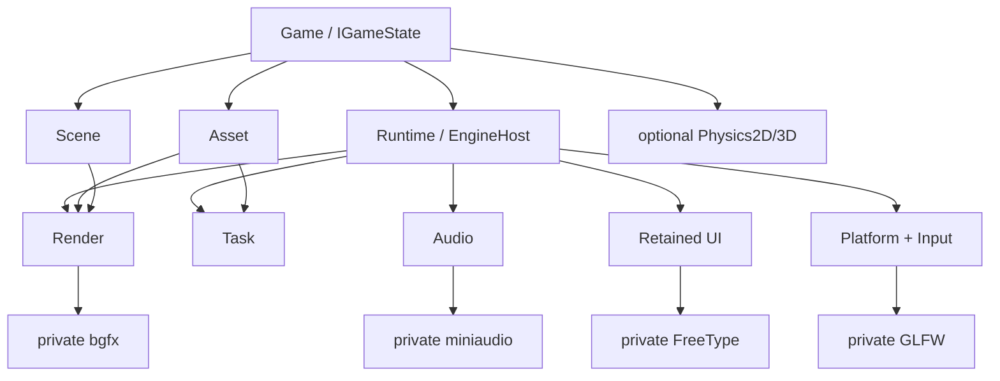

# vNext 目标架构

本文只描述已接受的不变量与“当前实现到完整目标”的差距。当前源码事实见 [架构总览](architecture.md)，
决策状态见 [设计冻结清单](design-freeze.md)，可执行工作见 [Backlog](backlog.md)。目标名称不等于
对应接口已实现。

## 产品目标

Tina 是 C++23 的 2D/3D 游戏 Runtime，产品路径为 Desktop bootstrap + Game State + samples。
Legacy `Tina.exe`、旧横版 2D 和旧 UI 产品图已经删除。当前 retained UI 位于 `src/ui`，属于 vNext。

核心不变量：

1. `EngineHost` 是唯一非全局组合根；
2. `IGameApplication` lifecycle-only，帧行为只在 `IGameState`；
3. Game API、Module SPI、Backend Private 三层分离；
4. 公开头不泄漏 GLFW/bgfx/Box2D/miniaudio/FreeType/cgltf/stb_image/EnTT；
5. 热路径有界、容量失败显式、借用寿命可验证；
6. Runtime 只读 Cooked Catalog，源资产只在 Cooker；
7. 逻辑失效与物理释放通过 Handle/Lease/Ticket/completion 分离。

## 目标模块图



当前 `EngineHost` 已组合 Platform/Task/Render/UI seam/Audio；Scene、Asset 与 Physics 由产品 State 持有。
未来若把 AssetSystem 组合进 Runtime，也必须保持 Game SDK 窄 capability，不能暴露模块 owner。

## 组合与启动

目标创建顺序保持事务式：Diagnostics/Memory → Clock → Platform → Task → optional Audio/Asset →
WindowSurface lease → Render → publish window。每一步成功后立即登记逆操作；失败时返回结构化 Error，
不发布半初始化 Host。

当前已经实现 Diagnostics、Clock、Platform、Task、optional Audio、WindowSurface/Render 的事务；独立
MemorySystem 与 Runtime-owned AssetSystem 尚未实现。

游戏启动目标：

```text
createInitialState
  -> bind primary UIContext or Headless
  -> initialState.onEnter
  -> commit initial policy/UI snapshot
  -> pushCommitted initial State onto GameStateStack
  -> publish committed stack runtime
```

当前 Runtime 已私有持有定容 `GameStateStack`，并实现 push/pop/replace/policy-change structural commands、
唯一提交点、enter 失败回滚和 pop-to-empty 退出。Game SDK 不取得可变 stack owner。

## 目标 Frame Pipeline

当前已实现的主干：

```text
Platform poll/validate
  -> Platform lifecycle dispatch
  -> UI input route/default action
  -> Action Mapping
  -> 0..4 Fixed Update (stack policy dispatch)
  -> Frame Update (top queues command)
  -> commit State command
  -> Audio completion
  -> RenderScene extraction/commit
  -> UI update/layout/paint/semantics/DisplayList
  -> RenderFramePacket submit/present/CPU completion
```

完整目标在不破坏上述顺序的前提下增加：

- owning Runtime event/completion phase；
- TaskGroup barrier 与 deterministic merge；
- GPU upload budget；
- 通用 GPU submission fence（不与当前 Texture/Mesh retirement marker 混称）。

这些新增阶段必须有唯一 owner、容量、失败语义与 reset/retire 点，不能通过一个通用 EventBus 或裸
pointer 把生命周期问题藏起来。

## 输入与 UI 目标

Platform final snapshot、ordered transition、UI route result 与 Gameplay Action 保持独立。UI 必须先发布
consume/claim，ActionMapper 才生成 Simulation/Frame Action；world pointer 使用 last-presented Camera2D
锁存。

当前已有 retained tree、layout/hit/paint/semantics、Text/Glyph、Focus Scope/Modal/持久 Pointer Capture、
ScrollView、Dropdown/Popup、虚拟 ListView/TreeView、Keyboard/Gamepad default action 与 Windows IMM32。
平台中立 accessibility action seam 已支持 Focus/Invoke/Toggle/SetRangeValue/SetTextValue，Windows UIA
已有 HWND 自动接线、Invoke/Toggle/RangeValue/Value patterns 与跨进程 HWND client gate。目标差距是
Narrator/Inspect 人工金标、Linux AT-SPI、多行/grapheme/BiDi/复杂 shaping 与完整 IME 候选窗，不是
“UI 尚不可见”；自动 gate 也不等于真实辅助技术验收。

50,000 节点深树的 structure commit/destroy、layout、hit 与 paint publication 已有非递归回归，Popup
publication 也已消除逐节点祖先回溯，当前步骤保持线性；完整 dirty-range pruning 和固定机 hard gate
仍是独立性能目标。

## Scene、Asset 与 Render 目标

- Scene：generation World、Transform、2D/3D component 与 extraction 已完成；command buffer/多 World
  orchestration 后置。
- Asset：Catalog/Cooked、AssetId、Handle/Lease、IO Task/Main completion、typed payload、Texture/Mesh
  upload、retirement ledger 与 AssetLease completion pin 已有；hot reload/增量 Cooker 后置。
- Render：Null/bgfx、Sprite2D/Opaque3D/UI Glyph、Texture2D/StaticMesh binding、owning packet 与 readback
  retirement marker 已有；通用 pass scheduler 与完整 PBR 后置。
- Physics：Box2D 2D 产品路径已有；Jolt 3D 未接入。

multi-mesh glTF Cooker 已生成 distinct AssetId/Prefab dependency；`3D-001` 产品 sample 已关闭两个 mesh 的
upload/bind/extract/draw E2E。

## 所有权与借用

| 对象 | owner | 当前/目标寿命规则 |
| --- | --- | --- |
| Platform frame | Platform backend | 到下一次 poll；回调内借用 |
| Phase Context | Runtime stack | 对应 callback 返回即失效 |
| UI root/listener | Game State RAII | token 不保活 Context/root |
| RenderScene/RenderFrame UI view | Runtime frame builders | submit-call-local borrow |
| committed UI snapshot view | UIContext | 下一次对应 commit 或 Context 析构时失效 |
| AssetHandle | Asset registry | 弱 lookup，可失效 |
| AssetLease | Asset payload | 强保活 CPU payload |
| GPU handle | RenderDevice | generation backend owner |
| FramePin/packet | Runtime packet/ledger | present-return CPU complete 已落地；Texture/Mesh 使用独立 readback marker retirement；通用 GPU submission fence 后置 |

任何 borrowed view 都必须注明精确失效点。不能用“一律不能跨帧”代替 committed UI view、Platform
view、phase writer 和 Lease 各自不同的规则。

## 关闭目标

当前关闭：abandon 当前 packet → State exit → Application shutdown → UI/dispatcher → Audio → Render →
`TaskSystem::shutdownAndJoinFor(shutdownDeadline)` → Platform → Clock → Diagnostics。Task timeout 会在
Diagnostics 仍存活时记录后 terminate，不继续析构 Worker 可能访问的 owner。完整目标仍可增加 State
TaskGroup barrier、Runtime-owned Asset/Audio lease drain 与通用 GPU completion，但必须保持
“join/completion 之前不释放被访问 owner”。

## 当前差距

| Backlog | 目标差距 |
| --- | --- |
| `TASK-001` | **Done**：Desktop 交互 CPU worker 默认 |
| `RUNTIME-001` | **Done**：stack/commands/唯一提交点、四相位 policy、`blocksGameplayInputBelow` 空 snapshot 与产品暂停 overlay |
| `RUNTIME-002` | FramePin + present-return CPU completion **Done**；RENDER-FENCE 的 Asset/Texture/Mesh readback retirement 亦已完成，通用 submission fence 非当前契约 |
| `3D-001` / `ASSET-001` | multi-mesh E2E + URI 安全 + base/MR/normal texture sampling **Done**；完整 PBR/IBL/shadow 后置 |
| `UI-002` / `UI-002-LINUX` / `UI-003` | action seam、Windows UIA patterns/HWND 产品接线与跨进程 gate 已有；Narrator/Inspect、AT-SPI 与 OS 级 DPI/跨 GPU 视觉矩阵仍开放 |
| `UI-004` / `UI-005` | **Done**：Focus Scope/Modal/Pointer Capture，以及 ScrollView、Dropdown/Popup、虚拟 ListView/TreeView |
| `TEXT-001` | 多行编辑、grapheme/shaping 与完整 IME 候选窗仍开放 |
| `PERF-001` / `PERF-002` | schema v1 **Done**；固定机 hard gate / 多进程 MAD 由 PERF-002 继续跟踪 |
| `CLEAN-001`～`CLEAN-004` | **Done**（依赖、转发头、旧 alias/参数与死 fallback 扫尾记录） |
| `TEST-001` / `TEST-002` | **Done**：Linux tip GCC13/Clang22（含 sanitizer）复验与 product-2d 同轮门禁 |

实现目标差距时，若反转 Accepted 决策必须新增 ADR 并 supersede 旧 ADR；不能只修改本文。
